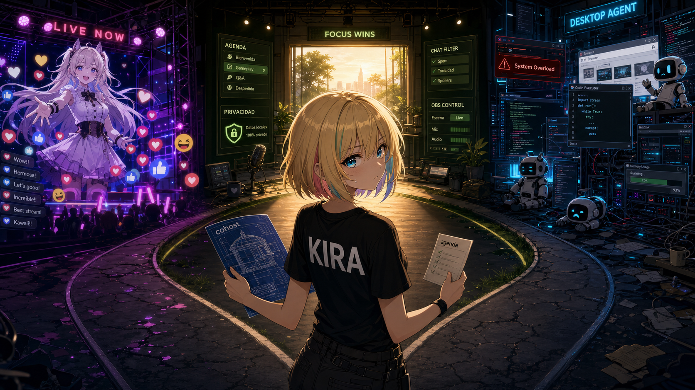

# OpenCohost — Local-First AI Streaming Co-Host
__________________

OpenCohost is a local-first AI streaming co-host platform. The core product is **Kira**, an AI co-host with a defined personality (dry sarcasm, sharp humor). Kira uses a **local LLM brain via Ollama** and **free cloud voice (Microsoft Edge-TTS) in v1**. With the shipped defaults, your viewer chat, prompts, and conversation memory never leave your machine — only Kira's outgoing spoken text is sent to Edge-TTS for synthesis. Inference can optionally be pointed at a cloud LLM provider instead, which does send the prompt off-machine; that is off by default and covered in [Privacy](#privacy). High-fidelity fully-local voice is planned as an advanced opt-in in a future release.

> Spanish version: [README.es.md](README.es.md)
> Spanish Note without AI: [README.note.md](README.note.md)

[Website](https://opencohost.com) | [Windows App](https://github.com/FranGuh/OpenCohost_UI) | [LiveAudio](https://liveaudio.opencohost.com)

> **Open beta.** OpenCohost is one developer covering a lot of surface — LLM orchestration, TTS, live chat, OBS, a desktop UI — so some things will not work well yet. It runs on my own hardware every day; the core holds up. But "Stable" in the table below means shipped and solid in normal use, not proven under every failure: Windows is the only fully validated platform so far, and the streaming/interruption path and the clause sanitizer have not yet faced a live adverse case. If something misbehaves, report it — that feedback is exactly what this beta is for. Bugs and ideas both go to [Issues](https://github.com/plynte-labs/opencohost/issues); there is a template for each.

## What Kira Does

- Listens to your stream via a local WebSocket transcription feed
- Responds via voice using local LLM inference (Ollama) and Edge-TTS (Microsoft cloud voice, free)
- Maintains a sliding conversation window across a stream session
- Supports optional offline TTS via Piper (`local-tts` extra) — no cloud calls when active
- Monitors its own health: if TTS becomes unavailable, Kira degrades gracefully rather than crashing

## Features

| Feature | Status |
|---|---|
| Manual chat input with voice response | Stable |
| Push-to-talk with global hotkey | Stable |
| Default TTS (Edge-TTS, free Microsoft cloud voice) | Stable |
| Optional offline TTS (Piper, `local-tts` extra) | Stable |
| WebSocket live transcription feed | Stable |
| Streaming TTS pipeline (speaks before LLM finishes) | Stable |
| Conversational memory (10-turn sliding window) | Stable |
| Personality profiles (editable from UI) | Stable |
| LLM model catalog with one-click switching | Stable |
| Ollama lifecycle management from the UI | Stable |
| Optional cloud LLM providers (OpenAI-compatible) with automatic local fallback | Stable — off by default, see [Privacy](#privacy) |
| Smart Chat Aggregator (Twitch) | Stable |
| Adaptive chat activation (tunes the wake threshold to the channel's own rate) | Stable |
| Smart Chat Aggregator (YouTube) | Opt-in, unofficial — see [PRIVACY.md](docs/PRIVACY.md#youtube-live-chat-is-opt-in-and-unofficial) |
| Health monitor with TTS fallback gate | Stable |
| Compact mode for second-monitor streaming | Stable |

> **Roadmap (not in v1):** High-fidelity fully-local voice via Qwen3-TTS / F5 voice cloning is planned as an advanced opt-in in a future release. It requires a separate Python environment, ~2 GB of models, and a GPU with sufficient VRAM.

## Requirements

### Prerequisites

- **Windows** (primary supported platform; clean-machine validation on Linux/macOS in progress)
- **Python 3.10+** (conda or venv environment activated)
- **[Ollama](https://ollama.com/) installed and running** — Kira cannot start without it

### Tauri prerequisites

The product UI (`pnpm tauri:debug`) needs a Rust/Node toolchain on top of the above:

| Requirement | Notes |
|---|---|
| [Node.js](https://nodejs.org/) | Any current LTS |
| [pnpm](https://pnpm.io/) `11.5.2` | Version pinned via `packageManager` in `package.json`; `corepack enable` picks it up automatically |
| [Rust + Cargo](https://rustup.rs/) | No `rust-toolchain.toml` in this repo — the Rust version is unpinned, any recent stable toolchain works |
| [WebView2 Runtime](https://developer.microsoft.com/microsoft-edge/webview2/) | Windows 11 ships it by default; install manually on Windows 10 |
| MSVC Build Tools (C++ workload) | Required for the `rustc` MSVC target on Windows — install via [Visual Studio Build Tools](https://visualstudio.microsoft.com/visual-cpp-build-tools/) |

### Hardware

| Tier | GPU VRAM | Use case |
|---|---|---|
| Minimum | 6 GB | Edge-TTS (cloud); Ollama on a smaller model |
| Recommended | 8–12 GB | Comfortable LLM inference with headroom |
| Ideal | 16+ GB | Larger models without contention |

## Setup

Clone with submodules — the Tauri front end is its own repository, wired in at `OpenCohost_UI/`.
A plain `git clone` leaves that directory empty and the Run section below has nothing to `cd` into.

```powershell
git clone --recursive https://github.com/plynte-labs/opencohost.git
cd opencohost

# already cloned without it?
git submodule update --init --recursive
```

> These commands assume your Python environment is already activated. Replace `python` with the path to your environment's interpreter if you are not in an activated shell.

```powershell
# Install the package with default extras (Edge-TTS + platform integrations + HTTP API)
pip install -e ".[cloud-tts,integrations,api]"

# uv equivalent
uv pip install -e ".[cloud-tts,integrations,api]"

# Optional: add offline Piper TTS support (no cloud calls for voice synthesis)
pip install -e ".[cloud-tts,integrations,api,local-tts]"
```

**Extras reference:**

| Extra | What it enables |
|---|---|
| `cloud-tts` | Edge-TTS — Microsoft free cloud voice (default) |
| `local-tts` | Piper offline TTS — fully local, no cloud calls |
| `integrations` | OBS WebSocket, NVIDIA VRAM monitor |
| `api` | FastAPI + uvicorn — the HTTP API the Tauri front end drives Kira through. Required to run the product (`pnpm tauri:debug` spawns it) and to collect the test suite. |
| `youtube-chat` | Unofficial YouTube live chat (pytchat) — opt-in, [read this first](docs/PRIVACY.md#youtube-live-chat-is-opt-in-and-unofficial) |
| `dev` | pytest, pre-commit, detect-secrets |

### Run

The product UI is Tauri, which spawns the Python backend on its own:

```powershell
cd OpenCohost_UI
pnpm tauri:debug
```

See [Tauri prerequisites](#tauri-prerequisites) above if this is your first run — it needs Node.js, pnpm, and a Rust toolchain on top of the Python setup.

For a standalone backend (headless, or with the front end served separately), use `run-api.bat` or
`uvicorn opencohost.api.main:app --host 127.0.0.1 --port 8765 --workers 1`.

`python -m opencohost` still opens the old CustomTkinter shell, which was **frozen as legacy** on 2026-08-13: it is kept around but not maintained. The flags armed by `EngineHost` never engage there, so it is not a valid surface for runtime validation.

### Configure storage paths

To move Ollama models, cache, or temp files to a different drive, edit `opencohost/config/storage.yaml`:

```yaml
storage:
  # cache_root: "/path/to/your/cache"
  # temp_root: "/path/to/your/temp"
  # ollama_models: "/path/to/ollama/storage"
```

## Architecture

```
OpenCohost_UI/                # Product UI — Tauri + React (pnpm tauri:debug)
├── src/features/             # One folder per surface: agenda, stream, musica, ...
└── src-tauri/src/backend.rs  # Spawns the Python backend if none is listening

opencohost/
├── __main__.py           # Legacy entry point (python -m opencohost)
├── api/                  # FastAPI host — the product's engine surface
│   ├── engine_host.py    # Composition root: owns the motor, arms host flags
│   ├── main.py           # App factory
│   └── routers/          # One router per surface (chat, agenda, ptt, obs, ...)
├── config/
│   ├── logger.py         # Structured logging (console + rotating files)
│   ├── settings.py       # Constants, model catalog, system prompt
│   ├── storage.py        # Portable path resolution for cache/temp
│   ├── storage.yaml      # Storage path overrides
│   └── default_profiles.json  # Seeded personality profiles
├── core/
│   ├── llm_engine.py     # LLM orchestration, memory, TTS pipeline
│   ├── observability/    # Health monitor, service state, TTS fallback gate
│   ├── profiles/         # Personality profile load/save
│   └── providers/cloud/  # OpenAI-compatible cloud LLM client
├── ui/                   # LEGACY CustomTkinter shell — frozen, not maintained
└── smart_aggregator/     # Live chat aggregator (Twitch; YouTube opt-in)
```

## Personality Profiles

On first run, OpenCohost seeds a set of default personality profiles into your local `perfiles.json` (ignored by git). Each shipped profile is language-tagged, and the seeded set follows your configured language — `opencohost/config/default_profiles.json` ships both:

**Spanish (`es`)**

| Profile | Persona |
|---|---|
| Akira | Default co-host — balanced and sharp |
| Akira (Learn) | Learning mode — educational and encouraging |
| Comunidad | Community mode — warm and inclusive |
| Calmado | Calm mode — slower pace, grounded tone |
| Técnico | Technical mode — precise, dry, cynical |
| Show | High-energy performance mode |

**English (`en`)**

| Profile | Persona |
|---|---|
| Kira | Default co-host — balanced and sharp |
| Kira (Learn) | Learning mode — educational and encouraging |
| Community | Community mode — warm and inclusive |
| Calm | Calm mode — slower pace, grounded tone |
| Technical | Technical mode — precise, dry, cynical |
| Showtime | High-energy performance mode |

Kira's name and base personality are preserved across all profiles.

## Ollama Integration

The app validates Ollama at startup and disables actions that depend on the LLM if the service is unavailable. The model panel provides a single contextual button:

- **Install Ollama** — opens the official download page when the binary is not found
- **Start Ollama** — runs `ollama serve` when installed but not responding
- **Download model** — pulls the selected model when Ollama is ready but the model is missing locally
- **Activate model** — switches to the selected model when already installed
- **Install Python dependency** — alerts when the `ollama` Python package is missing from the active environment

The service is checked at `http://127.0.0.1:11434/api/tags`. If Ollama becomes unavailable during a session, the engine marks itself as not ready and blocks processing, model switching, and downloads until the service responds again.

## HTTP API

`opencohost/api/` is a FastAPI process that owns its own Kira engine — it is never shared with, or imported by, the legacy Tk app. **It is the product's engine surface:** the Tauri front end in `OpenCohost_UI/` drives Kira entirely through it, and `pnpm tauri:debug` starts it for you. Run it standalone only if you want a headless backend or are serving the front end separately. The `api` extra from [Setup](#setup) already covers this; if you installed without it:

```powershell
pip install -e ".[api]"
uvicorn opencohost.api.main:app --host 127.0.0.1 --port 8765 --workers 1
```

**`--workers` MUST stay at 1.** A second worker means a second engine — double VRAM/Ollama load and a second audio device grab. `EngineHost` refuses to start a second time on the same machine via a lockfile.

**Do not bind `--host 0.0.0.0`.** That exposes the engine control surface to your LAN. CORS only restricts browser callers — it does nothing against a script or `curl` hitting the port directly. Keep this on loopback unless you
put an authenticating proxy in front of it.

One router per product surface, under `opencohost/api/routers/`: `agenda`,
`agent`, `avatar`, `chat`, `events`, `i18n_tts`, `llm_provider`, `memoria`,
`music`, `obs`, `perfiles`, `personalization`, `ptt`, `status`, `stream`.

Two worth calling out: `GET /api/status` is a read-only health/engine snapshot, and `POST /api/perfiles/switch` is idempotent via the `Idempotency-Key` header.
Full reference: [docs/api-reference.md](docs/api-reference.md).

## Privacy

The short version, with the shipped defaults:

| | Where it goes |
|---|---|
| Viewer chat, usernames, conversation memory | Never leave your machine |
| LLM inference | Local Ollama over loopback |
| Kira's spoken text | Microsoft Edge-TTS (bypass entirely with the `local-tts` extra) |

**One opt-in changes this.** OpenCohost can run inference against an OpenAI-compatible cloud endpoint instead of Ollama. When you enable it, the full prompt — persona, saved memorias, **and the filtered viewer-chat context** — is sent to that provider, and their retention policy applies, not ours. It is off by default (`active_provider` is `"local"`), and a missing or corrupt provider config resolves back to local-only.

Full detail, including the YouTube opt-in caveat:
[docs/PRIVACY.md](docs/PRIVACY.md).

## Testing

```powershell
# Full test collection
python -m pytest --collect-only -q

# Focused model + recovery suite
python -m pytest tests/test_llm_tiers.py tests/test_model_panel.py tests/test_heavy_model_inference_recovery.py -q

# Health monitor suite
python -m pytest tests/test_health_monitor.py tests/test_health_integration.py tests/test_app_shell_obs_resilience.py -q
```

See [docs/TESTING.md](docs/TESTING.md) for the full test surface.

## License

This project is licensed under the MIT License. See [LICENSE](LICENSE) for the full text.
