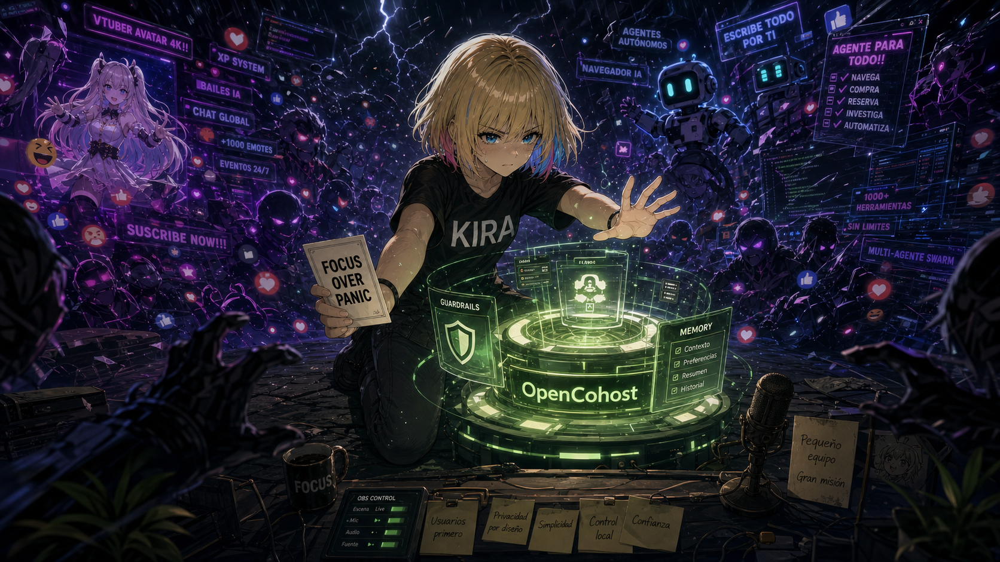
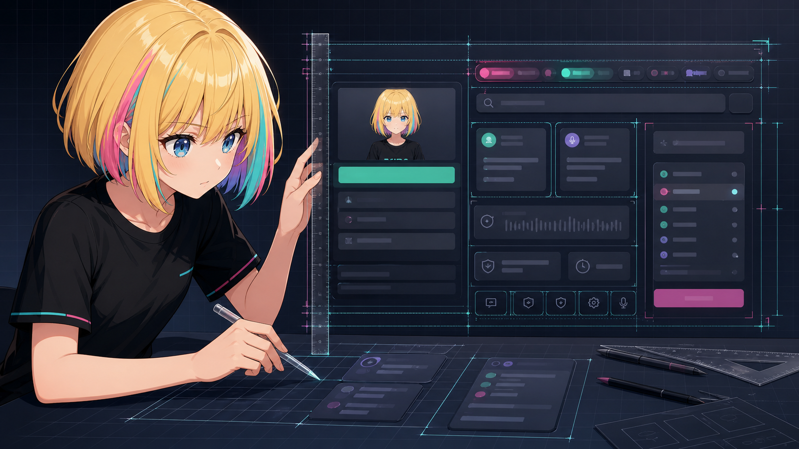

# Bienvenido a OpenCohost.
____________________________

## Qué es este proyecto
OpenCohost es algo, no es una locura, no es innovación, no es pionero, no es original, no es otro asistente o vtuber de IA, es un experimento personal que se va convirtiendo poco a poco en un trabajo más de investigación propia.

Nació con el objetivo de saber si era capaz de diseñar cualquier cosa, después moldear eso a algo funcional, pero durante el camino me di cuenta de que quizá la discusión no era hacerlo funcionar, sino por qué tendría que funcionar de ciertas formas, qué escenarios tomar ante diversas adversidades. Quizá leas esto y digas qué ambiguo que eres, pero hoy tengo muchas preguntas sin respuesta a las que trataré de buscarles un sentido aun sin ser respondidas.

### Opinión de qué es un LLM · 13-08-2026
Qué es para mí un LLM o IA generativa: en amplios términos, sin entrar en tecnicismos, es cualquier cosa que sabe de todo pero no entiende qué es el todo. Puede ampliar o atrofiar todos tus puntos de vista, te puede desafiar, pero luego, si eres más preciso con él, te demuestra que sus puntos flaquean. Puedes hacerlo cambiar de argumento en iteraciones. No entiende emociones, no entiende las neuronas, es una máquina probabilística. Probablemente sea el futuro de la sociedad, probablemente no; no me interesaría, la verdad.

Pero por qué escribes esto, si el enfoque principal del proyecto es más similar a un harness o layout del LLM. Lo explico, o trato de justificarlo, simplemente para que se tenga una idea base de que el LLM no es una persona: no piensa, no se deprime, no se enoja, no se cansa, está haciendo todo perfecto, no tiene deficiencias, no existen alucinaciones. Todo eso es invento o creencia humana (cosas a las que les buscamos sentido y nombre; hoy tienen un significado, en diez años serán otro concepto más). He trabajado e interactuado por miles de horas. No soy científico, no soy researcher, no soy experto de la IA, no soy senior; soy alguien que intenta encontrar un propósito o significado a toda esa desinformación.

### Por qué nació este proyecto
Estaba aburrido de interactuar con bots. El internet actualmente está lleno de mucha basura, así que construí mi propio generador de esta tanda. Pero algo interesante fue que necesitaba que la máquina generadora iterara durante varios turnos sin estar interactuando con ella. Al inicio pensé que sería un desafío imposible; después conseguí el concepto a medias, porque mi máquina es semiautónoma, mientras en el mercado ya había puestos establecidos con esa máquina autónoma y con muchos recursos detrás. Solamente soy yo y mi gran desconocimiento dentro de esta industria. Decidí tomar la palabra e invertí mis ahorros en construir esto (bueno, no exactamente: antes construí otras cosas, para agarrar experiencia).

Cuando llegas tarde a un mundo donde no eres nadie, no tienes contactos, no eres sabio, no tienes disciplina, odias la repetición, no te gusta programar, no eres experto y necesitas miles de horas de estudio en temas que jamás imaginaste conocer o aprender en tu vida, y para rematar el sector está abandonando los puestos entry-level, hay caminos: te quedas en la cueva expandiendo conocimiento, saltas a otro sector, y yo decidí el camino de tomar esa tecnología de moda y construir algo basándome en ella. Prácticamente no existe un camino correcto; son decisiones donde cada una tiene sus ventajas o consecuencias. Lo único importante es cuál de esas opciones te permitirá conectarte los días difíciles, seguir investigando aun cuando no tengas energía. Tomé el camino. Es duro, pero me gusta.

Gracias a eso nació el concepto de un cohost virtual de IA: ciego, tonto y random, solo experto en iterar durante horas en tu propia máquina, dependiendo del LLM. Tiene memoria, pero es limitada. Mi investigación en el futuro probablemente avance, probablemente no.

Esto es IA slop, si quieres verlo así. Sí. No me interesa tu argumento.

### Dónde está la trampa. No todo puede ser así de sencillo, ¿cuál es el precio?
Por qué es MIT o gratis: porque para hacerlo escalable necesitas el poder de cómputo, miles de ingenieros o tokens en IA, así como clientes a quienes vender. Yo decidí tomar el camino de aquellos que necesitan probar el concepto sin que les duela, y lo liberé no porque haya miles de productos iguales, sino porque no tengo claro el rumbo (o quizá sí, solo que no quiero revelar todas mis cartas por el momento). Tampoco quiero decir «construí un programa o harness de IA interactivo y semiautónomo» y solo tenerlo en mi computadora. Hoy es mi proyecto personal, el cual lleva mi esfuerzo, mis iteraciones, mi gasto en millones de tokens; mañana puede que sea un recuerdo o una anécdota.

En esta vida he creado muchas cosas: proyectos, niveles, dibujos o ilustraciones, videos, historias. Quizá este proyecto sea uno más del cajón. Probablemente te sirva, probablemente no, pero aquí está, abierto al mundo.

Por qué decidí que el LLM no ejecutara tareas —abrir un juego, organizar tus documentos, iterar código—: porque hay muchas empresas haciendo esa tarea, o proyectos que ya hacen ese concepto mucho mejor. OpenCohost Kira es el proyecto al cual le puedes contar o explorar ideas prototipo sin miedo a que te juzguen o te traten de tonto. Es inexacta, te miente, te afirma una verdad como si fuera el camino definitivo, se tarda en responder, no tiene emociones, no te habla de forma humana. Si quieres una voz más humana existen otras opciones (hoy no puedo permitirme desarrollar algo que no sé si lograré ejecutar en una sola máquina doméstica; si me apoyo de Ollama para la inferencia es porque no tuve que perder tiempo construyendo un motor desde cero, y no tuve que entrenar un LLM porque no tengo los recursos ni el conocimiento para hacerlo de forma efectiva). OpenCohost Kira deforma tus recuerdos, pero se ejecuta en local con posibilidad de usar un proveedor de nube para aquellos que puedan permitírselo. Puedes desarrollar un perfil diferente a Kira, puedes cambiarle el aspecto por otras imágenes. No decidí ir por un modelo 3D porque no tengo idea de cómo hacer un personaje 3D en Blender, así como eye tracking o lip sync.

#### Lo que realmente debes esperar de OpenCohost
OpenCohost Kira es la opción si quieres irte a hacer algo de fondo mientras escuchas e interactúas sobre un tema que tú le propusiste. Puede seguir la agenda programada, y puedes añadirle cards con conceptos actuales para que ella los cite.

En el futuro espero refinar el concepto. Muchas gracias por apoyar; feedback y contribuciones son aceptados. Actualmente el proyecto funciona en español; en inglés aún faltan algunos ajustes. Disfruta e interactúa con OpenCohost.
[[PREGUNTAS]]

#### Etapas importantes por las que ha pasado el proyecto.

[X] Darle voz robótica a Ollama.
[X] Hacer que QwenTTS deje de hablar en chino y empiece a hablar en español.
[X] Entregar a QwenTTS lotes de texto para que tarde poco en entregar el TTS.
[X] Descartar QwenTTS como motor por defecto.
[X] Hacer un event loop para que el LLM tenga prioridad de respuestas direct, stream y agenda.
[X] Hacer guardrails sencillos para mitigar defectos de los LLMs cuantizados.
[X] Que el cerebro sea intercambiable y probar distintos LLMs (Qwen 3, Llama 3, Gemma 4, GLM 5.2, DeepSeek V4 Pro).
[X] Hacer la interfaz de CustomTkinter y el motor independientes entre sí.
[X] Modularizar el core (+27 archivos) por un enfoque o una arquitectura por dominios.
[X] Mini RAG.
[X] Personalizar el LLM.
[X] Aceptar modelos de nube (NVIDIA NIM).
[X] Reducir *llm_engine.py* de 8.239 líneas a la mitad.
[X] Reducir la latencia del TTS.
[X] Evitar enviar el system prompt en cada iteración y mitigar su crecimiento exponencial en N iteraciones.
[X] Hacer que pueda seguir una agenda durante horas.
[X] Hacer que, tras N turnos, lo que dice en la agenda tenga sentido y no se repita.
[X] Filtrar ciertos caracteres o códigos para que no se lean en el TTS.
[X] Hacer que pueda ser interrumpible en monólogos, creando un sistema de routing del TTS.
[X] Separar enfoques de frontend y backend.
[X] Migrar la interfaz prototipo de CustomTkinter a un enfoque más moderno con Tauri.
[X] Hacer que recuerde interacciones.
[X] Mitigar el límite de contexto.
[X] Empezar a hablar antes de terminar de pensar: reproducir el audio frase por frase.
[-] Hacer i18n, que el LLM hable en inglés.
[-] Ser resiliente ante fallas del motor o proveedor LLM.
[-] Empaquetar el producto.

