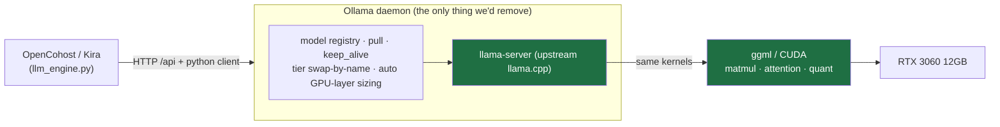
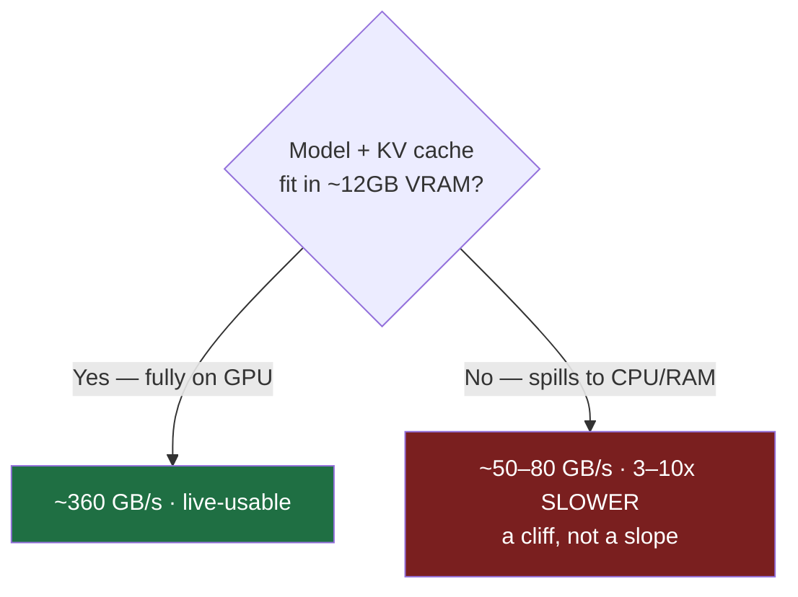
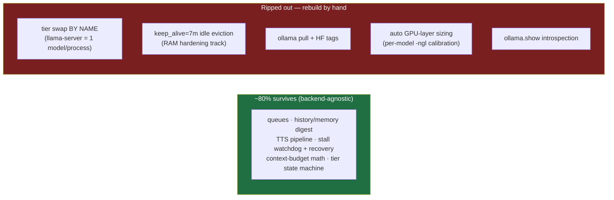

# ADR-022: LLM Inference Backend — Ollama vs. Bare llama.cpp (Decision: Stay on Ollama)

**Date**: 2026-06-29
**Status**: Accepted — no migration. Implementation of the config wins this points to lives in [ADR-023](./ADR-023-ollama-config-hardening-12gb.md).
**Branch**: `feat/ollama-config-hardening-20260629`
**Author**: Claude Code orchestrator + 8-agent audit workflow (repo coupling map, env probe, web research ×3, adversarial critique)
**Scope**: Decision record only. No backend change. Companion to [ADR-013](./ADR-013-model-latency-vs-repetition-benchmark-rtx3060.md) (model-latency frontier on the same 3060).

---

## The question

> "Once all models are downloaded via Ollama, is it better/viable to run them via **llama.cpp** instead? Does it improve latency / efficiency / token inference, and what does it cost?"

A reasonable question, because the internet is full of "llama.cpp is faster than Ollama". The audit chased it to the ground. **Verdict: stay on Ollama. Harden its config instead.**

---

## The one fact that settles it: Ollama *is* llama.cpp underneath

After a 2025 detour where Ollama shipped its own pure-Go GGML engine, PR **#16031** (merged 2026-05-29) **removed** the vendored backend and left upstream **`llama-server`** as the *sole* engine for GGUF models. On a Windows + RTX 3060 box, every model you run is GGUF — so **100% of your inference already flows through llama.cpp.**

**Consequence: there is no faster kernel to switch to.** The same matmuls, the same attention, the same quantization code run either way. The thin Go server layer (fork-exec the runner, translate the API, route models) is the *only* thing "switching to llama.cpp" removes. When a benchmark shows llama.cpp ahead, it is measuring **that wrapper overhead** — not a better engine.

### Measured reality (same GGUF + same flags, single-stream)

> ⚠️ None of these cards is a 3060. There is **no direct 3060 parity number** anywhere — the gap is extrapolated, and these are blog/community figures that vary 10–20% run-to-run.

| GPU | Model | llama.cpp | Ollama | Throughput gap | TTFT gap |
|---|---|---|---|---|---|
| A100 (datacenter) | Llama 3.1 8B Q4_K_M | 105 tok/s | 98 tok/s | ~7% | +23 ms |
| RTX 5090 | Llama 3 8B Q4_K_M | 95 tok/s | 82 tok/s | ~14% | — |
| **Consensus** | single-user | — | — | **3–10%** (wrapper, not kernel) | tens of ms |

---

## What actually moves the needle on 12GB (and where it lives)

Token generation is **memory-bandwidth bound**. The 3060 reads weights at ~360 GB/s from VRAM vs ~50–80 GB/s from system RAM. The whole performance question collapses to **one** thing: *does model + KV cache fit entirely in the GPU?*

| # | Lever | Impact | Reachable inside Ollama? |
|---|---|---|---|
| 1 | **Full GPU offload vs CPU spill** | **DOMINANT — 3–10x+ (a cliff)** | ✅ `num_gpu`, `OLLAMA_GPU_OVERHEAD` |
| 2 | Quantization (Q4_K_M) | Large (Q8 ~29% slower; also decides #1) | ✅ `ollama create --quantize`, custom GGUF |
| 3 | num_ctx | High (commonest cause of accidental spill) | ✅ per-request option |
| 4 | KV-cache quant (q8_0) | Moderate — *enabler* that frees headroom to dodge #1 | ✅ `OLLAMA_KV_CACHE_TYPE` |
| 5 | Flash attention | Moderate — helps TTFT/VRAM more than tok/s | ✅ `OLLAMA_FLASH_ATTENTION` |
| 6 | Batch size | Low for single-stream | ✅ `num_batch` |
| 7 | Speculative decoding | Lowest + riskiest on a 3060 (often net-negative) | ❌ **needs llama.cpp** |

**Every needle-moving lever (#1–#6) is reachable from a stock Ollama.** The *only* thing migration unlocks is #7 — the worst lever for this hardware (it needs a second model resident in already-scarce VRAM; on small/MoE models it drops decode 3–12%).

> **The "Ollama is 30–70% slower" myth** you'll find online is not an engine gap — it's **default-vs-tuned**: flash attention historically off, KV cache at f16, a conservative GPU-layer estimate that spills one layer. All three are config, all three fixed in Ollama (ADR-023).

---

## This box's real model inventory (the actionable part)

| Model | Size | Fits 12GB? | Verdict |
|---|---|---|---|
| `gemma:26b` | 16 GB | ❌ | Permanent CPU spill — **unusable at speed**, no backend rescues it. Drop from recommended tiers. |
| `qwopus:latest` | 16 GB | ❌ | Same — unusable at speed on this box. |
| **`gemma4:e4b`** (default *quality* tier) | 9.6 GB disk / **~3.3 GB resident** | ✅ comfortable | Elastic Gemma 3n slice — resolves to ~3.3 GB in VRAM at Q4_K_M (the 9.6 GB is the on-disk blob). Runtime probe: 100% GPU, ~6.8 GB free at num_ctx=8192. **Not** at spill risk — corrects the earlier disk-size estimate (see [ADR-023](./ADR-023-ollama-config-hardening-12gb.md) Runtime Correction). |
| `llama3` | 8 GB | ✅ | Fits comfortably. |
| `qwen3:1.7b` | 2 GB | ✅ | Fits comfortably. |

---

## What bare llama.cpp genuinely buys — and the cost

**Genuine, Ollama-can't-do-it wins** (none are on your roadmap): speculative decoding (`--model-draft`), raw GBNF grammars (`--grammar`), RoPE/YaRN context extension (`--rope-scaling`), `--n-cpu-moe`, and same-day upstream features. **None matters for a single-stream local co-host on 12GB.**

**The cost of migrating** (grounded in the repo coupling map — ~9 files do real Ollama I/O):

- **Effort**: ~3–5 days for a one-model adapter (which *kills tier-switching*); ~1.5–3 weeks for full parity (process-pool or `llama-swap` to restore tier swap + idle eviction + manual downloader + per-model GPU calibration), plus ongoing Windows CUDA-build maintenance.
- **New failure modes you'd own**: per-model OOM from manual `-ngl`, orphaned `llama-server` processes, port collisions, VRAM creep without idle eviction, CUDA-runtime/driver drift.

This deletes working product mechanics to chase single-digit throughput on the same kernel — **ROI-negative** for a launch-readiness / less-expansion project.

---

## Decision

**Stay on Ollama. Capture the reachable wins via config (ADR-023).**

### Revisit migration only if one becomes a *written requirement with a measured payoff*:
1. Speculative decoding on a large target model with VRAM to spare (not this 3060).
2. Strict structured output via raw GBNF beyond Ollama's `format: json`.
3. Context extension via YaRN/RoPE that Ollama's `num_ctx` ceiling blocks.
4. A same-day upstream model/feature whose delay blocks a release.
5. A measured, repeatable **>15–20% end-to-end** win from a tuned llama.cpp on *your* models at matched settings — that survives past TTS latency to something a viewer perceives.

None is true today.

---

## Related ADRs
- [ADR-013](./ADR-013-model-latency-vs-repetition-benchmark-rtx3060.md) — the model-latency/VRAM-cliff frontier on this same 3060; this ADR explains *why the cliff is backend-independent*.
- [ADR-023](./ADR-023-ollama-config-hardening-12gb.md) — the config hardening (flash attention only; KV-quant + GPU-overhead were dropped after a runtime probe showed e4b is not near the spill cliff).
