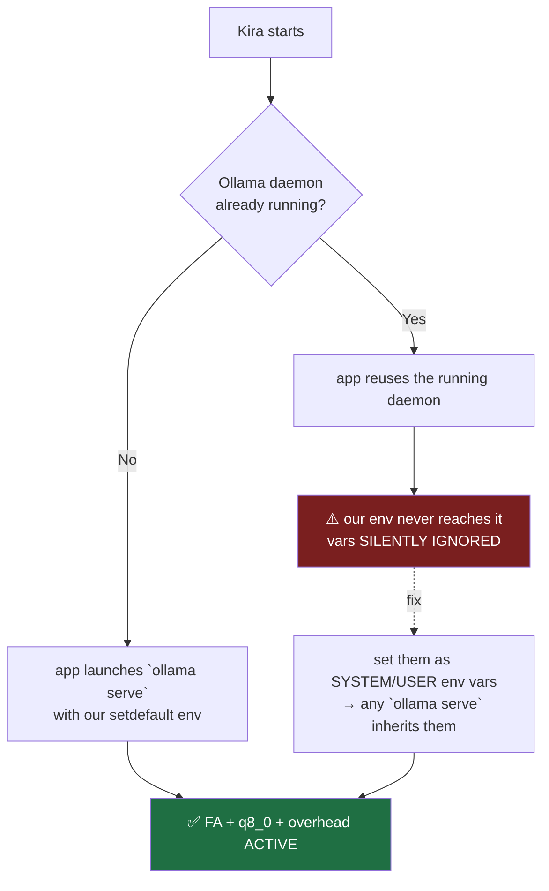

# ADR-023: Ollama Runtime Config Hardening for 12GB VRAM (Flash Attention · q8_0 KV Cache · GPU Overhead)

**Date**: 2026-06-29
**Status**: Accepted — implemented at the app-launched daemon (`ollama_startup.py`, strict-TDD). **Owner action still owed**: set the same vars as system env vars + verify with `ollama ps` (see §Verification).
**Branch**: `feat/ollama-config-hardening-20260629`
**Author**: Claude Code orchestrator + 8-agent audit workflow
**Scope**: Config/tuning of the *existing* Ollama backend. No new module. Phase of `ram_llm_hardening_20260626`, follows [ADR-022](./ADR-022-llm-backend-ollama-vs-llamacpp.md).

---

## Why

[ADR-022](./ADR-022-llm-backend-ollama-vs-llamacpp.md) concluded: the inference engine is identical to bare llama.cpp, so the wins that "switching to llama.cpp" promises are **config**, and that config lives inside Ollama. This ADR sets it.

The target is one tier specifically: **`gemma4:e4b` (9.6 GB)** — the default *quality* tier, the only one at real spill risk on a 12 GB card that also drives the display. Push it off the cliff and ADR-013's "VRAM cliff = 3–10x slower" is exactly what bites.

---

## The knobs

| Knob | Mechanism (level) | Effect | Default set | Override |
|---|---|---|---|---|
| **Flash attention** | `OLLAMA_FLASH_ATTENTION` (server env) | Lower TTFT + KV-cache VRAM; **required** for KV quant | `1` | export own value |
| **KV-cache quant** | `OLLAMA_KV_CACHE_TYPE` (server env) | ~½ KV-cache VRAM, tiny precision loss | `q8_0` | export `f16` to disable |
| **GPU overhead** | `OLLAMA_GPU_OVERHEAD` (server env, **bytes**) | Reserve VRAM for the display so Ollama doesn't over-commit and force mid-stream offload | `1 GiB` (`1073741824`) | export own byte count |
| RAM ceilings (existing, A3) | `OLLAMA_NUM_PARALLEL`, `OLLAMA_MAX_LOADED_MODELS` | One runner, one loaded model | `1`, `1` | export own value |

All applied via `env.setdefault(...)` in `ollama_startup.py` → **an operator who exported their own value keeps it.** This matters: `q8_0` carries a small precision risk on high-GQA models, so the operator must be able to fall back to `f16` without a code change.

---

## The trap: these are SERVER-level vars (read this before trusting them)

`OLLAMA_FLASH_ATTENTION` / `OLLAMA_KV_CACHE_TYPE` / `OLLAMA_GPU_OVERHEAD` are read by the **Ollama daemon at launch**, not per request. Our `setdefault` only reaches the daemon **when the app launches `ollama serve` itself**. The env probe showed the daemon was *not* running and started on-demand — good, our vars apply. **But** if Ollama is already running (installed as a background service, or started by hand) when Kira boots, our `setdefault` env never reaches it, and the vars are **silently ignored that session.**

**Belt-and-suspenders (owner action):** set the three vars as **Windows system/user environment variables** too, so whichever `ollama serve` wins the race inherits them. The code default covers the app-launched path; the system env covers the already-running path.

---

## VRAM budget — why `gemma4:e4b` is the one to watch

Rough budget on a 12 GB card already spending ~688 MiB on desktop/Edge (WDDM):

| Tier | Weights | + KV @ f16 | + KV @ **q8_0** | Fits fully on GPU? |
|---|---|---|---|---|
| `qwen3:1.7b` | ~2.0 GB | small | smaller | ✅ easy |
| `llama3` | ~8.0 GB | ~+1 GB | ~+0.5 GB | ✅ comfortable |
| **`gemma4:e4b`** | **9.6 GB** | risky near the ceiling | **~+0.5 GB → ~10.1 GB** | ⚠️ **fits with q8_0 + ~1 GB reserve; verify** |
| `gemma:26b` / `qwopus` | 16 GB | — | — | ❌ never (ADR-022) |

q8_0 KV cache is the lever that keeps `gemma4:e4b` *under* the cliff; `GPU_OVERHEAD` keeps the display from shoving it over mid-stream. The exact fit depends on `num_ctx` — **measure, don't assume.**

---

## Verification (owner, ~5 min — the numbers above are estimates)

1. `ollama 0.30.7 → 0.30.11` (update; 0.30.x is where flash-attention auto-enable lives).
2. Set the three system env vars; restart Ollama.
3. Load `gemma4:e4b`, then `ollama ps` → confirm it shows **100% GPU** (not "X% CPU") and read its residency.
4. Check server logs say flash attention is on for `gemma4:e4b` — its family **post-dates** the documented auto-FA list (qwen3/gemma3/…), so don't assume it inherits the path; the explicit var is what guarantees it.
5. If `gemma4:e4b` partial-offloads → lower `OLLAMA_GPU_OVERHEAD` or `num_ctx`. If the desktop stutters mid-stream → raise it.

---

## Risks (config-level, reversible — not new structural failure modes)

- **`q8_0` precision on high-GQA models**: the risk lands on the Qwen2.x family. The default tiers (`gemma4:e4b` / `llama3` / `qwen3:1.7b`) contain **no Qwen2.5**, so it's low-risk for defaults. Installed-but-not-tiered qwen2.5 models only matter if an operator wires one via `llm_tiers.json` — verify Kira's quality on that tier before committing q8_0 (override to `f16`).
- **`GPU_OVERHEAD` mis-set**: too high forces the protected tier into offload; too low starves the display. It's a **calibration knob** — the `ponytail:` comment in code names the tuning path; finalize against `ollama ps`.

---

## Implementation

- `opencohost/core/ollama_startup.py` — three `env.setdefault(...)` lines beside the A3 ceilings, with the server-level / calibration caveats inline.
- `tests/test_ollama_startup.py` — extended the exact-env assertion; added `test_operator_env_overrides_preserve_perf_knobs` (setdefault respects operator `f16` / custom reserve while applying unset defaults). Strict-TDD RED→GREEN, 11 passed.
- No settings.py constant: values live as literals next to the existing ceilings (same pattern); the `setdefault` override is the tuning seam. Adding a constant layer would be YAGNI.

**Net**: an afternoon of config captures the bulk of any realistic tuned-llama.cpp gain on this hardware, with minimal reversible config risk, and leaves the product's backbone (tier swap, RAM hardening, one-click pull, auto GPU sizing) untouched.

---

## Related ADRs
- [ADR-022](./ADR-022-llm-backend-ollama-vs-llamacpp.md) — why we stay on Ollama (the wins are config, not a different engine).
- [ADR-013](./ADR-013-model-latency-vs-repetition-benchmark-rtx3060.md) — the VRAM cliff these knobs keep `gemma4:e4b` away from.
