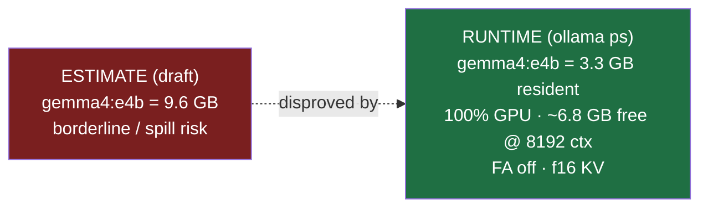
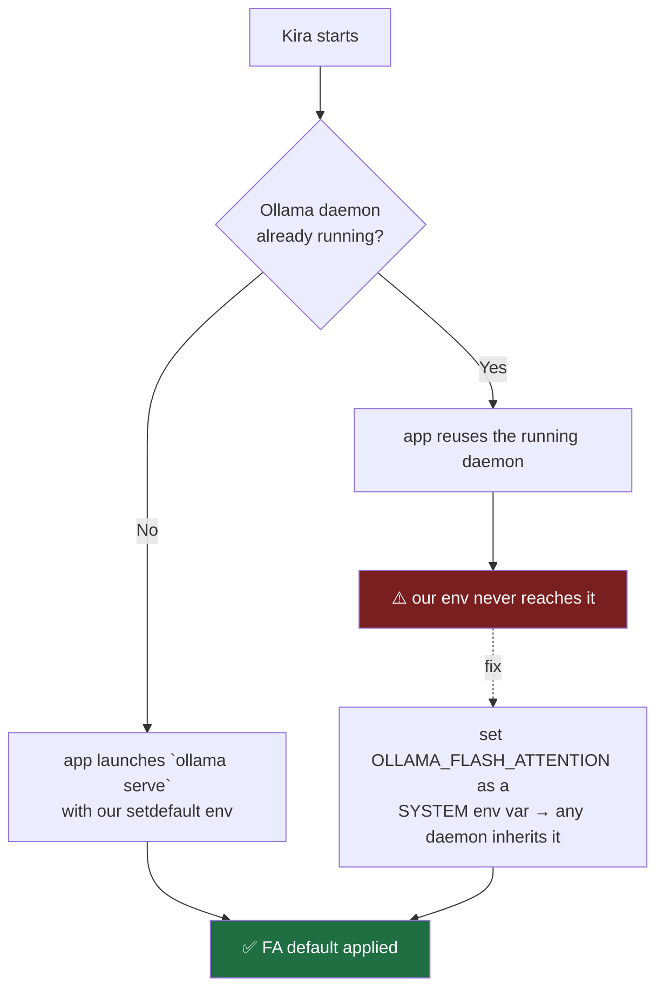

# ADR-023: Ollama Runtime Config Hardening for 12GB VRAM (Flash Attention)

**Date**: 2026-06-29 (amended same day after runtime validation)
**Status**: Accepted — shipped **flash-attention only**. KV-cache quant + GPU-overhead were **dropped** after a runtime probe disproved the spill-risk premise they addressed (see §Runtime Correction).
**Branch**: `feat/ollama-config-hardening-20260629`
**Author**: Claude Code orchestrator + audit + 5-agent runtime-log validation workflow
**Scope**: Config/tuning of the *existing* Ollama backend. No new module. Phase of `ram_llm_hardening_20260626`, follows [ADR-022](./ADR-022-llm-backend-ollama-vs-llamacpp.md).

---

## Runtime Correction (the headline — read this first)

The first draft of this ADR set **three** knobs (flash attention, `OLLAMA_KV_CACHE_TYPE=q8_0`, `OLLAMA_GPU_OVERHEAD=1 GiB`) to keep `gemma4:e4b` — believed to be **9.6 GB** and "the only tier at real spill risk" — off the VRAM cliff.

A live `ollama ps` probe disproved the premise:

The 9.6 GB was the **on-disk blob size** (`ollama list`), misread as resident VRAM. `gemma4:e4b` is an **elastic Gemma 3n slice** that resolves to ~3.3 GB in VRAM at Q4_K_M. At baseline — **flash attention OFF, f16 KV cache** — it already sits fully on GPU with ~6.8 GB to spare at `num_ctx=8192`.

**Consequence**: the spill cliff this ADR was protecting against isn't near. KV-quant and GPU-overhead were solving a non-problem, so they were removed. Flash attention stays — it's a free win regardless.

---

## What shipped

| Knob | Mechanism (level) | Effect | Default | Override |
|---|---|---|---|---|
| **Flash attention** | `OLLAMA_FLASH_ATTENTION` (server env) | Lower TTFT + KV-cache VRAM, same engine | `1` | export `0` to disable |
| RAM ceilings (existing, A3) | `OLLAMA_NUM_PARALLEL`, `OLLAMA_MAX_LOADED_MODELS` | One runner, one loaded model | `1`, `1` | export own value |

Applied via `env.setdefault(...)` in `ollama_startup.py` → an operator who exported their own value keeps it.

### Dropped (and why)
- **`OLLAMA_KV_CACHE_TYPE=q8_0`** — halves KV-cache VRAM, but with ~6.8 GB free there's nothing to reclaim; it traded a small precision risk on high-GQA models for headroom that isn't scarce.
- **`OLLAMA_GPU_OVERHEAD=1 GiB`** — guards against over-commit on a display-sharing card, but with ~6.8 GB free the over-commit risk is negligible.

Both remain trivially re-addable as `setdefault` lines (or operator system env vars) **if** a future model genuinely approaches the ceiling — but YAGNI until the runtime says so.

---

## The trap that still matters: flash attention is a SERVER-level var

`OLLAMA_FLASH_ATTENTION` is read by the **Ollama daemon at launch**, not per request. Our `setdefault` only reaches the daemon **when the app launches `ollama serve` itself**. If Ollama is already running (Windows tray service, or started by hand) when Kira boots, our value never reaches it and FA stays at the daemon's own default.

This is exactly why the 2026-06-29 validation run was a **baseline, not a test of this ADR**: the daemon was already running (updating to 0.30.11 restarts the tray service), so `ollama_startup.py:55` returned `already_running` before any `setdefault` ran. To actually exercise FA, set the system env var **and** confirm a cold daemon start.

---

## Verification (owner, ~5 min)

1. Stop the Ollama tray service fully (confirm `llama-server.exe` exits).
2. Set `OLLAMA_FLASH_ATTENTION=1` as a Windows system/user env var; restart Ollama.
3. Load `gemma4:e4b`; check the server log says flash attention is **on** — its family **post-dates** the documented auto-FA list (qwen3/gemma3/…), so don't assume it inherits the path; the explicit var is what guarantees it.
4. `ollama ps` → confirm 100% GPU (already true at baseline; this just confirms FA didn't change the fit).

---

## Risk

Minimal and reversible. Flash attention is broadly safe on Ampere+; an operator who hits a model where it misbehaves exports `OLLAMA_FLASH_ATTENTION=0`. No quality-affecting KV change ships by default anymore.

---

## Implementation

- `opencohost/core/ollama_startup.py` — one `env.setdefault("OLLAMA_FLASH_ATTENTION", "1")` beside the A3 ceilings, with the correction noted inline. (KV-quant + GPU-overhead lines removed.)
- `tests/test_ollama_startup.py` — exact-env assertion expects only the FA addition; `test_operator_can_disable_flash_attention_and_no_kv_overhead_knobs` locks that the two dropped knobs are **not** set by the app. Strict-TDD RED→GREEN, 11 passed.

---

## Related ADRs
- [ADR-022](./ADR-022-llm-backend-ollama-vs-llamacpp.md) — why we stay on Ollama; model inventory corrected to e4b ~3.3 GB resident.
- [ADR-013](./ADR-013-model-latency-vs-repetition-benchmark-rtx3060.md) — the VRAM cliff; this run confirms e4b is comfortably on the safe side of it.
