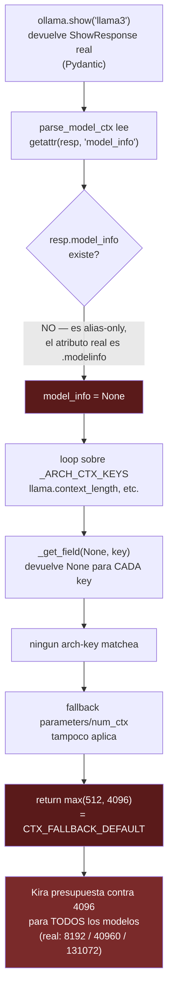
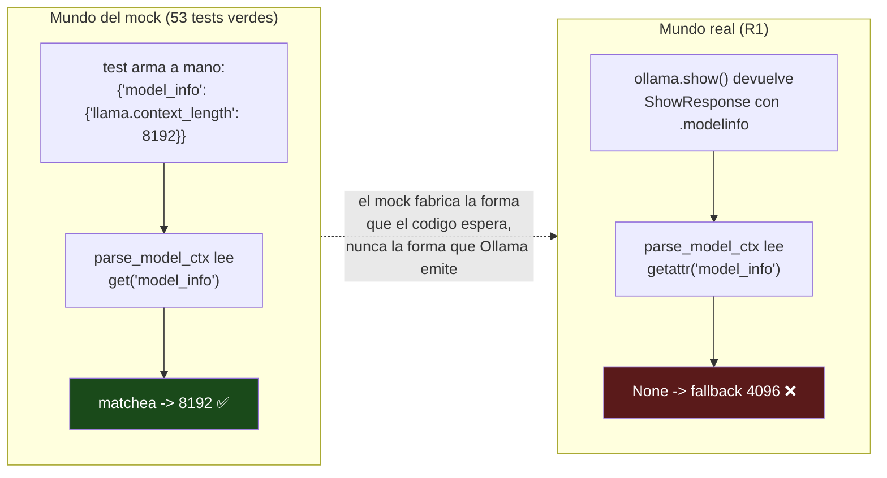

# ADR-025: Cuando los mocks mienten — el bug de ctx-discovery que solo el entorno real vio

**Date**: 2026-06-30
**Status**: Reference / informational
**Branch**: `maintenance/big-file-audit-small-fixes-20260629`
**Author**: Claude Code orchestrator + adversarial workflows (real-env harness, diseño → 2 jueces opus → apply)
**Scope**: Documento de referencia, pedagógico. El fix ya está en código (`d3334dc`). Esto no cambia código: explica un bug real, por qué fue invisible, y qué lección deja. Compañero de [ADR-014](./ADR-014-model-qualification-and-minibenchmark.md) (qualification/ctx) y del guardarraíl de overflow (`conductor/tracks/context_overflow_guardrail_20260623/`).

---

## Por qué existe este documento

Este ADR cuenta una historia incómoda y muy útil: teníamos **53 tests unitarios verdes** sobre la lógica de descubrimiento de contexto, y **todos mentían a la vez**. No porque estuvieran mal escritos, sino porque todos compartían el mismo punto ciego. El bug vivía exactamente en el hueco que ningún mock podía ver, y se quedó ahí — silencioso, en producción — hasta que el primer test contra Ollama real lo cazó en su primera ejecución.

La lección central, la que quiero que te lleves, es esta:

> **Un mock que fabrica la forma que el código espera es ciego a la realidad. Solo prueba que el código es consistente consigo mismo, no que es correcto contra el mundo.**

Si entendés *por qué* eso es así, vas a escribir tests mejores por el resto de tu carrera. Vamos a desarmar el monstruo paso a paso.

---

## El contexto: ¿qué hace `parse_model_ctx` y por qué importa?

OpenCohost corre modelos locales sobre Ollama. Cada modelo tiene una **ventana de contexto nativa** distinta: cuántos tokens puede "ver" de una vez. Esto no es trivia académica — es presupuesto. El guardarraíl de overflow recorta el historial de conversación para que la entrada quepa en esa ventana. Si el presupuesto está mal, Kira **olvida** la conversación antes de tiempo o, en el otro extremo, desborda el modelo.

Los números reales, medidos contra Ollama 0.6.2 (`tests/realenv/test_realenv_model_ctx.py:16-17`):

| Modelo | Contexto nativo real | Lo que el bug reportaba |
|---|---|---|
| `llama3` | **8 192** | 4 096 |
| `qwen3:1.7b` | **40 960** | 4 096 |
| `gemma4:e2b` | **131 072** | 4 096 |

La columna de la derecha es el síntoma: `CTX_FALLBACK_DEFAULT = 4096` (`opencohost/config/settings.py:47`). Para **todos** los modelos. `gemma4:e2b` tiene capacidad para 131 072 tokens y lo estábamos tratando como si tuviera 4 096 — **32 veces menos**. Kira estaba presupuestando contra una ventana 32x más chica que la real, y por lo tanto evictando historial muchísimo antes de lo necesario.

La función que descubre ese número es pura y vive aislada a propósito (`opencohost/core/context_budget.py:56`):

```python
def parse_model_ctx(show_response, *, fallback: int) -> int:
    ...
```

Recibe la respuesta de `ollama.show(model)` y devuelve el contexto nativo, o el `fallback` si no logra leerlo. La fila "lo que el bug reportaba" significa una cosa: **nunca logró leerlo. Ni una vez. Para ningún modelo real.**

---

## El monstruo: `model_info` vs `modelinfo`

Acá está el corazón del bug, y es de una sutileza casi cruel. La versión rota leía el campo así:

```python
# ANTES (buggeado)
model_info = _get_field(show_response, "model_info")
```

Donde `_get_field` (`opencohost/core/context_budget.py:43`) es un helper honesto que maneja tanto dicts como objetos con atributos:

```python
def _get_field(obj, name):
    if obj is None:
        return None
    if isinstance(obj, dict):
        return obj.get(name)
    return getattr(obj, name, None)   # <-- la trampa vive acá
```

El problema: el `ShowResponse` **real** que devuelve `ollama.show()` es un modelo Pydantic, y expone el diccionario de metadatos como el atributo **`.modelinfo`** (sin guion bajo). El nombre `model_info` existe en el esquema, pero **solo como alias** — no como atributo accesible vía `getattr`. Entonces:

```python
real_resp = ollama.show("llama3")
real_resp.modelinfo      # -> {"llama.context_length": 8192, ...}  ✅ existe
real_resp.model_info     # -> AttributeError / None vía getattr     ❌ alias-only
```

`getattr(real_resp, "model_info", None)` devolvía **`None`**. Sin excepción, sin warning, sin crash. Solo un `None` silencioso que degradaba "con elegancia" hacia el peor resultado posible: el fallback.

Seguí la cadena de consecuencias, porque el bug no termina en esa línea:



Fijate en el efecto dominó. Como `model_info` era `None`, el loop sobre `_ARCH_CTX_KEYS` (`opencohost/core/context_budget.py:77-80`) llamaba `_get_field(None, key)` para cada clave de arquitectura, y `_get_field` devuelve `None` cuando `obj is None`. **Ninguna clave matcheaba jamás.** El código caía hasta el fallback final de la línea 92, `return max(_CTX_FLOOR, fallback)`, y devolvía 4096. Cada. Vez.

El daño se propaga vía `llm_engine.py:1722`, que cachea el resultado en `self._model_ctx_limit[model]`, y de ahí lo consumen los tres puntos donde se calcula el presupuesto de contexto (`llm_engine.py:1172`, `:1275`, `:1313`). Un `None` mal leído contaminaba toda la cadena de presupuesto.

### El bug secundario (que el primero escondía)

Había una segunda falla, más mundana: `_ARCH_CTX_KEYS` tenía `gemma.context_length` y `qwen2.context_length`, pero **le faltaban** `gemma4.context_length` y `qwen3.context_length` (Engram #2633). Curiosamente, este segundo bug era **invisible mientras existía el primero** — daba igual qué claves buscaras si `model_info` siempre era `None`. El bug grande tapaba al chico. Solo al arreglar `modelinfo` quedó al descubierto que también faltaban las claves de las arquitecturas nuevas.

---

## Por qué NINGÚN mock lo vio: el gap mock-vs-real

Acá está la parte que duele y enseña. La lógica tenía 53 tests unitarios. Todos verdes. ¿Cómo?

Porque cada test construía su entrada **a mano**, y al construirla a mano, todos usaban la forma que el código buggeado esperaba: un dict (o un `SimpleNamespace`) con la clave `model_info`. El test y el código estaban de acuerdo entre ellos — y **ambos estaban equivocados sobre la realidad**.



Mirá los dos mundos lado a lado. El mock le entrega al código `{"model_info": {...}}` — exactamente lo que el código quiere leer. Verde. El test confirma que el código hace lo que el código hace. Es un espejo, no una prueba.

El entorno real entrega un `ShowResponse` con `.modelinfo`. El código lee `.model_info`. Rojo (en realidad: silenciosamente 4096).

> **El mock no estaba mal escrito. Estaba escrito contra la suposición equivocada — la misma suposición que tenía el código. Un test y el código que comparten un error no se atrapan mutuamente: se confirman.**

Esto es lo que en el equipo llamamos un test **circular**. El docstring del propio R1 lo dice sin anestesia (`tests/realenv/test_realenv_model_ctx.py:11-14`):

> *"This is the only check that proves the static `_ARCH_CTX_KEYS` strings match what real Ollama emits — the unit tests in test_context_budget.py feed synthetic keys, which is circular for that claim."*

Las claves de arquitectura son strings mágicos (`"llama.context_length"`). Un test unitario que **inventa** esos strings y después verifica que el código los encuentra no prueba nada sobre Ollama — prueba que copiaste bien el string de un lado al otro. Solo una llamada real a `ollama.show()` puede confirmar que esos strings son los que Ollama realmente emite.

---

## Cómo atacamos al monstruo: el harness real-env (R1)

La solución no fue "arreglar la línea". Fue construir el **único tipo de test que podía haberlo atrapado**, y dejarlo plantado para que no vuelva a pasar. Ese es el harness `tests/realenv/`, y su pieza relevante es R1 (`test_realenv_model_ctx.py`).

Tres decisiones de diseño lo hacen valioso:

1. **Usa el tipo de objeto exacto de producción.** R1 no arma un dict. Llama al `ollama.show()` real y le pasa el `ShowResponse` crudo a `parse_model_ctx` — *"the exact object type the engine's `_discover_model_ctx` -> `_fetch_show` path passes in production"* (`test_realenv_model_ctx.py:6-7`). Mismo tipo, mismo camino, sin intermediarios que "limpien" la forma.

2. **Calcula la verdad de referencia de forma independiente.** El helper `_real_ctx_from_show` (`test_realenv_model_ctx.py:28-45`) saca el contexto nativo leyendo `modelinfo` *y* `model_info` defensivamente, y buscando **cualquier** clave que termine en `.context_length`. No depende de la lista estática `_ARCH_CTX_KEYS`. Así el test compara dos caminos distintos hacia el mismo número — si la lista de claves se queda corta, el test lo nota.

3. **Es barato y se auto-saltea.** Corre solo con `OPENCOHOST_REALENV_TESTS=1` y se skipea si Ollama o el modelo no están (`test_realenv_model_ctx.py:1-3`). `ollama.show` es un RPC de metadatos — no genera tokens, no carga el modelo en VRAM. Por eso la suite por defecto sigue siendo 86 passed / 8 skipped sin tocar la GPU (`d3334dc`).

La aserción es brutal en su simpleza (`test_realenv_model_ctx.py:65-68`):

```python
assert got == real_ctx, (
    f"{tag}: ctx-discovery returned {got}, but the real native ctx is "
    f"{real_ctx} (CTX_FALLBACK_DEFAULT={CTX_FALLBACK_DEFAULT})"
)
```

"Lo que descubrió la función debe ser igual al contexto nativo real." En su primera corrida, con el código buggeado, los tres casos fallaron: `got=4096`, `real_ctx=8192/40960/131072`. El monstruo quedó expuesto a plena luz.

---

## El fix: antes y después

El arreglo es de **11 líneas** (`d3334dc`), y su pequeñez es exactamente la moraleja. El bug era enorme en consecuencia, diminuto en código.

**ANTES** — lee solo `model_info`, muerto contra toda respuesta real:

```python
model_info = _get_field(show_response, "model_info")

_ARCH_CTX_KEYS = (
    "llama.context_length",
    "gemma.context_length",
    "phi3.context_length",
    "qwen2.context_length",
    "mistral.context_length",
)
```

**DESPUÉS** (`opencohost/core/context_budget.py:67-74`, `:27-35`):

```python
# Real ollama ShowResponse exposes this field as the attribute `.modelinfo`
# (Pydantic; `model_info` is an alias-only key). Raw JSON and test dicts use
# the `model_info` key. Try the attribute name first, then the dict/legacy key.
model_info = _get_field(show_response, "modelinfo")
if model_info is None:
    model_info = _get_field(show_response, "model_info")

_ARCH_CTX_KEYS = (
    "llama.context_length",
    "gemma.context_length",
    "gemma4.context_length",   # <-- nuevo
    "phi3.context_length",
    "qwen2.context_length",
    "qwen3.context_length",    # <-- nuevo
    "mistral.context_length",
)
```

Dos cambios, ambos mínimos:

- **Leer `modelinfo` primero, caer a `model_info` después.** Esto es lo importante de la estrategia: el orden preserva la compatibilidad. La respuesta real Pydantic matchea `modelinfo`; los 53 tests viejos (dicts con `model_info`) y cualquier JSON crudo o `SimpleNamespace` legacy siguen matcheando el segundo. **Nadie se rompe.** No tocamos los tests existentes — el fix está diseñado para que sigan siendo válidos.
- **Agregar las claves `gemma4`/`qwen3`** que el primer bug mantenía ocultas.

El comportamiento, antes y después, en una tabla:

| Entrada | ANTES | DESPUÉS |
|---|---|---|
| `ollama.show("llama3")` real (`.modelinfo`) | 4096 ❌ | **8192** ✅ |
| `ollama.show("qwen3:1.7b")` real | 4096 ❌ | **40960** ✅ |
| `ollama.show("gemma4:e2b")` real | 4096 ❌ | **131072** ✅ |
| dict de test `{"model_info": {...}}` | matcheaba ✅ | sigue matcheando ✅ |
| respuesta sin ctx (cualquier forma) | 4096 (correcto) | 4096 (correcto) |

---

## El proceso: cómo se validó sin atajos

Vale la pena contar cómo llegó esto a `master`, porque el rigor fue parte del arreglo, no un agregado.

El cambio pasó por un gate de tres etapas: **diseño → 2 jueces adversariales opus → apply** (Engram #2636). Los jueces no dieron el visto bueno fácil — confirmaron por su cuenta que el campo Pydantic es efectivamente `modelinfo` con alias `model_info`, verificaron que hay **un solo caller en producción** (`llm_engine.py:1722`, vía `_discover_model_ctx`), y señalaron lo que ya sabíamos en el fondo: que los tests unitarios de las claves son circulares, así que **mandaron correr R1 contra Ollama real antes del merge**. No alcanzaba con verde sintético.

La validación final, bajo Strict TDD (Engram #2636):

- 3 tests unitarios nuevos RED → GREEN en `test_context_budget.py` (el atributo `modelinfo`, la clave `gemma4`, la clave `qwen3`).
- R1 pasó de `xfail(strict)` a verde contra Ollama real: **3 passed** (8192 / 131072 / 40960).
- Suite por defecto: **86 passed / 8 skipped** (realenv sigue salteándose, cero carga de modelo).

---

## Dónde nos deja esto

El bug está cerrado y, más importante, el **agujero metodológico** que lo dejó pasar está tapado. Hoy:

- `parse_model_ctx` lee el contexto nativo real de cada modelo. Kira presupuesta contra la ventana correcta — 131072 para `gemma4:e2b`, no 4096 — y el guardarraíl de overflow recorta historial cuando de verdad hace falta, no 32 veces antes.
- Existe un harness real-env (`tests/realenv/`) que corre la lógica de producción contra Ollama real, gateado para no encarecer la suite normal. R1 es ahora el guardián vivo de esa frontera: si algún día Ollama renombra el campo otra vez, o aparece una arquitectura con una clave nueva, R1 va a gritar.
- Tenemos una regla de equipo, ganada con dolor: **cuando un valor cruza la frontera de un sistema externo (Ollama, un SDK, una API), al menos un test debe usar el objeto real de ese sistema.** Los mocks son perfectos para la lógica interna; son ciegos para la forma de lo que entra desde afuera.

La moraleja, una vez más, porque es la única cosa que quiero que recuerdes de este documento:

> **Un mock confirma que tu código es consistente con tus suposiciones. Solo el entorno real puede confirmar que tus suposiciones son ciertas. Cuando esas dos cosas divergen — y acá divergieron por una sola letra, un guion bajo — el mock se queda callado y el bug vive en producción hasta que algo real lo toca.**

Por una letra. `model_info` contra `modelinfo`. Esa fue la distancia entre 53 tests verdes y un sistema que presupuestaba mal el contexto de todos los modelos, todo el tiempo.

---

## Referencias

- **Código**: `opencohost/core/context_budget.py:27-35` (`_ARCH_CTX_KEYS`), `:43` (`_get_field`), `:56-92` (`parse_model_ctx`, lectura `modelinfo` en `:72`).
- **Caller de producción**: `opencohost/core/llm_engine.py:1703` (`_discover_model_ctx`), `:1722` (llamada), `:1728` (`_fetch_show` → `ollama.show`).
- **Fallback**: `opencohost/config/settings.py:47` (`CTX_FALLBACK_DEFAULT = 4096`).
- **Test que lo cazó**: `tests/realenv/test_realenv_model_ctx.py` (R1, valores reales en `:16-17`).
- **Commit**: `d3334dc` — *fix(llm): ctx-discovery reads real ollama modelinfo + gemma4/qwen3 keys*.
- **Memoria**: Engram #2633 (descubrimiento del bug vía real-env), #2636 (fix + gate diseño→jueces→apply).
- **Compañeros**: [ADR-014](./ADR-014-model-qualification-and-minibenchmark.md), guardarraíl de overflow (`conductor/tracks/context_overflow_guardrail_20260623/design.md`).
