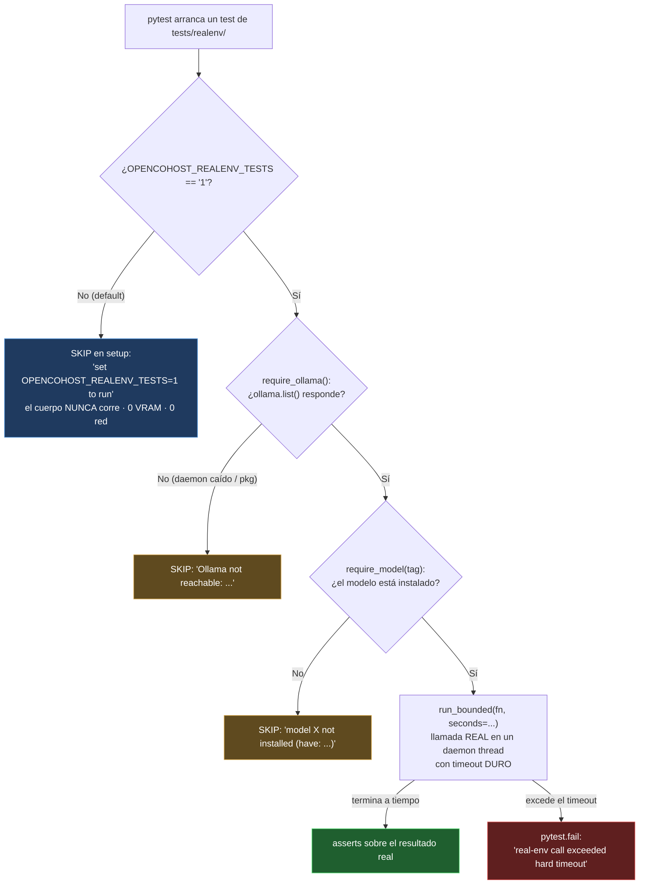
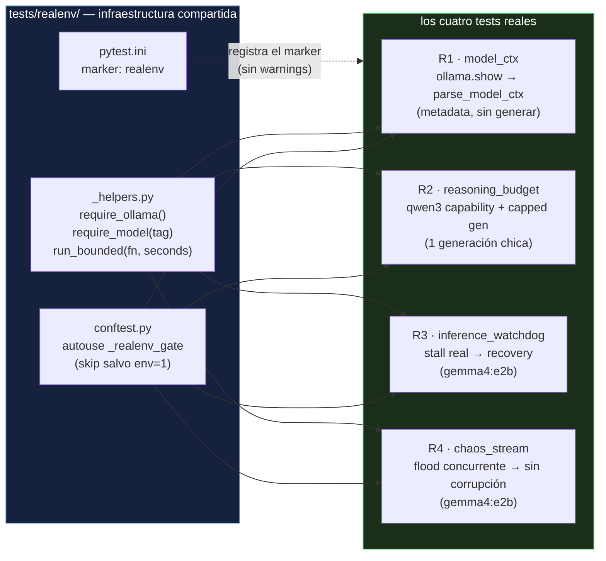

# ADR-026: Tests de entorno real sin reventar el suite — el harness gateado

**Date**: 2026-06-30
**Status**: Reference / informational (documenta `tests/realenv/`, commit `a5606de`)
**Branch**: `maintenance/big-file-audit-small-fixes-20260629`
**Author**: Claude Code orchestrator + workflows adversariales (diseño → 2 jueces opus → apply)
**Scope**: Documental. No cambia código; explica el porqué y el cómo del harness opt-in para integración con Ollama real. Companion de [ADR-014](./ADR-014-model-qualification-and-minibenchmark.md) (qualification de modelos) y [ADR-023](./ADR-023-ollama-config-hardening-12gb.md) (hardening 12GB).

---

## Por qué existe este documento

Casi todo el suite de OpenCohost es rápido y honesto: corre en ~3 segundos, no toca la red, no carga un solo gramo de modelo. Eso es exactamente lo que querés de un suite que vas a correr cien veces por día. Pero esa misma virtud esconde un agujero: **un mock nunca te va a decir la verdad sobre el mundo real.** Un mock devuelve lo que vos le programaste que devuelva. Si tu suposición sobre la forma de la respuesta de Ollama está mal, el mock está mal con vos — y los dos van a estar de acuerdo, en verde, para siempre.

Este ADR cuenta cómo construimos `tests/realenv/`: una colonia de tests que sí hablan con un **Ollama real cargando un modelo real**, para atrapar la clase de bug que los mocks estructuralmente no pueden ver — y cómo logramos que esa colonia conviva con el suite rápido **sin reventar la RAM/VRAM de una RTX 3060 de 12 GB** cada vez que alguien escribe `pytest`.

La lección que queremos que te lleves: **los tests de modelo real valen oro, pero tienen que ser opt-in.** Si no, te cuesta el doble — pagás latencia y memoria en cada corrida, y terminás desactivándolos. La solución no es elegir entre "rápido" y "real"; es un *gate* que te deja tener los dos.

---

## El monstruo

Querés probar que tu integración con el LLM aguanta la realidad: la latencia variable, los stalls genuinos, la forma exacta de la respuesta de `ollama.show`, el comportamiento de un modelo de razonamiento cuando le cortás el presupuesto de tokens. Nada de eso lo podés simular con fe. Lo tenés que *vivir*.

Pero vivirlo tiene un precio físico brutal:

- **Memoria**: cargar `gemma4:e2b` o `qwen3` se come varios GB de VRAM. En una 3060 de 12 GB, hacerlo en cada corrida de `pytest` —junto al resto del sistema, el navegador, el IDE— es la receta para un OOM o un swap a pagefile que convierte 3 segundos en varios minutos (ver el "VRAM cliff" documentado en [ADR-013](./ADR-013-model-latency-vs-repetition-benchmark-rtx3060.md)).
- **Latencia**: una sola generación real puede tardar de 5 a 60+ segundos. Multiplicá eso por un suite y el feedback loop se muere.
- **No-determinismo**: un modelo real varía. Un test que a veces tarda 6 s y a veces 27 s (p90 real de e2b) **no puede** correr sin un timeout duro, o un día se cuelga para siempre en CI y nadie sabe por qué.
- **Disponibilidad**: en CI, o en la máquina de otro colaborador, puede no haber Ollama corriendo, o no estar instalado el modelo. Un test que *explota* en esa situación es un test que todos terminan ignorando.

El monstruo, entonces, no es "cómo testear con un modelo real". Es **cómo tener tests de modelo real que NO castiguen al 99% de las corridas que no los necesitan, y que se comporten con dignidad cuando el modelo no está.**

---

## El objetivo

Cuatro propiedades, no negociables:

1. **Default rápido**: `pytest` sin ninguna variable de entorno NO debe cargar un modelo. Cero VRAM, cero red. El suite rápido queda intacto (149 passed, 8 skipped, ~3 s — verificado en `a5606de`).
2. **Opt-in explícito**: los tests reales corren solo cuando vos, a propósito, prendés un interruptor. Nunca por accidente.
3. **Degradación digna**: si activaste el interruptor pero no hay Ollama, o falta el modelo, el test **se skippea con un mensaje claro** — no falla en rojo. Un test que falla por algo que no es el código bajo prueba es ruido, y el ruido entrena a la gente a ignorar el rojo.
4. **Sin cuelgues**: cada llamada real está envuelta en un **timeout duro manual**. Si el modelo se cuelga, el test falla a tiempo en vez de congelar la corrida.

---

## Cómo atacamos al monstruo — el gate de tres capas

La idea central es que un test real solo se ejecuta si **todas** estas puertas están abiertas, y cada puerta que está cerrada produce un *skip* (no un *fail*):



### Capa 1 — el `autouse` gate (la puerta de entrada)

El corazón es un fixture `autouse` en `tests/realenv/conftest.py:9`. *Autouse* significa que pytest lo aplica a **todos** los tests del directorio sin que ningún test tenga que pedirlo. Esa es la elegancia: no podés olvidarte de gatear un test nuevo, porque el gate viene de fábrica con la carpeta.

```python
# tests/realenv/conftest.py:9
@pytest.fixture(autouse=True)
def _realenv_gate():
    if os.environ.get(REALENV_ENV_FLAG) != "1":   # REALENV_ENV_FLAG = "OPENCOHOST_REALENV_TESTS"
        pytest.skip(f"real-env test; set {REALENV_ENV_FLAG}=1 to run")
    yield
```

El detalle que hace que esto sea seguro: el `pytest.skip()` corre en **setup**, *antes* del cuerpo del test. Eso significa que cuando la variable no está, el test ni siquiera empieza — no se importa `ollama`, no se llama a `ollama.show`, no se carga nada. El skip es gratis. Esa es la diferencia entre "el suite rápido ignora estos tests" y "el suite rápido los corre y se cuelga".

### Capa 2 — los probes de disponibilidad (`require_ollama` / `require_model`)

Una vez abierta la primera puerta, cada test declara qué necesita del mundo. En `tests/realenv/_helpers.py`:

```python
# _helpers.py:7 — ¿hay un daemon que conteste?
def require_ollama():
    try:
        import ollama
        ollama.list()
    except Exception as exc:           # transporte caído, paquete ausente, etc.
        pytest.skip(f"Ollama not reachable: {exc!r}")

# _helpers.py:21 — ¿está ESTE modelo instalado? (tolera el sufijo ':latest')
def require_model(tag: str):
    require_ollama()
    ...
    if want not in installed and not any(e.startswith(want + ":") for e in installed):
        pytest.skip(f"model {tag!r} not installed (have: {sorted(installed)})")
```

La decisión de diseño acá es **skip, no fail**. Si corrés el suite real en una máquina sin `qwen3:1.7b`, el test de razonamiento se hace a un lado solito y te dice qué tenés instalado. No te grita por algo que no es tu culpa. Esto es lo que hace que el harness sea *portable*: el mismo código corre en la rig del owner con tres modelos y en un CI pelado, y en cada lado ejecuta exactamente lo que puede y skippea con honestidad lo que no.

El `_canon()` (`_helpers.py:16`) que recorta `:latest` es una de esas asperezas del mundo real que un mock jamás te hubiera enseñado: `ollama list` a veces te devuelve `llama3:latest` y vos pediste `llama3`. Sin esa normalización, el test skippearía aunque el modelo *esté*.

### Capa 3 — el timeout duro manual (`run_bounded`)

Acá está la pieza más subestimada. El stack no tiene `pytest-timeout` instalado en el entorno `flux_env`. En vez de agregar una dependencia, resolvimos el problema con la stdlib — un thread daemon y un `join` con plazo:

```python
# _helpers.py:39
def run_bounded(fn, *, seconds: float, **kwargs):
    """Corre fn() en un daemon thread; falla si excede `seconds`. Re-lanza errores de fn."""
    box = {}
    def worker():
        try:
            box["result"] = fn(**kwargs)
        except BaseException as exc:
            box["error"] = exc
    t = threading.Thread(target=worker, daemon=True)
    t.start()
    t.join(seconds)                    # esperá, pero no para siempre
    if t.is_alive():
        pytest.fail(f"real-env call exceeded hard timeout of {seconds:.1f}s")
    if "error" in box:
        raise box["error"]             # el error real del modelo sube tal cual
    return box.get("result")
```

Tres detalles que valen la pena entender, porque son el tipo de cosa que se aprende a las 3 AM:

- **El thread es `daemon=True`**. Si la generación real se cuelga de verdad, el `join(seconds)` vuelve, el test falla, y el thread huérfano **no impide que el proceso termine** — Python no espera a los daemons al salir. Sin eso, un cuelgue de Ollama te dejaría el proceso de pytest zombie para siempre.
- **`BaseException`, no `Exception`**. Captura también `KeyboardInterrupt`/`SystemExit` dentro del worker para que el error real suba por el camino controlado en vez de morir en silencio en otro hilo.
- **Re-lanza el error original**. El harness no traga la excepción del modelo: si `ollama.chat` revienta, esa excepción exacta se vuelve a lanzar en el hilo del test, así el assert ve el fallo real y no un timeout genérico.

Es `ponytail` en estado puro: en vez de meter una dependencia nueva para algo que la stdlib hace en 20 líneas, usamos `threading.Thread` + `join`. La línea de `_helpers.py:41` lo dice sin vergüenza: *"Manual hard-timeout because pytest-timeout is not installed in flux_env."*

---

## La anatomía del harness



Cada test elige cuánto del mundo real toca, en orden creciente de costo. R1 es casi gratis (solo metadata, sin generación). R4 es el más caro (flood concurrente con generación real). Esa gradación es deliberada: pagás latencia proporcional a lo que el test necesita probar, ni un token más. R4 lo deja explícito en su docstring — `LLM_MAX_TOKENS` parcheado a 24, modelo `e2b` rápido, prompts cortos — para que un test de *concurrencia* no se convierta sin querer en un test de *latencia*.

---

## Qué fallo real atrapa cada uno

Esta es la parte que justifica todo el aparato. Cada test apunta a un agujero que un mock **estructuralmente no puede** cubrir, porque un mock solo confirma la forma que vos ya asumiste.

### R1 — `test_realenv_model_ctx.py` · la discrepancia entre lo que asumís y lo que Ollama emite

**Lo que prueba:** que `opencohost.core.context_budget.parse_model_ctx` —la lógica de descubrimiento de contexto en producción— lea el campo *real* de una `ShowResponse` real y devuelva el contexto nativo del modelo, no el fallback.

**El fallo real que atrapó** (y vaya si lo atrapó): R1 fue el **primer** test real que corrimos, y destapó un bug latente que **todos los mocks daban por verde**. La firma de producción leía `model_info`:

```python
# ANTES — parse_model_ctx leía solo "model_info"
model_info = _get_field(show_response, "model_info")
# ...arch-key lookup sobre model_info → siempre None en la práctica
```

Pero el `ollama` real (0.6.2) expone ese campo como el atributo `.modelinfo` — `model_info` es solo un alias de Pydantic que `getattr` devuelve como `None`. Resultado: **el lookup de arch-keys estaba muerto para toda respuesta real.** El contexto siempre caía al `CTX_FALLBACK_DEFAULT = 4096`, sin importar que `llama3` realmente declara 8192, `qwen3` 40960 y `gemma4:e2b` 131072. El guardrail de overflow venía presupuestando contra 4096 para *todos* los modelos — recortando el historial mucho antes de lo que correspondía. **Ningún mock lo vio, porque cada mock construía a mano `.model_info`: el atributo exacto que el código con bug leía.** El test y el código estaban de acuerdo en el mismo error.

```python
# tests/realenv/test_realenv_model_ctx.py:51 — la prueba contra la verdad
@pytest.mark.parametrize("tag", ["llama3", "gemma4:e2b", "qwen3:1.7b"])
def test_ctx_discovery_matches_real_model_ctx(tag):
    require_model(tag)
    resp = run_bounded(lambda: ollama.show(tag), seconds=20)   # show real, sin generar
    real_ctx = _real_ctx_from_show(resp)                       # lee .modelinfo de verdad
    got = context_budget.parse_model_ctx(resp, fallback=CTX_FALLBACK_DEFAULT)
    assert got == real_ctx     # 4096 (buggy) != 8192/131072/40960 (real)
```

**El after** (fix en commit `d3334dc`, ver [ADR-023](./ADR-023-ollama-config-hardening-12gb.md) y la línea `context_budget.py:72`):

```python
# DESPUÉS — modelinfo primero, model_info como fallback legacy/dict/test
model_info = _get_field(show_response, "modelinfo")
if model_info is None:
    model_info = _get_field(show_response, "model_info")
```

…más agregar `gemma4.context_length` y `qwen3.context_length` a `_ARCH_CTX_KEYS` (`context_budget.py:27`), que antes solo tenía `gemma` y `qwen2`. R1 pasó de `xfail(strict)` (rojo confirmando el bug) a tres asserts verdes contra Ollama real (8192 / 131072 / 40960). **Ese único test pagó por sí solo todo el harness.** Es el argumento entero de este ADR en un caso concreto: el valor de un test real no es repetir lo que ya sabés, es contradecirte.

### R2 — `test_realenv_reasoning_budget.py` · la premisa de los modelos de razonamiento

**Lo que prueba:** las dos premisas físicas sobre las que [ADR-014](./ADR-014-model-qualification-and-minibenchmark.md) construyó su lógica de self-heal — premisas que el suite mockeado de `test_reasoning_token_budget.py` solo puede *asumir* contra fakes:

1. Que `qwen3` realmente anuncia la capability `thinking`, y que el probe de producción `MotorVocalIA._check_capabilities_reasoning` la lee de una `ollama.show` real (no de un stub monkeypatcheado).
2. Que un `num_predict` chiquito sobre un modelo de razonamiento realmente gasta todo el presupuesto visible en pensar internamente — `content` vacío + `thinking` no vacío. Esa es la forma exacta de respuesta a la que el self-heal de ADR-014 reacciona.

```python
# test_realenv_reasoning_budget.py:62
resp = run_bounded(lambda: ollama.chat(
    model="qwen3:1.7b",
    messages=[{"role": "user", "content": "Hola"}],
    options={"num_predict": 8, "temperature": 0},   # presupuesto mínimo
), seconds=60)
...
assert not content.strip()     # el contenido visible quedó vacío...
assert thinking.strip()        # ...porque los 8 tokens se fueron en pensar
```

**El fallo real que atrapa:** una regresión silenciosa donde un build futuro de `qwen3` cambie de forma —que con `num_predict=8` ya emita contenido visible, o que deje de anunciar `thinking`— rompería el self-heal de ADR-014 sin que ningún mock se entere, porque el mock seguiría devolviendo la forma vieja. R2 es el canario: si la premisa física cambia, este test se cae y te avisa *antes* de que el bug llegue al stream en vivo. Nótese el comentario `ponytail` honesto en `test_realenv_reasoning_budget.py:79`: el valor 8 está verificado empíricamente (thinking_len 21 en flux_env), con la ruta de upgrade anotada — bajá el cap a 4 si un build futuro de qwen3 hace que 8 emita contenido visible.

### R3 — `test_inference_watchdog_realenv.py` · el stall genuino

**Lo que prueba:** que el watchdog de inferencia interrumpe una generación de Ollama **real y en vuelo** —no un `threading.Event` cooperativo como en el unit suite— y que la recuperación dispara.

```python
# test_inference_watchdog_realenv.py:33
m._inference_watchdog_timeout = 0.05     # clamped a 0.1s; cualquier gen real >> 0.1s
result = run_bounded(
    lambda: m._generar_dialogo("decime hola", source="direct", commit_history=False),
    seconds=30,
)
assert result == ""
assert m._last_llm_failure["reason"] == "watchdog_timeout"
assert "llm_timeout_recovered" in ui_events
```

**El fallo real que atrapa:** que el watchdog "funcione" contra un `Event` falso pero falle contra HTTP+inferencia de verdad. El unit test dispara un evento cooperativo; el real fuerza un timeout de 0.05 s (clampeado a 0.1 s en `llm_engine.py:1467`) contra una generación que tarda 5-8 s, así el disparo es determinista. Después verifica toda la cadena de producción: `_ollama_chat_with_watchdog` lanza `TimeoutError("watchdog_timeout:...")` (`llm_engine.py:1468`), `_is_watchdog_timeout_error` lo reconoce (`:1632`), `_recover_from_stalled_inference` graba `_last_llm_failure` y emite `ui_callback("llm_timeout_recovered")` (`:1640`-`:1669`). Si cualquier eslabón se rompiera contra una llamada real —por ejemplo, si Ollama no liberara el thread como esperamos— el mock seguiría feliz, pero R3 se caería. El detalle fino: `_last_known_good_model == current_model` hace que el rollback sea un no-op, así el test **no carga un segundo modelo** — costo controlado incluso en el test más agresivo.

### R4 — `test_chaos_stream_realenv.py` · el flood concurrente

**Lo que prueba:** que el pipeline real aguanta un aluvión concurrente de prompts aleatorios sin corromper su estado. Tres threads productores llaman al `enqueue` real (protegido por `_pq_lock`) mientras un thread de drenado corre el `_process_priority_queue` → `_ejecutar_inferencia` → `_generar_dialogo` real (Ollama real). Solo el TTS está stubbeado.

```python
# test_chaos_stream_realenv.py — invariantes muestreadas DURANTE el caos y al final
assert not errors                              # ningún thread crasheó, ningún invariante violado
assert len(m.historial) >= 2                   # al menos una generación REAL committeó (user + assistant)
assert len(final_queue) <= m._pq_max_items     # la cola no se desbordó
```

**El fallo real que atrapa:** condiciones de carrera en el manejo de la priority queue y del buffer de acumulación que solo aparecen bajo concurrencia *real* con timing *real* de inferencia. Un mock devuelve al instante, así que comprime el tiempo y esconde justo las ventanas de carrera que importan. R4 mete latencia genuina entre el lock-adquirir y el lock-soltar, muestrea los invariantes mientras el caos sucede (no solo al final), y exige que **al menos una generación real haya committeado de punta a punta** (`historial >= 2`) — prueba de que la inferencia realmente corrió, no de que los prompts solo se encolaron. Todo dentro de un `run_bounded(seconds=90)` para que un cuelgue no congele la corrida.

---

## Antes y después — la experiencia de correr el suite

El payoff se ve mejor en la línea de comandos. **Antes** de este harness, no había forma de probar la integración real sin escribir un script aparte y correrlo a mano. **Después**, los tests reales viven *en el mismo árbol* que los unitarios, pero el default no paga nada por ellos:

```bash
# DEFAULT — el día a día. Cero modelo, cero red, ~3 segundos.
$ pytest
149 passed, 8 skipped in 3.0s
#         └─ los 8 skipped son los realenv: gateados, gratis, invisibles

# OPT-IN — cuando querés la verdad del modelo real. A propósito.
$ OPENCOHOST_REALENV_TESTS=1 pytest tests/realenv/ -v
test_realenv_model_ctx.py::...[llama3]      PASSED   # ctx real 8192
test_realenv_model_ctx.py::...[gemma4:e2b]  PASSED   # ctx real 131072
test_realenv_model_ctx.py::...[qwen3:1.7b]  PASSED   # ctx real 40960
...

# OPT-IN en una máquina SIN el modelo — degradación digna, no rojo
$ OPENCOHOST_REALENV_TESTS=1 pytest tests/realenv/test_realenv_reasoning_budget.py
SKIPPED [1] model 'qwen3:1.7b' not installed (have: ['llama3'])
```

El mismo comando, tres entornos distintos, tres comportamientos correctos: rápido por default, real cuando lo pedís, honesto cuando falta el modelo. Eso es exactamente lo que el monstruo nos pedía resolver.

---

## Cómo nos deja parados

- **El suite rápido sigue siendo rápido.** El gate `autouse` garantiza que ninguna corrida normal de `pytest` cargue jamás un modelo. La velocidad del feedback loop está protegida por construcción, no por disciplina.
- **Tenemos una red de seguridad para la clase de bug más cara.** Los bugs de "mi suposición sobre la API externa está mal" son los que más sobreviven a los mocks, justamente porque el mock encarna la suposición. R1 demostró el punto el día uno: encontró un bug de descubrimiento de contexto que llevaba vivo, en verde, contra docenas de unit tests.
- **El harness es portable y autodescriptivo.** Corre lo que puede, skippea con un mensaje claro lo que no, y nunca se cuelga. Un colaborador sin Ollama lo clona y el suite real simplemente se hace a un lado.
- **Es opt-in de verdad, no opt-in de mentira.** No hace falta acordarse de deseleccionar nada. El default es seguro; lo peligroso/caro requiere una variable de entorno explícita.

La generalización que vale para cualquier proyecto que integre un servicio pesado (un LLM, una GPU, una base externa): **no elijas entre tests rápidos y tests reales — gatealos.** Un `autouse` skip detrás de una variable de entorno, probes que skippean cuando falta el recurso, y un timeout duro de stdlib. Tres piezas chicas que te dan tests de integración real que no le cuestan nada al 99% de las corridas, y que un día te van a contradecir cuando más lo necesitás. Ese día, te van a pagar el harness entero de una sola vez — como hizo R1.

---

## Related ADRs
- [ADR-014](./ADR-014-model-qualification-and-minibenchmark.md) — qualification y mini-benchmark de modelos; R2 prueba sus premisas de razonamiento contra Ollama real.
- [ADR-023](./ADR-023-ollama-config-hardening-12gb.md) — hardening de config Ollama en 12GB; el fix de ctx-discovery que R1 destapó vive en esa línea.
- [ADR-013](./ADR-013-model-latency-vs-repetition-benchmark-rtx3060.md) — el "VRAM cliff" y la latencia real en la 3060 que motivan por qué cargar modelos en cada corrida es inviable.
