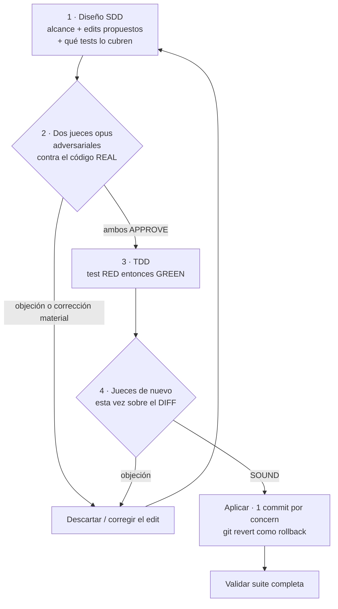
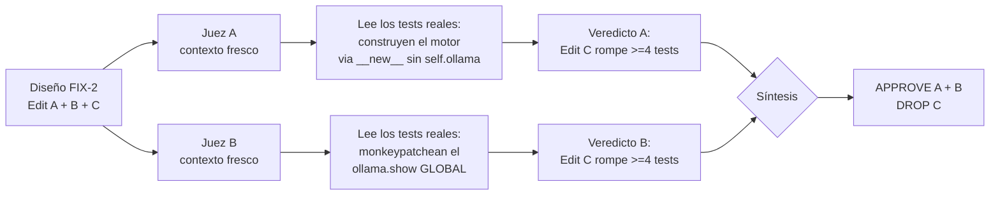

# ADR-027: Cómo atacamos los monstruos — diseño → jueces → aplicar

**Date**: 2026-06-30
**Status**: Reference / informational (documento vivo — el método, no una decisión a debatir)
**Branch**: `maintenance/big-file-audit-small-fixes-20260629`
**Author**: Claude Code orchestrator + workflows adversariales (diseño SDD + jueces opus + síntesis)
**Scope**: Documenta el *método de trabajo* sobre el core, no un cambio de código puntual. Casos reales tomados de `docs/audit_snapshots/big_file_audit_20260629/10_core_fixes_design.md` y de los commits `7a3c364`, `d3334dc`, `418fc1a`.

---

## Por qué existe este documento

Hay una clase de cambio que da miedo tocar: el que vive en el **core** y al que se aferran muchos tests. No porque sea grande —algunos son de tres líneas— sino porque cuando se rompe, se rompe *callado*. La inferencia sigue corriendo, los tests verdes siguen verdes, y meses después descubrís que Kira viene presupuestando el contexto contra `4096` tokens para *todos* los modelos. A ese tipo de cambio lo llamamos acá "el monstruo": chico de cuerpo, largo de consecuencias.

La tentación natural es atacarlo de frente: leer el código, hacer el edit que "obviamente" corresponde, correr la suite, commit. El problema es que esa secuencia tiene un agujero. El momento más peligroso —decidir *qué* tocar— es exactamente el momento en el que nadie te está mirando. La suite recién opina **después** de que ya escribiste el cambio, y si la suite comparte el mismo punto ciego que tu cambio (spoiler: pasa, y lo vas a ver más abajo), te aplaude un error.

Este ADR describe el método con el que decidimos atacar esos monstruos, y muestra **tres veces concretas** en que el método atajó un bug *antes* de que tocara el core. Si te llevás una sola idea, que sea esta: **la verificación más barata es la que ocurre antes de escribir el código, no después.**

---

## El método: un gate de cuatro tiempos

Para todo cambio sobre el core no aplicamos directo. Pasamos por un *gate* (una compuerta) con cuatro tiempos. La regla del gate la pidió el owner explícitamente, y quedó registrada en el diseño de los core-fixes: *"diseño SDD → 2 jueces opus adversariales independientes validan alcance+correctitud contra el código real → recién ahí aplicar"* (`10_core_fixes_design.md:4`).



Leído en una frase: **diseñás antes de tocar, dos jueces revisan el plan contra el código que existe de verdad, recién ahí escribís el test y el código, y los jueces vuelven a mirar el diff.** Los dos puntos de control (tiempo 2 y tiempo 4) son adversariales y *anteceden* a que el cambio llegue a `master`. Cada concern entra en su propio commit, así el rollback es un `git revert <sha>` quirúrgico y no una cirugía a corazón abierto (`10_core_fixes_design.md:29-30`).

Lo importante no es la ceremonia. Es **dónde** cae la verificación: el tiempo 2 ocurre cuando todavía no escribiste nada. Cuesta cero deshacer un plan. Cuesta caro deshacer un commit que ya rompió cuatro tests de otra persona.

---

## Por qué DOS jueces, y por qué adversariales

Un solo revisor tiende a leer lo que el autor *quiso* decir. Dos revisores **ciegos e independientes** —cada uno con contexto fresco, sin ver el veredicto del otro— tienen que llegar al mismo lugar por su cuenta. Si los dos, por separado, leen los mismos tests reales y los dos dicen "esto rompe", la señal es fuerte. Si discrepan, también aprendiste algo: el diseño era ambiguo.

"Adversarial" acá significa una cosa puntual: **el juez no valida el diseño contra sí mismo, lo valida contra el código que existe.** No pregunta "¿este edit es elegante?". Pregunta "¿qué tests tocan esta función, cómo construyen el objeto, qué monkeypatchean, y este edit los respeta?". Esa diferencia es la que convierte al gate en algo más que un sello de goma.



Workflow real: `wf_eb8f0fde-988` (1 diseño + 2 jueces + síntesis), registrado en Engram (`#2627`). Veamos qué cazó.

---

## Tres veces que el gate pagó

### Caso 1 — El "Edit C" que habría roto ≥4 tests

El FIX-2 (limpieza en `llm_engine.py`) venía con tres edits. Dos eran inofensivos: borrar `import re` locales que ya existían a nivel de módulo (`re` se importa en la línea 2). El tercero, el **Edit C**, parecía igual de obvio: en `_fetch_show` la llamada era al módulo global `ollama.show(...)`, y el diseño proponía "modernizarla" a `self.ollama.show(...)`.

Los jueces fueron a leer **cómo los tests construyen el motor** y encontraron el problema:

```python
# ANTES (intacto — lo que el código tiene, llm_engine.py ~:1489 según snapshot)
show = ollama.show(self.current_model)       # llama al módulo global

# DISEÑADO como "Edit C" — y DESCARTADO en el gate
show = self.ollama.show(self.current_model)  # llamaría a un atributo de instancia
```

¿Por qué rompe? Porque varios tests **no construyen el motor con su `__init__`**: lo crean con `MotorVocalIA.__new__(...)` para saltarse el arranque pesado, así que `self.ollama` **nunca existe**. Y para controlar la respuesta, hacen `monkeypatch.setattr(ollama, "show", fake)` sobre el **módulo global**. El Edit C habría apuntado la llamada a un `self.ollama` inexistente (`AttributeError`) y, de paso, habría esquivado el monkeypatch que los tests sí preparan. Resultado: **≥4 tests rotos por construcción** (`10_core_fixes_design.md:8,16`).

El veredicto del gate fue inequívoco: ambos jueces APPROVE en los tres fixes, **con una corrección material — Edit C DROPPED**. Se aplicaron solo A+B. El commit lo dice con todas las letras: *"The designed ollama.show->self.ollama.show swap was DROPPED at the judge gate"* (`7a3c364`).

La lección del caso: el edit que más "obvio" parece es justo el que nadie verifica contra los tests. El gate lo verificó.

### Caso 2 — La circularidad de las claves `gemma4`/`qwen3`

Este es el caso favorito para enseñar, porque muestra **por qué la suite te puede aplaudir un bug**.

`parse_model_ctx` descubre la ventana de contexto real de un modelo leyendo la respuesta de `ollama.show`. El código leía el campo así:

```python
# ANTES (context_budget.py) — leía un atributo que en ollama real NO existe
model_info = _get_field(show_response, "model_info")
```

El detalle fatal: el `ShowResponse` real de ollama (0.6.2, Pydantic) expone el diccionario como **`.modelinfo`**, no `.model_info` (`model_info` es solo un alias de clave, y por `getattr` devuelve `None`). Con `model_info = None`, el lookup de claves de arquitectura quedaba **muerto para toda respuesta real**, y el contexto caía siempre al `CTX_FALLBACK_DEFAULT = 4096` — sin importar que `llama3` sea 8192, `qwen3` 40960 o `gemma4` 131072 (`d3334dc`, `#2633`). Kira presupuestaba contexto contra 4096 para todos los modelos, y el guardrail de overflow recortaba demasiado temprano. Callado.

¿Por qué ningún test lo cazó en meses? Acá está la **circularidad**: cada mock de la suite **construía a mano un `.model_info`** —exactamente el atributo que el código bug leía—. El test y el bug se daban la razón mutuamente en un lazo cerrado. El mock alimentaba `model_info`, el código leía `model_info`, todos verdes. Nadie en ese círculo se parecía a la realidad.

```python
# DESPUÉS (context_budget.py:72-74) — lee el atributo real primero, dict/legacy como respaldo
model_info = _get_field(show_response, "modelinfo")
if model_info is None:
    model_info = _get_field(show_response, "model_info")
```

Y se agregaron las claves que faltaban en `_ARCH_CTX_KEYS`: `gemma4.context_length` (`context_budget.py:30`) y `qwen3.context_length` (`:33`) — antes solo estaban `gemma`/`qwen2`. Por eso el subtítulo del caso: **solo el run real las prueba.** El bug lo cazó la **primera** ejecución del test de entorno real (`tests/realenv/test_realenv_model_ctx.py`, la suite gated `OPENCOHOST_REALENV_TESTS=1`), corriendo `ollama.show` contra el modelo de verdad. Tres modelos, tres `xfail` → bug confirmado a mano. Ningún mock podía verlo, porque todos los mocks vivían dentro del círculo (`#2633`; commit `d3334dc`: *"Caught by the new realenv R1 test; no mock saw it"*).

La lección del caso: **un test que comparte el supuesto del código no es una verificación, es un eco.** Para romper el eco hace falta una fuente fuera del círculo — acá, el binario real de ollama.

### Caso 3 — El strip del `source` tag: reconstruir, no mutar

El último caso muestra el gate eligiendo *cómo* hacer un cambio, no solo *si* hacerlo.

Queríamos que cada entrada del historial llevara su origen (`source`: `direct`/`ptt` = host, `chat` = viewer, `kira-agenda`), para que el **Topic Scout** sugiriera temas a partir de la conversación del **host** y no del chat de viewers. El valor ya estaba en alcance en `_commit_history`; solo se estaba descartando. Entonces se etiquetó la entrada al guardarla:

```python
# DESPUÉS (llm_engine.py:1864-1865) — la entrada viva del deque ahora lleva su origen
self.historial.append({'role': 'user', 'content': safe_context, 'source': source})
self.historial.append({'role': 'assistant', 'content': dialogo, 'source': source})
```

Acá aparece el monstruo escondido. Esa misma lista (`self.historial`) se copia hacia los `messages` que van a `ollama.chat` — **el único camino por el que el historial llega a Ollama**. Si la clave `source` viaja hasta ahí, le estás filtrando metadata interna al modelo. La forma ingenua de evitarlo sería *mutar*: hacer `msg.pop('source')` antes de mandar. **Eso corrompe el historial**: estarías arrancándole el tag a la entrada *viva* del deque, justo la que el Scout necesita leer un instante después.

La solución correcta es **reconstruir, no mutar**. En el loop que arma el prompt se crea un dict fresco con solo `role` y `content`, dejando la entrada original intacta:

```python
# ANTES — se anexaba la MISMA entrada por referencia (con todo lo que tuviera dentro)
for msg in history_snapshot:
    messages.append(msg)

# DESPUÉS (llm_engine.py:1123) — dict nuevo: el source se proyecta afuera, el original queda tagueado
for msg in history_snapshot:
    messages.append({'role': msg['role'], 'content': msg['content']})
```

Así el `source` nunca llega a `ollama.chat`, y al mismo tiempo el deque conserva su tag para que el Scout filtre los turnos del host antes de cortar los últimos N (`llm_engine.py:1490-1494`). El commit lo deja explícito: *"REBUILD, not mutate — so the key never leaks to ollama.chat ... and the live deque entries keep their tag"* (`418fc1a`). El cambio pasó el gate completo: *"Gated explore->design->critique (SOUND)->TDD A-D->2 judges (SOUND)->validate. 255 passed."*

La lección del caso: cuando una estructura es **compartida por dos consumidores con necesidades distintas** (Ollama quiere `{role, content}`, el Scout quiere `source`), copiar es barato y mutar es una bomba de tiempo. El gate no inventó la regla; la hizo visible antes de aplicar.

---

## La lección de fondo: por qué la verificación adversarial paga en el core

Los tres casos comparten una forma. En los tres, el cambio "obvio" tenía un costo invisible que **solo se ve mirando algo externo al cambio**:

| Caso | Lo que el cambio asumía | La fuente externa que lo desmintió |
|---|---|---|
| Edit C | "la llamada es a una instancia" | cómo los tests construyen el motor (`__new__`, monkeypatch global) |
| `gemma4`/`qwen3` | "el campo se llama `model_info`" | el `ShowResponse` real de ollama (`.modelinfo`) |
| `source` tag | "puedo mutar la entrada para limpiarla" | el segundo consumidor de la misma lista (el Scout) |

La moraleja no es "agreguen jueces a todo". Es **dónde** poner la verificación. En código de aplicación, un test después del cambio suele alcanzar. En el **core** —donde muchos tests comparten supuestos con el código, donde un campo mal leído degrada en silencio, donde una estructura la tocan tres consumidores— el test *posterior* puede compartir tu punto ciego. Ahí, una verificación **previa y adversarial**, hecha contra el código y el runtime reales, atrapa lo que la suite verde no atrapa. Es más barata (deshacer un plan cuesta cero) y más honesta (no se cree el supuesto que vino a revisar).

Dicho corto: **la suite te dice que tu código hace lo que tu código cree. El run real y el juez adversarial te dicen si lo que tu código cree es verdad.** En el core, esa diferencia es la que separa un refactor limpio de un bug que vivirá meses.

---

## Cómo nos deja hoy

- **Los 3 core-fixes diferidos: aplicados, 0 pendientes.** `f07ad92` (UI grid duplicado), `7a3c364` (imports + estado muerto `_pending_switch_retries`), con Edit C correctamente descartado. Validación: 186 passed (`#2627`).
- **El bug de ctx-discovery: cazado y corregido.** `d3334dc` lee `modelinfo` con respaldo a `model_info`, y suma `gemma4`/`qwen3` a `_ARCH_CTX_KEYS`. Kira vuelve a presupuestar contexto contra la ventana real del modelo, no contra 4096.
- **El `source` tag: vivo y sin fugas.** `418fc1a` etiqueta el historial, lo reconstruye antes de Ollama, y habilita al Topic Scout host-only. Cambio firmado por el owner (puede dar cero sugerencias en sesiones dominadas por chat de viewers — intencional). 255 passed.
- **Una capa nueva fuera del círculo de mocks:** la suite `tests/realenv/` (gated por `OPENCOHOST_REALENV_TESTS=1`), que corre contra Ollama de verdad. La suite por defecto sigue liviana (sin carga de modelo); el run real es opt-in (`#2633`).

El gate dejó de ser una ceremonia y pasó a ser parte de cómo se trabaja el core: diseñar, dejar que dos jueces lo rompan en papel, escribir el test que falla, escribir el código que lo pasa, dejar que los jueces miren el diff, y recién ahí aplicar — un commit por concern, `git revert` a mano. Tres monstruos, tres veces que el método pagó.

---

## Referencias

**Código**
- `opencohost/core/context_budget.py:27-33` (`_ARCH_CTX_KEYS` con `gemma4`/`qwen3`), `:56` (`parse_model_ctx`), `:72-74` (lee `modelinfo` → `model_info`).
- `opencohost/core/llm_engine.py:1123` (rebuild del prompt), `:1490-1494` (Scout host-only), `:1864-1865` (`_commit_history` taguea `source`).

**Snapshots / commits**
- `docs/audit_snapshots/big_file_audit_20260629/10_core_fixes_design.md` (diseño + veredicto del gate, workflow `wf_eb8f0fde-988`).
- `7a3c364` (FIX-2/FIX-3, Edit C dropped) · `d3334dc` (ctx-discovery `modelinfo` + claves) · `418fc1a` (source tag rebuild-not-mutate) · `f07ad92` (FIX-1 UI).

**Engram (project `voiceai`)**
- `#2627` — 3 core fixes via design→judge→apply gate.
- `#2633` — realenv tests; bug `model_info` vs `modelinfo` cazado por el primer run real.
