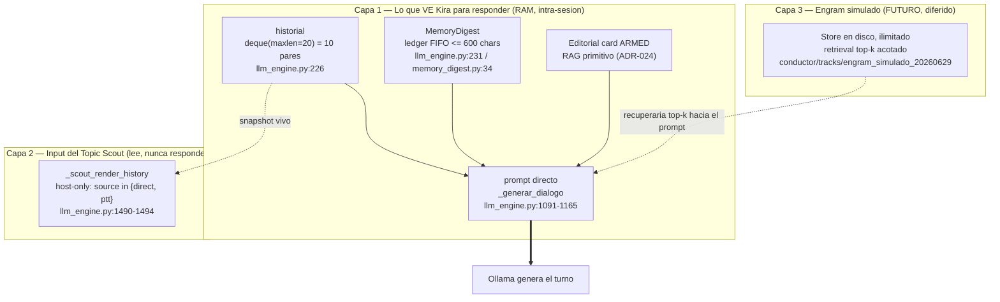
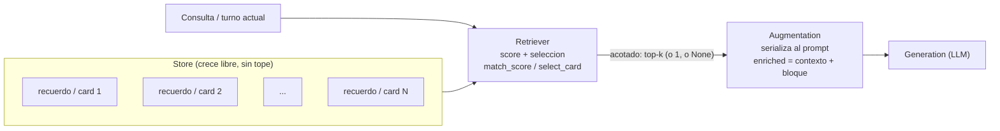
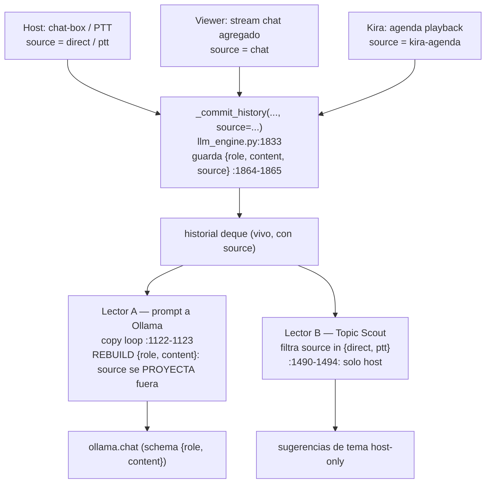

# ADR-028: La memoria de Kira — tres cerebros, las cards como RAG, y el camino al engram — Reference / Informational

**Date**: 2026-06-30
**Status**: Reference / informational (no behavior change — nombra y ordena lo que ya existe + deja escrito el futuro diferido)
**Branch**: `maintenance/big-file-audit-small-fixes-20260629`
**Author**: Claude Code orchestrator (memory-architecture audit pass)
**Scope**: Documento de lectura. Separa tres memorias que se venían confundiendo en las conversaciones de diseño, muestra que las Editorial Cue Cards ya son un RAG, explica cómo el `source` tag afila al Topic Scout, y enmarca el *engram simulado* como "generalizar el RAG de las cards a la conversación, con retrieval acotado en vez de un contexto que crece". Companion de [ADR-024](./ADR-024-editorial-cards-primitive-rag.md).

---

## Por qué existe este documento

Cada vez que hablábamos de "la memoria de Kira" terminábamos discutiendo tres cosas distintas como si fueran una sola. Alguien decía "Kira no se acuerda de lo que hablamos hace media hora" (memoria persistente), otro respondía "pero si tiene el historial de 10 turnos" (lo que ve para responder), y un tercero metía "el Scout debería sugerir temas de la charla" (el input del sugeridor). Tres cosas, una palabra. Y mientras esa palabra fuera ambigua, **cada mejora caía en la capa equivocada**.

Este ADR corta el nudo. Pone nombre a las tres memorias, las dibuja, y muestra el patrón que las une a todas — *retrieval acotado, no contexto que crece* — para que la próxima mejora aterrice donde tiene que aterrizar y no como un parche más.

> **TL;DR** — Kira tiene **tres** memorias, no una: (1) lo que VE para responder (historial de 10 turnos + MemoryDigest + card editorial), (2) lo que LEE el Topic Scout (turnos host vivos), y (3) la memoria persistente que todavía no existe (*engram simulado*, diferido). Las tres comparten un principio: **el prompt es un presupuesto, no un baúl**. Las cards editoriales ya demuestran ese principio funcionando — son un RAG primitivo. El engram es generalizar ese RAG a la conversación.

---

## 1. El monstruo: tres memorias que se confundían

El síntoma que disparó todo fue concreto. El owner notó que el sugeridor de temas mezclaba conversaciones: hablaba con Kira de LLMs locales, pero el Scout proponía temas que venían del chat de viewers (pizza, el clima, lo que fuera que estuviera más activo). La queja sonaba a "Kira no entiende de qué estamos hablando" — un problema de memoria. Pero no lo era. Era un problema de **qué memoria leía cada quién**.

La investigación (Engram `#2639`) encontró la raíz: el sugeridor de temas estaba **ciego a la conversación hablada**. Solo veía señales derivadas del chat de viewers, nunca los turnos del host. Y cuando construimos el Topic Scout para que SÍ leyera la conversación, apareció el segundo nivel del monstruo (Engram `#2646`): `self.historial` era **un único deque compartido** que mezclaba todos los orígenes —host, viewer, PTT— sin ninguna marca de procedencia. Host y viewer entraban los dos como `role="user"`, indistinguibles.

Así que el monstruo tenía dos cabezas:

1. **Conceptual** — nadie tenía claro cuál de las tres memorias estaba rota, porque las tres se llamaban "la memoria".
2. **Técnica** — aunque supieras cuál querías leer, no podías separarla: el deque no guardaba de dónde venía cada turno.

Lo atacamos en ese orden. Primero separamos los conceptos (este documento). Después agregamos la marca que faltaba (el `source` tag, §6). El resto de este ADR es ese recorrido.

---

## 2. Las tres capas de memoria



### Capa 1 — Lo que VE Kira para responder

Esta es la memoria de trabajo. Es lo que se ensambla en el prompt directo cada vez que Kira tiene que contestar (`_generar_dialogo`, `llm_engine.py:1091-1165`). Tiene tres ingredientes:

- **`historial`** — un `deque(maxlen=HISTORY_MAX_TURNS * 2)` (`llm_engine.py:226`). Con `HISTORY_MAX_TURNS = 10` (`settings.py:57`), son **20 mensajes = 10 pares** user/assistant. Guarda las réplicas verbatim de Kira y el contexto host sanitizado. Es RAM pura: se borra en `clear_history`, en cambio de perfil y al reiniciar.
- **`MemoryDigest`** — un ledger FIFO acotado a **600 chars** (`memory_digest.py:34`, instanciado en `llm_engine.py:231`). Cuando un par viejo se cae del `historial` por capacidad, se captura una línea lossy del estilo `contexto: <primeras palabras> → Kira: <primera oración>` (`_build_ledger_line`, `llm_engine.py:1883-1893`). Es la "L1 pipeline memory": sobrevive al cambio de modelo y al watchdog, pero **nunca toca disco** (`memory_digest.py:5`).
- **La card editorial activa** — si hay una card ARMED que matchea la consulta, su contexto se inyecta. Esto es el RAG de §5.

El comentario en `settings.py:57` es honesto sobre el porqué del 10: *"Reducido a 10 turnos para no desbordar el contexto de 4096"*. La Capa 1 es chica **a propósito**.

### Capa 2 — El input del Topic Scout

El Topic Scout (`scout_digest`, `llm_engine.py:1571-1629`) es un "tercer sugeridor" que en momentos de idle le pide al modelo cargado 2-3 temas adyacentes a la charla (ej.: hablando de LLMs → "regulación de LLMs"). **No es lo que ve Kira para responder** — es una lectura aparte, con otro propósito.

El Scout NO lee el `MemoryDigest` (que tiene turnos viejos evictados y suele errarle al tema vivo). Lee un **snapshot vivo** del `historial` (`llm_engine.py:1598-1599`) y lo filtra a host-only (`_scout_render_history`, `:1490-1494`). Esa fue una decisión explícita del owner (Engram `#2643`): el Scout pivotea sobre la conversación HOST genuina, no sobre lo último que pasó.

### Capa 3 — El engram simulado (futuro, diferido)

Las dos capas anteriores son **deliberadamente chicas y volátiles**. La Capa 3 es la que todavía no existe: una memoria **persistente en disco, ilimitada**, de la que en cada turno se recupera solo lo relevante y se inyecta una porción acotada (top-k) al prompt. "Memoria grande, ventana chica". Está diseñada en proposal/design (`conductor/tracks/engram_simulado_20260629/`, Engram `#2645`/`#2646`) pero **diferida** — porque persistir conversación es PII y eso es una decisión de producto, no de ingeniería (§7).

La clave que une las tres capas: **ninguna resuelve la memoria larga metiendo más historial en el prompt.** Esa es la lección de §8.

---

## 3. Por qué separarlas importa (no es taxonomía por gusto)

Confundir las tres capas no es un problema estético: **te lleva a arreglar la capa equivocada**. Tres ejemplos reales de este repo:

- "Kira no se acuerda de hace media hora" → suena a Capa 1, pero la Capa 1 es chica **a propósito** (presupuesto de 4096). La solución real vive en la Capa 3 (engram), no en agrandar el historial.
- "El Scout mezcla temas" → suena a Capa 1 ("Kira no entiende"), pero era Capa 2: el Scout leía un historial sin marca de origen. La solución fue el `source` tag (§6), que **no toca para nada la Capa 1**.
- "Metamos más contexto para que responda mejor" → tienta tocar la Capa 1, pero crecer el prompt rompe el KV-cache y dispara la latencia (§8). La respuesta correcta es retrieval acotado (Capa 3), no más baúl.

Una palabra ambigua hace que cada mejora apunte mal. Nombrarlas es la mitad del arreglo.

---

## 4. El patrón que las une: retrieval acotado

Las tres capas son instancias del mismo patrón. Vale la pena dibujarlo solo, porque es la idea central de todo el documento:



La regla de oro está en la flecha del medio: **el store crece libre; lo que se acota es lo que ENTRA al prompt.** "Cuánto recuerda Kira" (el store) queda desacoplado de "cuánto entra al prompt" (el presupuesto top-k). Ese desacople es lo que hace que la memoria pueda crecer sin que la latencia ni la calidad se degraden.

`MemoryDigest` ya vive bajo esa disciplina hoy: tiene cota dura de 600 chars (`memory_digest.py:34`) e inyección selectiva solo en el path directo (`llm_engine.py:1147-1159`). El engram simulado **generaliza** ese patrón; no lo contradice.

---

## 5. Las cards editoriales YA son un RAG primitivo

Acá está la parte que más gente subestima: el patrón de §4 **no es una idea futura, ya está en producción**. Las Editorial Cue Cards son, literalmente, un RAG (esto lo establece [ADR-024](./ADR-024-editorial-cards-primitive-rag.md) en detalle; lo resumo porque es la fundación del engram).

| Etapa RAG | Implementación que YA existe | Dónde |
|---|---|---|
| **Corpus / Store** | `EditorialCardStore` (SQLite), `list_armed()` como set recuperable | `editorial_cards.py` |
| **Retriever** | `match_score()` (token-overlap léxico) + `select_card()` (umbral 0.8, guards) | `editorial_matching.py:96-200` |
| **Augmentation** | `to_prompt_block()` → bloque `<editorial_context>` acotado | `editorial_agenda_bridge.py:71-134` |
| **Injection** | `direct_editorial_context_provider` → `enriched = f"{contexto}\n\n{editorial_block}"` | `llm_engine.py:1130-1138` |
| **Generation** | El LLM (Ollama) consume el prompt aumentado | downstream |

Es retrieval **léxico** (token-overlap, no embeddings) sobre un corpus **escrito a mano** por el operador, con un ciclo de vida ARMED→ACTIVE→USED. Eso lo hace *primitivo*, no menos RAG. La analogía de ADR-024 lo dice mejor: es el conductor de TV que prepara fichas antes del programa y, cuando surge el tema, **saca la ficha justa** — nadie se la dicta al oído en vivo.

Detalle importante para el engram: el path host-directo es **no-consumidor** (`resolve_direct_context`, `editorial_agenda_bridge.py:117-121`). Recupera e inyecta el contexto de una card ARMED **sin** cambiarle el estado. Recuperar sin consumir es exactamente lo que necesita una memoria de conversación: leés un recuerdo muchas veces sin gastarlo.

El engram simulado es: **tomar este mismo patrón y apuntarlo a un segundo corpus** — la conversación. Mismo store→retriever→augmentation acotada→generation; cambia *qué* se indexa (la charla, no fichas escritas a mano) y *quién* lo escribe (se escribe solo, no el operador).

---

## 6. El `source` tag: cómo afilamos al Scout

Para que el Scout pudiera leer host-only (Capa 2) necesitábamos algo que no existía: saber de dónde venía cada turno del `historial`. Ese fue el cambio quirúrgico de esta rama (commit `418fc1a`, Engram `#2658`).



El cambio fue mínimo porque el valor **ya estaba en alcance**: `_commit_history(self, contexto, dialogo, *, source="direct")` (`llm_engine.py:1833`) recibía `source` y lo descartaba al guardar. Ahora lo guarda en ambas entradas del par (`:1864-1865`). Las categorías:

| `source` | Categoría | Quién |
|---|---|---|
| `direct` / `ptt` | **host** | el operador hablándole a Kira |
| `chat` | **viewer** | chat de stream agregado |
| `kira-agenda` | propio de Kira | playback de agenda (`llm_engine.py:576`) |

Lo elegante es lo que pasó con los **dos lectores** del deque:

**Lector A — el prompt a Ollama.** Ollama espera mensajes `{role, content}`. Una clave extra `source` se filtraría hasta `client.chat`. La solución NO fue mutar los dicts guardados (`msg.pop("source")` corrompería el historial vivo), sino **reconstruir** un dict fresco en el loop de copia (`llm_engine.py:1122-1123`). El `source` se proyecta fuera al armar el prompt, y la entrada viva conserva su etiqueta. Antes/después del dato que viaja a Ollama:

```python
# Entrada GUARDADA en historial (con la etiqueta):
{'role': 'user', 'content': 'hablábamos de LLMs locales', 'source': 'direct'}

# Lo que REALMENTE llega a ollama.chat (rebuild en :1122-1123, sin source):
{'role': 'user', 'content': 'hablábamos de LLMs locales'}
```

**Lector B — el Topic Scout.** Acá el `source` es el héroe. `_scout_render_history` (`:1490-1494`) **filtra primero, recorta después**: toma del snapshot completo solo las entradas `source in {"direct","ptt"}`, y *después* se queda con las últimas `LLM_SCOUT_HISTORY_MSGS` (6). Filter-then-slice, no al revés — así el Scout ve los últimos 6 turnos host **reales**, no 6 turnos mixtos diluidos a los pocos host que sobrevivan.

### El bug en acción — antes/después del Scout

Sesión donde el host charla de LLMs pero el chat de viewers está activo con otra cosa. **Antes** (sin `source`, el Scout renderiza todo):

```
Host: hablábamos de cómo corren los LLMs locales en una 3060
Kira: sí, Ollama te deja correr gemma en 12 gigas sin sudar
Host: [chat] alguien pregunta si la piña va en la pizza        <- viewer, source="chat"
Kira: la piña en la pizza es un crimen tipificado
```

El Scout veía esa mezcla y sugería temas adyacentes a... la pizza. **Topic drift**: el síntoma exacto que reportó el owner.

**Después** (filtro `source in {direct, ptt}`):

```
Host: hablábamos de cómo corren los LLMs locales en una 3060
Kira: sí, Ollama te deja correr gemma en 12 gigas sin sudar
```

→ el Scout sugiere "regulación de LLMs", "privacidad de modelos locales". El input quedó afilado a la conversación host.

### El honesto: el Scout puede quedarse mudo

Hay una consecuencia firmada por el owner (Engram `#2658`, crítica adversarial): con el filtro host-only y `LLM_SCOUT_MIN_DIGEST_LINES = 2` (`settings.py:75`), una sesión dominada por viewer-chat con poco host puede dejar **menos de 2 líneas host** → el Scout devuelve `[]` (`llm_engine.py:1601-1602`). No es un bug: es la semántica correcta (sin conversación host, no hay temas host que sugerir). Pero es el cambio observable más filoso, y por eso se firmó explícitamente en vez de venderlo como "sugiere distinto".

---

## 7. El engram: generalizar el RAG de las cards a la conversación

Con el `source` tag puesto, el prerequisito del engram quedó resuelto (Engram `#2646`): ya se puede separar host de viewer, que es lo que la persistencia "host-only" necesita. El engram simulado (`conductor/tracks/engram_simulado_20260629/proposal.md`) es, en una frase: **las cards de §5, pero el corpus se escribe solo y además recuerda la conversación.**

Espeja la anatomía de las cards:

- **Store** persistente en disco, ilimitado, que **no se evicta por presupuesto** (crece; lo acotado es lo que se inyecta). Con granularidad por-persona: recuerda *con quién* habló, no solo *qué*.
- **Retriever** que arranca **reusando `match_score`/`select_card`** tal cual (token-overlap, cero dependencias nuevas — el proyecto banea deps tipo torch). Embeddings semánticos son un upgrade *medido y posterior*, no requisito de la v1.
- **Augmentation top-k acotada**: a diferencia de `select_card` (una card o None), recupera top-k recuerdos y los serializa con cota dura de chars — la misma disciplina de `MemoryDigest.build_block`.
- **Generation** sin cambios: mismo injection point que ya usan las cards (`llm_engine.py:1130-1138`).

**Por qué está diferido — y no es por vagancia.** Persistir conversación a disco es almacenar **PII**, aunque sea del propio operador. Hoy hay una decisión deliberada de que `MemoryDigest` nunca toque disco (`memory_digest.py:5`). El engram **invierte esa postura**, y eso exige consentimiento informado, redacción de PII en el borde del disco, cifrado a evaluar, y un "olvidar todo" real (hoy `clear_history` limpia solo RAM). Esa es una pregunta de **producto**, no de ingeniería: requiere una postura del owner sobre privacidad antes de escribir una línea. Mientras OpenCohost esté en modo *less-expansion* y la prioridad sea validación de runtime → rendering → launch, el engram queda como referencia, no como track activo.

---

## 8. La lección: retrieval acotado vs. crecer el contexto

Esta es la moraleja que justifica toda la arquitectura, y tiene un número detrás. La tentación natural ante "Kira no recuerda" es **meter más historial en el prompt**. El diagnóstico de la rama `prompt_efficiency_kvcache` (Engram `#2644`) muestra por qué eso es una trampa:

En el runtime real del owner, `prompt_eval_count` creció de **281 a 5480 tokens por turno**, con respuestas de 24-29 segundos. La causa: una vez que el `historial` se llena, cada turno tira el par más viejo del frente → el prefijo común que `llama.cpp` reusa del KV-cache se colapsa → **re-prefill completo del prompt cada turno**. Crecer el contexto no es gratis: pega contra un techo de TTFT y VRAM que se siente como lag.

Por eso las tres capas comparten el mismo principio — **el prompt es un presupuesto, no un baúl**:

| Estrategia | Qué pasa cuando la memoria crece |
|---|---|
| **Crecer el contexto** (meter más turnos) | Latencia y costo suben linealmente; techo duro en la ventana del modelo (4096); "lost in the middle" degrada la calidad; el KV-cache se rompe |
| **Retrieval acotado** (top-k al prompt) | El store crece libre en disco; el prompt queda chico y constante; traés 3 recuerdos pertinentes en vez de 50 turnos crudos |

Traer **3 recuerdos relevantes** le gana a **volcar 50 turnos crudos** — en latencia, en costo y en calidad. Las cards ya lo demuestran (recuperan UNA card relevante, no todas). El engram lo lleva a la conversación. Y `MemoryDigest` ya es la prueba de que la cota dura funciona. La memoria larga de Kira **no es un prompt más grande; es un retriever mejor.**

---

## 9. Cómo nos deja hoy

- **Las tres capas están nombradas y separadas.** Capa 1 (lo que ve Kira) intacta; Capa 2 (Scout) afilada a host-only; Capa 3 (engram) diseñada y diferida con disparadores claros.
- **El `source` tag está en producción** (commit `418fc1a`, 255 tests verdes según Engram `#2658`). Cada entrada del `historial` lleva su origen; el Scout filtra host-only; el prompt a Ollama queda limpio de la etiqueta.
- **El Topic Scout sigue DARK por default** (`SCOUT_ENABLED = False`, `settings.py:68`). Owe del owner: poner `SCOUT_ENABLED = True` y correr el test gated de realenv (`tests/realenv/test_topic_scout_realenv.py`, target `gemma4:e2b`) para validar que la adyacencia ("LLMs"→"regulación") funciona contra un modelo chico real. La adyacencia en un modelo chico está **sin probar** hasta ese run.
- **El engram simulado NO está construido.** Es proposal+design (gitignored), no gate de release. Se dispara solo por decisión explícita del owner: continuidad multi-sesión como feature + aceptar el trade-off de PII en disco.
- **No hubo cambio de comportamiento por este documento.** Es referencia. El único comportamiento que cambió en la rama fue el del Scout (host-only), firmado aparte.

El monstruo no era técnico, era de vocabulario. Una vez que las tres memorias tuvieron nombre, el arreglo técnico (el `source` tag) salió chiquito: una clave en un dict que ya estaba en alcance. Esa es la moraleja meta del ADR — **nombrar bien el problema es la mitad de resolverlo.**

---

## Referencias de código

- `opencohost/core/llm_engine.py:226,231` — `historial` (deque) y `_memory_digest` (Capa 1)
- `opencohost/core/llm_engine.py:1091-1165` — `_generar_dialogo`: ensamblado del prompt directo (lo que ve Kira)
- `opencohost/core/llm_engine.py:1122-1123` — copy loop: rebuild `{role,content}`, strip del `source` antes de Ollama
- `opencohost/core/llm_engine.py:1479-1506` — `_scout_render_history`: filtro host-only (Capa 2)
- `opencohost/core/llm_engine.py:1571-1629` — `scout_digest`: el Topic Scout y sus gates
- `opencohost/core/llm_engine.py:1833-1865` — `_commit_history`: guarda el `source` tag + eviction capture al digest
- `opencohost/core/memory_digest.py:5,34` — RAM-only nunca persistido; cota dura de 600 chars
- `opencohost/core/editorial_agenda_bridge.py:117-121` — `resolve_direct_context`: retrieval no-consumidor (RAG host-directo)
- `opencohost/config/settings.py:57,68,75` — `HISTORY_MAX_TURNS=10`, `SCOUT_ENABLED=False`, `LLM_SCOUT_MIN_DIGEST_LINES=2`
- `docs/adr/ADR-024-editorial-cards-primitive-rag.md` — las cards como RAG primitivo (la fundación)
- `conductor/tracks/engram_simulado_20260629/` — proposal + design del engram (Capa 3, diferido)
- `conductor/tracks/history_source_tag_20260629/design.md` — diseño del `source` tag
