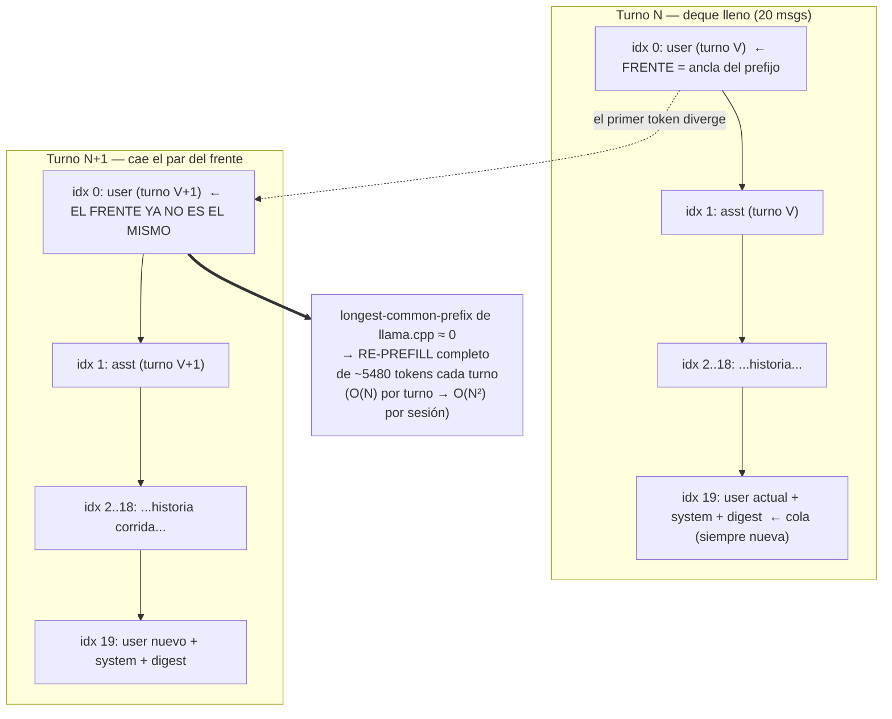
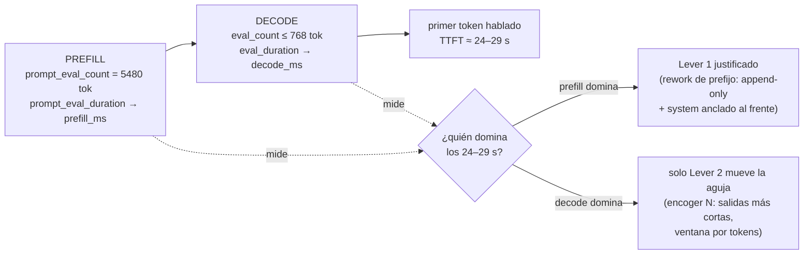

# ADR-029: Por qué Kira tarda en arrancar a hablar — KV-cache, front-eviction y measure-first

**Date**: 2026-06-30
**Status**: Reference / informational (documento de aprendizaje — sin cambio de comportamiento)
**Branch**: `maintenance/big-file-audit-small-fixes-20260629`
**Author**: Claude Code orchestrator + SDD explore/propose/design (track `prompt_efficiency_kvcache_20260629`)
**Scope**: Solo lectura y narrativa. Acompaña la propuesta/diseño del track de eficiencia de prompt y deja registrado el diagnóstico — incluida una hipótesis que resultó **falsa**, porque equivocarse bien también es parte del aprendizaje. Compañero de [ADR-013](./ADR-013-model-latency-vs-repetition-benchmark-rtx3060.md) (latencia vs repetición en hardware de consumo).

---

## Por qué existe este documento

Hay un momento incómodo cuando usás a Kira en vivo: hacés una pregunta y pasan **24 a 29 segundos** antes de que arranque a hablar. No es que el modelo "piense mucho". Es que cada turno **reprocesa casi todo el prompt desde cero**, en lugar de reusar el trabajo que ya hizo el turno anterior.

Este ADR cuenta la cacería de ese monstruo. Y tiene una vuelta de tuerca pedagógica: la **primera hipótesis era falsa**. Yo mismo le había dicho al owner que el culpable era el `MemoryDigest` reventando el cache. **Estaba equivocado.** El verdadero culpable es más sutil y más interesante: la **evicción por el frente** (front-eviction) de la ventana deslizante de historial. Corregir esa atribución no es un detalle — cambia por completo cuál es el fix correcto. Por eso vale la pena leer la historia entera, no solo la conclusión.

La lección final, si te llevás una sola: **medí antes de reescribir**. El `O(N²)` que duele acá es **reprocesamiento**, no búsqueda.

---

## El monstruo, en números (el "before")

En el runtime del owner, el campo `prompt_eval_count` que Ollama devuelve por turno crecía así durante el calentamiento de una conversación:

| Turno | `prompt_eval_count` | Qué está pasando |
|---|---|---|
| ~1 | **281** | Ventana casi vacía: prompt corto, prefill barato |
| ~4 | **1166** | La historia se va acumulando al final (tail) |
| ~7 | **2891** | Sigue creciendo; todavía es aditivo |
| ~10+ | **5480** | `deque` saturado (10 turnos) → meseta cerca del techo |

Dos hechos hacen de esto un monstruo y no una curiosidad:

1. **`prompt_eval_count` se reporta como número positivo grande, NO como `None`.** Esto importa muchísimo. El propio código documenta que un prompt servido **íntegramente desde el KV-cache** reporta `prompt_eval_count = None` (Ollama omite el campo), y por eso lo coacciona a `0` (`opencohost/core/context_budget.py:178-183`). Que veamos **5480** reportado significa, literal, **5480 tokens evaluados desde cero ese turno**. No es estimación: es la propia telemetría de Ollama confesando el re-prefill.

2. **Los 24–29 s** de TTFT (time-to-first-token) son ese prefill **más** el decode de hasta 768 tokens de salida.

Tené presente ese par `281 → 5480`: es la huella del monstruo. Todo lo que sigue explica por qué crece así y por qué no se queda cacheado.

---

## La hipótesis falsa (y por qué la cuento)

Mi primera explicación fue: *"el `MemoryDigest` inyecta `[hace N turnos]` y reetiqueta distancias cada turno; eso cambia el texto y revienta el prefijo cacheado"*. Suena razonable. **Y es falso.**

El digest vive **solo en el último mensaje de usuario** del prompt (`opencohost/core/llm_engine.py:1151-1159`). Es decir, en la **cola** (tail) del prompt — los tokens más nuevos. Y la cola **siempre se reprocesa igual**, tenga o no digest, porque por definición es lo único que cambió respecto al turno anterior. Un prefijo reutilizable es por el **frente**, nunca por la cola. Así que el digest no podía ser el prefix-buster: estaba apuntando al lugar equivocado del prompt.

Registré la corrección explícitamente en memoria (Engram `voiceai`, observación #2644, *"front-eviction busts KV-cache, not the digest"*). Lo dejo escrito acá a propósito: **una hipótesis plausible que apunta al subsistema visible y novedoso (el digest) es exactamente la clase de error que cuesta caro si la "arreglás" sin medir.** Habríamos tocado el digest, no habría mejorado nada, y el monstruo seguiría ahí.

---

## La verdad del terreno: cómo se arma el prompt

Antes de nombrar al culpable real, hay que ver **exactamente** qué se le manda a Ollama. El armado vive en `_generar_dialogo` (`opencohost/core/llm_engine.py:1091-1178`). En orden:

- Se toma un snapshot de `self.historial` bajo lock (`llm_engine.py:1106-1107`). Ese `historial` es un `deque(maxlen=HISTORY_MAX_TURNS * 2)` = **20 mensajes** (`llm_engine.py:226`, con `HISTORY_MAX_TURNS = 10` en `config/settings.py:57`).
- Según el perfil, hay **dos formas** de ensamblar (`llm_engine.py:1097-1165`):

  - **`use_system_role=True`**: `[{system: SYSTEM_PROMPT}] + historial + [{user: enriched}]`. El system prompt queda **al frente**, como ancla.
  - **`use_system_role=False` (el DEFAULT, `llm_engine.py:224`)**: `historial + [{user: SYSTEM_PROMPT + "\n\n[label]: " + enriched}]`. El system prompt se **pliega dentro del último mensaje** (`llm_engine.py:1163-1165`). No hay ancla al frente: el índice 0 del prompt es **el turno de usuario más viejo de la historia**.

Guardá esta distinción. Es la mitad del monstruo.

La otra mitad está en cómo se **guarda** cada turno. `_commit_history` (`llm_engine.py:1833-1865`) hace `append` de la respuesta de Kira **verbatim** — el texto completo, sin compactar (`llm_engine.py:1865`). Y `num_predict = LLM_MAX_TOKENS = 768` (`config/settings.py:38`), así que cada turno almacenado puede pesar **hasta ~768 tokens**. El cap del `deque` es por **turnos** (10), no por **tokens**.

---

## El monstruo real: front-eviction colapsa el prefijo

Acá está el corazón del asunto. Mientras el `deque` se va llenando (turnos 1 a 10), la historia es puramente **aditiva por la cola**: cada turno agrega mensajes al final y el frente no se mueve. El prefijo es estable, y de hecho durante el warm-up Ollama **sí** podría reusar buena parte… si hubiera ancla.

Pero una vez que el `deque` está **lleno** (más de 10 turnos), cada turno nuevo **descarta el par más viejo por el frente** (auto-evicción del `deque`). Y por si fuera poco, `apply_char_budget` y `trim_messages_reactive` también borran desde `messages[front:...]` (`opencohost/core/context_budget.py:131-136`). El frente del prompt **cambia cada turno**.

¿Por qué eso es fatal? Porque llama.cpp (el motor bajo Ollama) reutiliza el KV-cache haciendo **longest-common-prefix matching**: reusa tokens desde el principio **hasta el primer token que difiere**. Si el primer token ya cambió, el prefijo común es ~0 y **se reprefila todo**.



Y el **perfil default lo empeora**: con `use_system_role=False`, ni siquiera hay un bloque `system` fijo al frente que sirva de ancla. El índice 0 es directamente el turno de usuario más viejo — el que justo se va a eviccionar. Prefijo común ≈ 0, **el prompt entero se reprocesa**. En el caso `use_system_role=True` al menos el bloque system ancla algo; en el default no ancla nada. Por eso el código de eviccion protege el índice 0 **solo si** es un mensaje `system` (`context_budget.py:125-126`): en el path default, ese índice es plenamente evictable.

**Conclusión del diagnóstico:** el prefix-buster no es el digest (cola, siempre reprocesada). Es la **evicción por el frente de la ventana deslizante**, agravada por un perfil default sin ancla.

---

## Por qué 5480 bajo un cap de "solo 10 turnos"

La pregunta natural del owner fue: *"si guardo solo 10 turnos, ¿cómo llego a 5480 tokens?"*. La respuesta es la combinación de dos decisiones de diseño:

- **El cap es por TURNOS, no por TOKENS** (`HISTORY_MAX_TURNS = 10`). Diez turnos no acotan los tokens.
- **Las respuestas se guardan verbatim** (`llm_engine.py:1865`), y el perfil "Akira (Learn)" produce respuestas largas (hasta ~768 tokens). Diez turnos verbosos de ~768 tokens, más los contextos de usuario, más el system prompt, más el digest → **varios miles de tokens**. 5480 es perfectamente consistente con una ventana de 10 turnos **saturada de respuestas largas**.

Por eso el crecimiento `281 → 1166 → 2891 → 5480` es simplemente el `deque` **llenándose** de turnos verbatim hasta saturar (~turno 10), y después una meseta cerca del techo de la ventana. No hay fuga ni bug: es el comportamiento esperado de "cap por turnos + guardado verbatim".

---

## Measure-first: ¿prefill o decode? (lo único ya aplicado)

Acá viene la disciplina. Sabemos que `prompt_eval_count` llega a 5480 (eso ya estaba instrumentado). Pero los **24–29 s** son **prefill + decode**, y **no sabíamos la proporción**. El motor leía `prompt_eval_count` pero **nunca logueaba** `prompt_eval_duration` ni `eval_duration` — los dos campos que dicen cuánto tiempo de pared se fue en cada fase.

Sin esos dos números, cualquier "esto ahorra X segundos" es **adivinar**. Y adivinar es justo lo que nos llevó a la hipótesis falsa.

Por eso lo **único que se aplicó** en este track es pura observabilidad — commit **`c428574`** (*"feat(obs): log prefill/decode wall-time split"*). La línea `ctx_utilization` ahora emite el split (`opencohost/core/llm_engine.py:1312-1327`):

**Before** (lo que se logueaba):
```
ctx_utilization: model=llama3 prompt_eval_count=5480 num_ctx=4096 ratio=1.338
```

**After** (commit c428574 — mismo lugar, tres campos nuevos):
```
ctx_utilization: model=llama3 prompt_eval_count=5480 num_ctx=4096 ratio=1.338 \
                 prefill_ms=21000 decode_ms=6000 eval_count=512 source=direct
```

Cero cambio de comportamiento: Kira dice y recuerda exactamente lo mismo. Solo ahora **podemos ver** qué fracción del TTFT es prefill. Ese número decide el camino:



Esto es lo elegante del enfoque: **el mismo número (`prefill_ms` vs `decode_ms`) descarta o justifica el rework caro.** No invertís semanas en estabilizar el prefijo para descubrir que el cuello era el decode de 768 tokens, donde ningún prefijo perfecto te salva.

---

## Las dos palancas (y por qué solo una es accionable hoy)

**Lever 1 — estabilizar el prefijo (KV-prefix stability).** Suena ideal: "procesá cada token una sola vez". Pero solo sirve si el prefijo **deja de cambiar**. Y la ventana deslizante lo cambia cada turno por construcción. Para lograr reuso real necesitarías: (a) un contexto **append-only** que crezca hasta el ctx y luego **resuma-y-resetee** en vez de eviccionar por el frente, (b) el system prompt **anclado al frente** (`use_system_role=True` o reestructurar el path plegado), y (c) commitear **los mismos tokens** que se promptean (sacar digest/editorial de la región reusada). Eso es un **rework arquitectónico, no un knob**. Queda fuera de alcance, condicionado a que la medición muestre que **prefill domina**.

**Lever 2 — encoger N (la accionable).** Como la front-eviction ya impide el reuso del prefijo **hoy**, lo único que reduce el prefill **en la arquitectura actual** es **achicar la cantidad de tokens en la ventana**. Dos sub-palancas, ambas diseñadas pero **apagadas por default** (mergean "en oscuro", el owner las prende tras leer los números):

- **Cap de ventana por presupuesto de tokens** junto al cap por turnos.
- **Compactar las respuestas de Kira antes de guardarlas** en historial.

Ejemplo concreto del "before/after" de la compactación (Lever 2, aún no activada):

**Before** — lo que `_commit_history` guarda hoy (verbatim, ~768 tokens):
```
Kira: "Mirá, lo de GTA 6 es un clásico de la industria. Anuncian, generan hype,
y después el delay. Pasó con Cyberpunk, pasó con medio catálogo... [continúa
600+ palabras con tangentes sobre el modelo de negocio, anécdotas, etc.]"
```

**After** — lo que un compactador heurístico guardaría (~150 tokens, solo para turnos futuros; el turno vivo ya se dijo completo):
```
Kira: "Lo de GTA 6 es el ciclo clásico hype→delay, como Cyberpunk."
```

El turno que el espectador escuchó **no cambia** (ya se emitió completo). Lo que cambia es lo que entra al historial para los **próximos** turnos → baja `prompt_eval_count` en estado estable de forma aproximadamente proporcional. **Pero** es un cambio de comportamiento real: Kira pasa a recordar un **resumen**, no el texto exacto, y eso puede romper callbacks y chistes recurrentes. Por eso **requiere sign-off del owner** y un flag para volver atrás.

---

## Cómo nos deja parados esto hoy

| Pieza | Tipo | Estado | Default al mergear |
|---|---|---|---|
| Telemetría prefill/decode (`c428574`) | Observabilidad | **Aplicado** | Activo (solo amplía un log) |
| Bench harness measure-first | Test gateado | Diseñado | Skipped sin `OPENCOHOST_REALENV_TESTS=1` |
| Cap de ventana por tokens (`HISTORY_CTX_CAP`) | Observable | Diseñado, off | `None` = idéntico al actual |
| Compactar respuestas (`HISTORY_COMPACT_ASSISTANT`) | Observable, alto riesgo | Diseñado, off | `False` = verbatim, idéntico |
| Lever 1 (rework de prefijo) | Arquitectónico | Fuera de alcance | Sin cambio — requiere track propio + sign-off |

Hoy estamos en el punto **correcto y honesto**: el diagnóstico está bien atribuido (front-eviction, no el digest), la corrección de la hipótesis quedó registrada, la **única** cosa aplicada es la medición que faltaba, y los dos fixes con costo de comportamiento esperan **datos + sign-off**. El monstruo está identificado y desarmado conceptualmente; lo que falta es leer `prefill_ms` vs `decode_ms` en runtime para elegir entre apretar N (Lever 2) o justificar el rework (Lever 1).

---

## La lección (llevátela aunque olvides el resto)

1. **El `O(N²)` acá es REPROCESAMIENTO, no búsqueda.** No hay un loop anidado en el código; el cuadrático nace de "cada turno reprocesa toda la ventana, y la ventana crece con los turnos". Buscar un `for` dentro de un `for` te hubiera hecho perder el día.
2. **El prefijo se reusa por el FRENTE; la cola siempre se reprocesa.** Por eso el digest (cola) era inocente y la front-eviction (frente) era culpable. Saber **dónde** vive cada cosa en el prompt es la mitad del diagnóstico.
3. **Medí antes de reescribir.** La hipótesis del digest era plausible y falsa. El antídoto no fue ser más listo: fue **loguear `prompt_eval_duration`/`eval_duration`** y dejar que el número decida. Un commit de observabilidad de 12 líneas (`c428574`) protege contra semanas de rework injustificado.

---

## Referencias (todo anclado a código real)

- **Armado del prompt y dos paths**: `opencohost/core/llm_engine.py:1091-1178` (default `use_system_role=False` en `:224`; plegado del system en el último mensaje `:1163-1165`; digest tail-only `:1151-1159`).
- **Guardado verbatim + captura de evicción**: `opencohost/core/llm_engine.py:1833-1865` (`_commit_history`, append verbatim en `:1865`).
- **Telemetría prefill/decode (measure-first)**: `opencohost/core/llm_engine.py:1312-1327` — commit **`c428574`**.
- **Front-eviction (la causa raíz)**: `opencohost/core/context_budget.py:95-138` (anclaje del frente solo si `system` en `:125-126`; `del messages[front:...]` en `:131-136`); coerción `None`→`0` para prompts servidos desde KV en `:178-183`.
- **Settings**: `config/settings.py` — `LLM_MAX_TOKENS=768` (`:38`), `LLM_KEEP_ALIVE="7m"` (`:43`), `CTX_FALLBACK_DEFAULT=4096` (`:47`), `CHAR_BUDGET_SAFETY_FACTOR=3.5` (`:48`), `HISTORY_MAX_TURNS=10` (`:57`).
- **Track SDD**: `conductor/tracks/prompt_efficiency_kvcache_20260629/proposal.md` (explore + proposal + design).
- **Memoria del diagnóstico y la corrección**: Engram `voiceai`, observación **#2644** — *"Prompt re-prefill diagnosis: front-eviction busts KV-cache, not the digest"*.

---

## Runtime validation — 2026-06-30 (live gemma4 session)

**Contexto de sesión:** perfil Akira, modelos gemma4 (fast + slow tier), 2026-06-30 12:09–14:33. Sin cambios de código — observación del sistema vivo post-commit c428574.

### Qué valida

**La instrumentación (commit c428574) funciona en producción.** Cada línea `ctx_utilization` emitida durante la sesión tenía todos los campos completos: `prompt_eval_count`, `num_ctx`, `ratio`, `prefill_ms`, `decode_ms`, `eval_count`, `source`. El prerequisito *measure-first* queda satisfecho.

**El TTFT está dominado por DECODE, no por prefill.** Números reales de la sesión:
- `prefill_ms`: 421–1640 ms, creciendo lentamente a medida que `prompt_eval_count` subió de 558 a 6357 tokens durante el warm-up.
- `decode_ms`: 6587–17490 ms (grande, consistente en todos los turnos).
- Tiempo de pared LLM completo: 7–19 s por turno.
- Primer fragmento TTS: 0.08–2.3 s (arranque streamed).
- Pipeline TTS completo: 54–127 s por respuesta.

**Conclusión apoyada por los datos: Lever 2 (compactar respuestas verbosas) es la palanca correcta.** Respuestas más cortas reducen tanto el tiempo de decode como la longitud total del pipeline TTS. **Lever 1 (rework de prefijo) es de BAJA prioridad para gemma** — el prefill ya es barato en relación al decode; eliminar el re-prefill por completo ahorraría a lo sumo ~1 s en un turno de 7–19 s.

**La verbosidad es el driver dominante de latencia.** `eval_count` fue 700–1156 tokens por respuesta → 10–27 fragmentos TTS por turno. El pipeline TTS (54–127 s) es muy superior al LLM (7–19 s), y ambos escalan con la longitud de salida. Compactar las respuestas almacenadas (Componente C del design) y/o acotar la longitud de salida atacan el cuello real.

### Qué no prueba / deja abierto

**La hipótesis de prefix-reuse (Lever 1) no se midió directamente.** `prefill_ms` creció aproximadamente en forma lineal con `prompt_eval_count` (consistente con re-prefill), pero no se corrió un A/B contra una condición de prefijo estable. Los datos confirman que el re-prefill ocurre y que es barato para gemma; no dicen qué pasaría con un prefijo estable.

**Sin datos de modelos no-gemma.** El fast-tier qwen3 nunca realizó una inferencia en esta sesión. La conclusión "decode domina" aplica a gemma4; el comportamiento de qwen3 queda sin validación por datos en vivo.

### CRÍTICO — telemetría engañosa en `ctx_utilization` (owed item)

**`num_ctx=131072` en el log de `ctx_utilization` es misleading para gemma.** Verificado en código: `llm_engine.py:1193-1194` hace `pop` de `num_ctx` en `opciones_llm` para gemma antes de llamar a Ollama — el campo nunca se envía. Gemma corre con el default de su modelfile, NO con 131072. El campo que se imprime como `num_ctx=` en `llm_engine.py:1313` (`_ctx_for_obs = self._model_ctx_limit`) refleja el techo de contexto nativo descubierto, no el `num_ctx` efectivo que recibe Ollama. En consecuencia, `ratio` = tokens de prompt vs techo nativo (indicador de headroom), no utilización del KV cache.

**El path primario de gemma se confirmó SEGURO en vivo** — la preocupación del "agravante gemma" de la propuesta no se materializa a esta escala, porque gemma nunca recibe una solicitud `num_ctx=131072`.

**Recomendación (sin cambio de código en este ADR):** renombrar el campo de log de `num_ctx=` a `native_ctx=` (o añadir un campo paralelo `effective_num_ctx=`) para que la línea deje de implicar que gemma está asignando un KV cache de 131072 tokens. Es un fix de claridad de telemetría; no cambia ningún comportamiento. Se recomienda incluir en el próximo touch a Componente A o como fix de label standalone.
