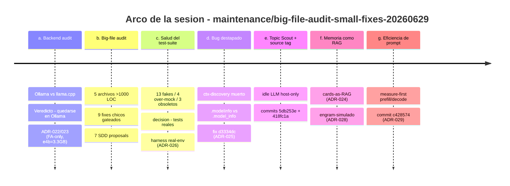
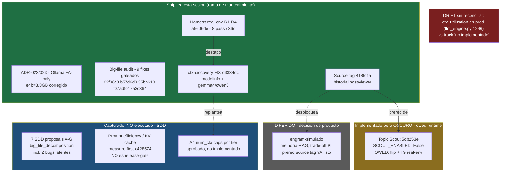

# ADR-030: Diario de decisiones — qué hicimos, por qué, y dónde nos deja

**Date**: 2026-06-30
**Status**: Reference / informational (no hay cambio de código en este ADR — narra y enlaza la sesión)
**Branch**: `maintenance/big-file-audit-small-fixes-20260629`
**Author**: Claude Code orchestrator (cierre de sesión, sobre el resumen Engram #2638)
**Scope**: Documento de lectura. Cuenta el arco completo de una sesión de *pre-release hardening* — de la auditoría de backend al bug de producción que destapó el harness — y deja el mapa de en qué estado quedó cada track. No cambia comportamiento; es la pieza "cómo nos deja actualmente".

---

## Por qué existe este diario

Una sesión larga deja dos cosas: commits y memoria que se evapora. Los commits cuentan el *qué*; casi nunca el *por qué*, y nunca el "qué quedó debiendo". Este ADR es el pegamento: toma el resumen de sesión (Engram #2638) y lo convierte en algo que el dueño pueda **leer dentro de seis meses** y reconstruir no solo qué se tocó, sino qué decisión había detrás y qué seguía pendiente.

Hay un hilo conductor en toda la sesión, y conviene nombrarlo de entrada porque es "el monstruo" que atacamos siete veces seguidas: **las suposiciones que se miran lindas pero nadie midió.** "llama.cpp es más rápido". "e4b ocupa 9.6 GB". "los tests verdes prueban que funciona". "el digest es lo que rompe el cache". Cada parada de la sesión es la misma jugada: agarrar una creencia cómoda, medirla contra la realidad (un `ollama ps`, un test contra Ollama de verdad, un log de wall-time) y dejar que el dato decida. El resultado, varias veces, fue **borrar trabajo** que íbamos a hacer porque la premisa no se sostenía. Esa es la disciplina de la sesión: *measure-first*, dentro de un modo de operación de *menos expansión, más validación*.

---

## El arco, de un vistazo



Cada parada abajo responde lo mismo: **cuál era el objetivo, cuál era el propósito, cómo atacó al monstruo, cómo nos deja, y qué quedó OWED** (debido, pendiente del dueño).

---

## (a) Auditoría de backend: Ollama vs llama.cpp → quedarse, y endurecer

**Objetivo.** Responder una pregunta honesta del dueño: una vez que ya bajaste todos los modelos por Ollama, ¿no conviene correrlos por **llama.cpp pelado** y ganar latencia?

**Propósito.** Release-readiness. Si hay un cambio de backend que mejora la experiencia del co-host en vivo, hay que saberlo *antes* de lanzar, no después.

**Cómo atacó al monstruo.** Una auditoría de 8 agentes (mapa de acoplamiento, sonda de entorno, research, crítica adversaria) fue a buscar el "llama.cpp es más rápido" hasta la raíz. El dato que cierra el caso: **Ollama *es* llama.cpp por dentro.** Tras el PR #16031 (mergeado 2026-05-29) Ollama eliminó su motor Go propio y dejó `llama-server` (llama.cpp upstream) como único motor para GGUF. En una caja Windows + RTX 3060, el 100% de la inferencia ya pasa por llama.cpp. No hay kernel más rápido al que migrar — la única cosa que "cambiar a llama.cpp" remueve es la capa fina de gestión (swap por nombre, `keep_alive`, descarga, sizing de capas GPU), que es justo lo que da valor de producto. Veredicto: **quedarse en Ollama, endurecer su config** ([ADR-022](./ADR-022-llm-backend-ollama-vs-llamacpp.md)).

Y acá apareció la **corrección estrella de la sesión**. El primer borrador del hardening seteaba tres perillas (flash attention + `KV_CACHE_TYPE=q8_0` + `GPU_OVERHEAD=1GiB`) para salvar a `gemma4:e4b` —que creíamos de **9.6 GB**— del precipicio de VRAM. Un `ollama ps` en vivo desmintió la premisa: e4b es un *slice* elástico de Gemma 3n que resuelve a **~3.3 GB residentes** a Q4_K_M, 100% en GPU, con ~6.8 GB libres a `num_ctx=8192`. Los 9.6 GB eran el **blob en disco**, leído como si fuera VRAM. Resultado: dos de las tres perillas resolvían un problema inexistente, **se borraron**, y quedó solo flash attention ([ADR-023](./ADR-023-ollama-config-hardening-12gb.md)).

**Cómo nos deja.** En Ollama, con `OLLAMA_FLASH_ATTENTION=1` como `setdefault` en `ollama_startup.py`, y con el inventario de modelos corregido (e4b cómodo, no al borde). Decisión cerrada, reversible, documentada.

**OWED.** Ejercitar FA de verdad: `OLLAMA_FLASH_ATTENTION` es una variable de **nivel daemon**; nuestra corrida del 06-29 fue *baseline* porque el daemon ya estaba corriendo y el `setdefault` nunca disparó. El dueño debe setearla como variable de **sistema** de Windows y arrancar el daemon en frío para confirmar FA-on en la familia gemma4 (que post-data la lista de auto-FA).

---

## (b) Auditoría de archivos grandes: 9 fixes chicos gateados + 7 SDD proposals

**Objetivo.** Cinco archivos de producción superan las 1000 LOC. Auditarlos buscando bugs y *smells*, arreglar lo seguro, y **proponer** (no ejecutar) lo grande.

**Propósito.** Mantenibilidad pre-release sin abrir tracks nuevos. El modo de operación es explícito: *less-expansion*. La regla de la sesión fue un **gate**: cambios chicos y seguros van directo a la rama de mantenimiento; cualquier cosa arquitectónica se convierte en una **SDD proposal** y espera decisión del dueño.

**Cómo atacó al monstruo.** "Archivo grande = hay que refactorizarlo ya" es otra suposición cómoda. En vez de eso, auditores opus + jueces produjeron snapshots numerados (`docs/audit_snapshots/big_file_audit_20260629/00-10`) y separaron el grano de la paja. Lo seguro se aplicó: corrección de padding de versión + NOTE de Ollama en el launcher (`02f36c0`), código muerto / evicción O(1) / tags en stream-admin (`b57d6d3`), un *no-op* muerto en agenda (`35bb610`), un bloque `Ayuda`-tab duplicado en `app_shell` (`f07ad92`), imports redundantes + el atributo muerto `_pending_switch_retries` en `llm_engine` (`7a3c364`). Las tres correcciones de *core* pasaron por un gate más estricto pedido por el dueño: **diseño → 2 jueces opus adversarios independientes → aplicar solo si APRUEBAN** (workflow `wf_eb8f0fde-988`, Engram #2627).

**Cómo nos deja.** Cinco archivos más limpios, todo gateado, suite afectada verde. Lo grande quedó **capturado, no ejecutado**: 7 SDD proposals en `docs/sdd_tracks/big_file_decomposition_20260629.md`.

**OWED.** Las 7 proposals A-G esperan decisión. Dos de ellas no son refactors cosméticos sino **bugs latentes** que la auditoría destapó: (1) una *race* `self.after` cross-thread en `app_shell` (corroborada vía el thread daemon de `chat_source`) y (2) un *retry-budget* compartido que puede devolver un LLM vacío en silencio. Esas dos merecen prioridad cuando se retome la decomposición.

---

## (c) Harness real-env: cuatro tests que cargan Ollama de verdad

**Objetivo.** Una auditoría de salud del test-suite encontró la grieta: ~13 tests fake/triviales, 4 sobre-mockeados, 3 obsoletos. El problema de fondo: **mockear Ollama esconde la forma real de su respuesta.** Construir un harness opt-in que pruebe contra un Ollama vivo.

**Propósito.** Release-readiness con honestidad. Un test verde que miente es peor que no tener test. Pero correr modelos en cada `pytest` es inviable en una 3060 (el dueño ya mató corridas que construían Tk + cargaban modelos y se comían la RAM) — así que la restricción dura fue: **el `pytest` por defecto tiene que seguir siendo rápido.**

**Cómo atacó al monstruo.** `tests/realenv/` nace gateado: salta salvo `OPENCOHOST_REALENV_TESTS=1`. Cuatro tests reales — R1 contexto, R2 reasoning budget, R3 inference watchdog, R4 chaos stream — que cargan modelos de verdad (`a5606de`). Las 8 aserciones pasan contra Ollama real en ~36s, verificado de punta a punta esta sesión. Y la suite por defecto **sigue rápida**: 149 passed / 8 skipped en ~3s, los real-env se saltan sin cargar un solo modelo.

**Cómo nos deja.** Con una segunda línea de defensa que ningún mock puede dar: una vez por release, con un comando explícito, los caminos críticos se ejercitan contra el motor real.

**OWED.** Nada bloqueante acá — pero ver (d), porque este harness **inmediatamente ganó su sueldo**.

---

## (d) El bug que el harness destapó: ctx-discovery muerto en producción

Esta es la mejor historia de la sesión, porque es el harness de (c) justificándose en su primer día.

**Objetivo (emergente).** El test real-env R1 falló donde todos los mocks pasaban. Investigar y arreglar.

**Propósito.** Corrección de un bug de producción silencioso — el peor tipo, el que no tira excepción.

**El bug.** `context_budget.parse_model_ctx` leía el campo `model_info`. Pero el `ShowResponse` real de Ollama expone ese campo como atributo **`.modelinfo`** (en Pydantic, `model_info` es solo un *alias* de clave, no un atributo). Los mocks construían a mano un `.model_info` y por eso pasaban; la respuesta real nunca tenía ese atributo. Consecuencia: la búsqueda de contexto **moría en toda respuesta real** y caía siempre al fallback de **4096** para *todos* los modelos — cuando llama3 nativo es 8192, qwen3 es 40960 y gemma4 es 131072. El guardrail de overflow estaba presupuestando contra 4096 un modelo que tenía 32× más ventana. Y de yapa, `_ARCH_CTX_KEYS` ni siquiera tenía las claves `gemma4`/`qwen3`.

**Antes / Después** (`opencohost/core/context_budget.py`):

```python
# ANTES — leía solo el alias; .modelinfo real nunca matcheaba → 4096 SIEMPRE
model_info = _get_field(show_response, "model_info")

# DESPUÉS (commit d3334dc, context_budget.py:72-74) — atributo real primero,
# clave legacy/dict como respaldo
model_info = _get_field(show_response, "modelinfo")
if model_info is None:
    model_info = _get_field(show_response, "model_info")
```

```python
# Y _ARCH_CTX_KEYS (context_budget.py:27-35) sumó las dos arquitecturas faltantes:
_ARCH_CTX_KEYS = (
    "llama.context_length",
    "gemma.context_length",
    "gemma4.context_length",   # ← nuevo
    "phi3.context_length",
    "qwen2.context_length",
    "qwen3.context_length",    # ← nuevo
    "mistral.context_length",
)
```

| Modelo | Ventana nativa real | Lo que descubría ANTES | DESPUÉS |
|---|---|---|---|
| llama3 | 8192 | 4096 | 8192 |
| qwen3 | 40960 | 4096 | 40960 |
| gemma4 | 131072 | 4096 | 131072 |

**Cómo atacó al monstruo.** Frontal: "los tests verdes prueban que funciona" cayó porque los tests verdes estaban mintiendo sobre la forma del dato. El arreglo se hizo con strict-TDD — 3 unit tests RED→GREEN en `tests/test_context_budget.py` — y el real-env R1 pasó de `xfail` a verde.

**Cómo nos deja.** Con descubrimiento de contexto **realmente funcionando** por primera vez. Eso es importante porque varias cosas dependían de ese número y estaban operando a ciegas.

**OWED.** Un efecto secundario delicioso: ahora que ctx-discovery funciona, el cap de `num_ctx` por tier (A4: fast=6144 / balanced=quality=4096, aprobado pero no implementado) **interactúa con la ventana ahora-correcta**. Antes el cap era irrelevante porque todo era 4096; ahora hay que pensarlo de nuevo. Ver §OWED consolidado.

---

## (e) Topic Scout: un LLM ocioso que sugiere temas, escuchando solo al host

**Objetivo.** El dueño quería que Kira propusiera temas adyacentes derivados de la conversación en vivo (hablando de LLMs → sugerir "regulación de LLMs"). La investigación encontró que la *feature no existía*: nada miraba el hilo de conversación para proponer agenda.

**Propósito.** Expansión de producto — pero contenida y oscura por defecto, fiel al modo *less-expansion*.

**Cómo atacó al monstruo.** Acá el monstruo fue distinto: **el riesgo de que una feature nueva pise lo que ya funciona.** `scout_digest()` (`llm_engine.py:1571`) corre solo en idle, toma una foto del hilo vivo (`self.historial`, últimos mensajes, bajo `_history_lock`, sanitizado) y le pide al modelo cargado 2-3 títulos adyacentes cortos, ruteados como **DRAFTED** hacia el inbox de temas con aprobación humana. Nunca preempta a Kira: gateado por `SCOUT_ENABLED` (False por defecto), modelo cargado, sin switch pendiente, no procesando, no hablando. Y para no pelear con el único *runner* de Ollama, usa un cliente dedicado de timeout corto (`LLM_SCOUT_TIMEOUT=8s`): si se cuelga, cierra el socket → Ollama cancela → el runner se libera en ~8s, sin gatillar recovery ni swap de modelo (commit `5db253e`, DARK).

**El prerequisito que volvió a aparecer — el source tag.** Para que el Scout escuche *solo al host* (y no a la chat de viewers) hubo que arreglar algo estructural: `historial` era un único *deque* compartido que mezclaba host/viewer/ptt **sin etiqueta de origen por entrada**. El valor de `source` ya existía en la llamada a `_commit_history` y se estaba **descartando**. La sesión lo recuperó (commit `418fc1a`):

```python
# DESPUÉS — _commit_history etiqueta cada turno con su origen
self._commit_history(contexto, dialogo, source=source)   # host=direct/ptt, viewer=chat, kira-agenda

# El loop de armado de prompt REconstruye {role, content} fresco (llm_engine.py:1123)
# → 'source' nunca llega a ollama.chat (no se filtra a la inferencia):
messages.append({'role': msg['role'], 'content': msg['content']})

# Y el Scout filtra-luego-corta a host-only (llm_engine.py:1490-1493):
host_only = [m for m in history_snapshot
             if isinstance(m, dict) and m.get("source") in {"direct", "ptt"}]
```

**Cómo nos deja.** El Scout está **implementado pero oscuro** (`SCOUT_ENABLED=False`), y el source tag ya vive en producción — lo cual además **desbloquea** la persistencia host-only futura (ver (f)). Una decisión consciente del dueño quedó firmada: con host-only + el mínimo de 2 líneas, el Scout puede producir **cero** sugerencias en sesiones dominadas por chat de viewers (sin conversación de host → sin temas de host — *intencional*).

**OWED.** Validación runtime del Scout: prender `SCOUT_ENABLED` y correr el test gateado **T9** (`OPENCOHOST_REALENV_TESTS=1 tests/realenv/test_topic_scout_realenv.py`) para verificar la calidad de adyacencia contra un modelo real. Hasta entonces es código probado pero no probado-en-vivo.

---

## (f) Arquitectura de memoria: las cards ya son un RAG, y el "segundo cerebro" diferido

**Objetivo.** Poner nombre correcto a lo que ya existe, y dibujar el camino de mejora — sin construirlo todavía.

**Propósito.** Vocabulario compartido + dirección de producto. Si llamamos las cosas por su nombre, las mejoras obvias aterrizan como decisiones deliberadas y no como parches *ad-hoc*.

**Cómo atacó al monstruo.** El monstruo acá es lingüístico: el equipo describía las Editorial Cue Cards como "una forma de pasarle notas a Kira". Eso *tiene un nombre*: recuperar contexto relevante de un store y aumentar el prompt antes de generar **es la definición de RAG**. [ADR-024](./ADR-024-editorial-cards-primitive-rag.md) mapea la anatomía completa: Corpus (`EditorialCardStore`), Retriever léxico (`match_score`/`select_card`, token-overlap), Augmentation (`to_prompt_block` → `<editorial_context>`), Injection (`llm_engine.py:1063-1064`), Generation (Ollama). Es un RAG *primitivo* — retriever léxico, corpus escrito a mano, cards con ciclo ARMED→ACTIVE→USED — pero RAG al fin. Nombrarlo así hace **legible el roadmap**: cada mejora (retrieval semántico, top-k, auto-autoría) es un upgrade conocido de RAG.

El paso siguiente — generalizar ese patrón a memoria conversacional — es el track **engram-simulado** (el "segundo cerebro" de Kira), y quedó **diferido a propósito**. Su exploración + diseño concluyeron algo importante: v1 tiene que ser **léxico, cero deps nuevas** (el proyecto prohíbe deps escala-torch), reusando el retriever de token-overlap + un 4º store SQLite. Y destapó el mismo blocker que (e) resolvió: sin source tag en el historial, no hay persistencia host-only limpia. Ese blocker **ya cayó** en (e) — el source tag era su prerequisito.

**Cómo nos deja.** Las cards entendidas como RAG (vocabulario fijado, ADR escrito), y el upgrade semántico/memoria mapeado pero **no construido**. El prerequisito estructural (source tag) ya está en su lugar para cuando el dueño decida activarlo.

**OWED.** engram-simulado sigue DIFERIDO — y debe seguir así hasta una decisión explícita del dueño que acepte el trade-off de **PII**: persistir conversación de host a disco invierte la postura actual RAM-only y exige consentimiento/cifrado/retención. No es deuda técnica; es una decisión de producto que todavía no se tomó.

**Actualización (2026-07-02).** El dueño tomó esa decisión explícita (engram #2770) para una variante **acotada**: el track `kira_memory_persistence_20260701` ("memorias de Kira"), no el engram-simulado completo descrito arriba. Se levantó el diferimiento solo para ese alcance reducido — extractos cortos, host-distillados, de los turnos directos/voz del propio streamer (nunca chat de viewers) — y se implementó tal como se anticipó en (f): retriever léxico, cero deps nuevas, 4º store SQLite (`memorias.db`), gateado por source tag. Cifrado y retención/auto-expiry se descartaron **conscientemente** como no-objetivos de v1 (store local en texto plano, purga explícita por perfil) — misma postura que ya rige `sessions.db`/`cards.db`. El disclosure completo al usuario vive en `docs/PRIVACY.md` y `docs/TRUST_MODEL.md`; el engram-simulado *general* (memoria conversacional completa como RAG) sigue DIFERIDO sin decisión tomada.

---

## (g) Eficiencia de prompt: medir antes de optimizar

**Objetivo.** En el runtime del dueño, `prompt_eval_count` creció de 281 a **5480 tokens por turno** (respuestas de 24-29s). Entender por qué el prompt se re-procesa entero cada turno y qué se puede hacer.

**Propósito.** Latencia percibida — pero explícitamente **no es un release-gate**. Es mejora, no bloqueante.

**Cómo atacó al monstruo.** Este es el caso más puro de *measure-first*, y trae una **autocorrección honesta**. La hipótesis original (mía) era que el `MemoryDigest` rompía el cache. La exploración la refutó: el que rompe el prefijo KV es la **front-eviction** de la ventana deslizante de 10 turnos — cada turno tira el índice 0, el *longest-common-prefix* de llama.cpp colapsa y se re-prefilla todo. El digest vive en la cola (tail), que se re-procesa igual. La decisión correcta no fue optimizar a ciegas sino **instrumentar primero**: el commit `c428574` loguea el split de wall-time prefill vs decode (`llm_engine.py:1319-1320`, `prompt_eval_duration` / `eval_duration`) para *aprender* dónde se va el tiempo antes de comprometer un cambio. El lever accionable (Lever 2: ventana por presupuesto de tokens + compactar las respuestas verbosas de Kira antes de guardarlas) quedó identificado; el Lever 1 (estabilidad del prefijo KV) requiere una reescritura arquitectónica y se desestimó por ahora.

**Cómo nos deja.** Con observabilidad nueva en producción y un diagnóstico **corregido** (front-eviction, no el digest). Sin código de optimización todavía — a propósito.

**OWED.** Leer el split prefill/decode de una corrida real y *entonces* decidir si Lever 2 vale la pena. Sigue siendo PROPOSAL.

---

## El monstruo, nombrado

Las siete paradas son la misma jugada contra el mismo enemigo:

| Parada | La suposición cómoda | La medición que la mató | Resultado |
|---|---|---|---|
| (a) | "llama.cpp es más rápido" | Ollama *es* llama.cpp (PR #16031) | No migrar |
| (a) | "e4b ocupa 9.6 GB, está al borde" | `ollama ps`: 3.3 GB residentes | Borrar 2 perillas |
| (b) | "archivo grande = refactor ya" | auditoría + 2 jueces | 9 fixes, 7 proposals |
| (c/d) | "tests verdes = funciona" | real-env R1 falla | Bug ctx-discovery |
| (e) | "una feature nueva no rompe nada" | gates + cliente dedicado | Scout DARK, host-only |
| (g) | "el digest rompe el cache" | exploración del prefijo KV | Es front-eviction |

El patrón: **medí, y muchas veces vas a borrar trabajo en lugar de agregarlo.** Esa es la forma de la sesión.

---

## Mapa de tracks — cómo nos deja



---

## Lo que queda OWED (consolidado)

Ninguno bloquea el merge de la rama de mantenimiento; son las cuerdas sueltas a la vista.

1. **Validación runtime del Topic Scout (T9).** Prender `SCOUT_ENABLED` + correr `OPENCOHOST_REALENV_TESTS=1 tests/realenv/test_topic_scout_realenv.py` contra un modelo real para validar adyacencia. Hasta entonces, el Scout es código probado, no probado-en-vivo.
2. **Las 7 SDD proposals A-G** (`docs/sdd_tracks/big_file_decomposition_20260629.md`) esperan decisión — con prioridad para los **2 bugs latentes**: la *race* `self.after` cross-thread y el *retry-budget* compartido que devuelve LLM vacío en silencio.
3. **A4 — caps de `num_ctx` por tier** (fast=6144 / balanced=quality=4096), aprobado y no implementado. Ahora que ctx-discovery funciona, **reevaluar** cómo interactúan los caps con la ventana ahora-descubierta-correctamente.
4. **Drift de telemetría.** `ctx_utilization` ya envía en producción (`llm_engine.py:1246`) mientras `context_overflow_guardrail_20260623` figura "no implementado" en `tracks.md`: el sub-layer E ya aterrizó. Reconciliar doc vs código.
5. **Ejercitar Flash Attention de verdad.** Setear `OLLAMA_FLASH_ATTENTION=1` como variable de **sistema** + arrancar el daemon en frío (todas las corridas hasta ahora fueron baseline con el daemon pre-corriendo).
6. **Merge de la rama** de mantenimiento, después de la validación runtime de arriba.

---

## Índice de lectura — ADR-022 a ADR-029

El arco de esta sesión está repartido en una familia de ADRs. **Honestidad sobre el estado:** ADR-022, ADR-023 y ADR-024 están escritos; ADR-025, ADR-026, ADR-028 y ADR-029 son los **hogares reservados** de cada pieza — hoy el conocimiento vive en Engram + el track indicado, y **este diario (ADR-030) es por ahora el índice canónico** que los une. (ADR-027 no se asignó en esta sesión.)

| ADR | Tema | Estado | Dónde leerlo hoy |
|---|---|---|---|
| [ADR-022](./ADR-022-llm-backend-ollama-vs-llamacpp.md) | Ollama vs llama.cpp → quedarse | ✅ escrito | el archivo |
| [ADR-023](./ADR-023-ollama-config-hardening-12gb.md) | Hardening FA-only + corrección e4b=3.3GB | ✅ escrito | el archivo |
| ADR-024 → ADR-025 | Bug ctx-discovery (`.modelinfo`) | 🔜 reservado | commit `d3334dc`; `context_budget.py`; Engram #2638 |
| ADR-026 | Harness real-env (R1-R4) | 🔜 reservado | commit `a5606de`; `tests/realenv/`; Engram #2638 |
| [ADR-024](./ADR-024-editorial-cards-primitive-rag.md) | Editorial Cards = RAG primitivo | ✅ escrito | el archivo |
| ADR-028 | engram-simulado (memoria como RAG) | 🔜 reservado | track `engram_simulado_20260629/design.md`; Engram |
| ADR-029 | Eficiencia de prompt (measure-first) | 🔜 reservado | track `prompt_efficiency_kvcache_20260629/`; commit `c428574` |

Tracks vivos relacionados (no-ADR): Topic Scout (`topic_scout_llm_20260629`), source tag (`history_source_tag_20260629`), RAM/LLM hardening (`ram_llm_hardening_20260626`).

---

## Cómo nos deja, en una línea

La sesión nos deja **más liviana de suposiciones que cuando empezó**: un backend confirmado (no migrado), dos perillas borradas por una medición, cinco archivos más limpios, un harness que ya pagó su sueldo destapando un bug silencioso de contexto, una feature nueva guardada en la oscuridad hasta que se valide, y la memoria-como-RAG nombrada y mapeada pero sin construir. Nada se lanzó a ciegas; todo lo grande quedó **capturado y esperando una decisión**, que es exactamente donde tiene que estar un proyecto en modo *menos expansión, más validación*.

---

## Related ADRs

- [ADR-022](./ADR-022-llm-backend-ollama-vs-llamacpp.md), [ADR-023](./ADR-023-ollama-config-hardening-12gb.md) — la auditoría de backend y el hardening de esta sesión.
- [ADR-024](./ADR-024-editorial-cards-primitive-rag.md) — las cards como RAG primitivo; el cimiento de la dirección de memoria.
- [ADR-013](./ADR-013-model-latency-vs-repetition-benchmark-rtx3060.md) — la frontera latencia/VRAM en la misma 3060; contexto de por qué el inventario de modelos importa.
