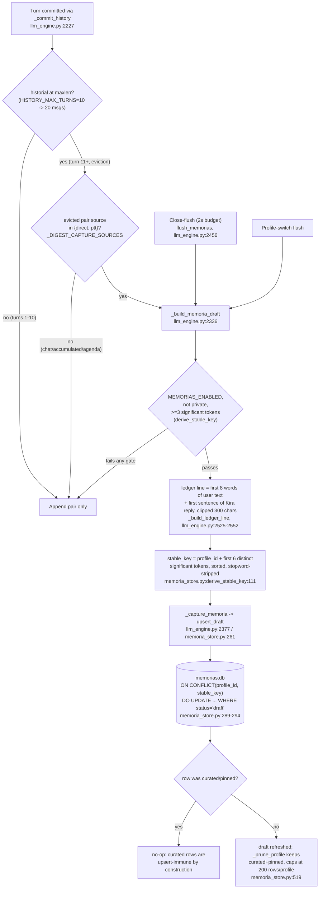
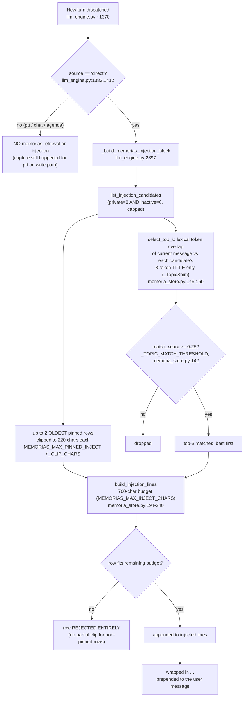

# ADR-034 — Memoria Retrieval Stays Lexical: Assessment, Triggers, and Risks

**Date:** 2026-07-16
**Status:** Accepted (no code change — assessment + decision record)
**Driver:** Owner question: is the memoria subsystem's storage/retrieval (informally "the RAG")
optimal as-is, or does it need an upgrade to embeddings/semantic search? Answered by a double
independent review — a deep-dive agent plus an independent Codex CLI second opinion — both run
2026-07-16 against the live repo and the live `memorias.db`.

## Context

OpenCohost's memoria subsystem (`kira_memory_persistence`, ADR-028/030) gives Kira a small,
per-profile long-term memory: turns that scroll out of the rolling chat window get distilled into
short "memoria" rows, and a subset of those rows gets re-injected into later prompts. The owner
asked, in plain terms, whether this counts as a real RAG (retrieve-then-generate over a semantic
index) or something cheaper, and whether the retrieval technology is a bottleneck worth upgrading
now (embeddings, a vector index, BM25). This ADR is the evidence-first answer.

## What the system actually is

### Write path (capture)

No LLM call happens anywhere in capture. A memoria is a mechanical compression of a turn pair,
built entirely from string operations.

Key points, each with a file:line anchor:

- **Rolling history is a 10-turn deque.** `HISTORY_MAX_TURNS = 10` (`opencohost/config/settings.py:57`).
- **Eviction-time capture.** `_commit_history` (`llm_engine.py:2227`) checks, on every new turn, whether
  the deque is already at `maxlen`; if so the oldest user/assistant pair is about to fall off and is
  captured first. Only sources `{"direct", "ptt"}` qualify (`_DIGEST_CAPTURE_SOURCES`,
  `llm_engine.py:72`) — viewer chat and agenda turns are fail-closed excluded so raw chat can never
  leak into a memoria.
- **The draft body is purely mechanical.** `_build_ledger_line` (`llm_engine.py:2540-2552`) takes
  the first 8 words of the user text (`_first_words`, `llm_engine.py:2525`) and the first sentence
  of Kira's reply (`_first_sentence`, `llm_engine.py:2531`, split on `. ! ?`), joins them, and the
  draft content is that string clipped to 300 chars (`_build_memoria_draft`, `llm_engine.py:2375`).
  No summarization model is invoked — this is string slicing, not compression-by-LLM.
- **Dedup key.** `derive_stable_key` (`memoria_store.py:111-123`) takes the first 6 distinct
  significant tokens of `user+assistant` text (after `normalize_tokens` plus a domain stopword list
  — `_MEMORIA_DOMAIN_STOPWORDS`, `memoria_store.py:72-74`), sorts them, and prefixes with
  `profile_id`. Capture requires `>=3` significant tokens (`_MIN_SIGNIFICANT_TOKENS`,
  `memoria_store.py:62`) or the pair is dropped as low-signal.
- **Upsert semantics.** `INSERT ... ON CONFLICT(profile_id, stable_key) DO UPDATE ... WHERE
  memorias.status = 'draft'` (`memoria_store.py:283-296`). Because the `WHERE` clause is on the
  conflict resolution, a curated or pinned row (`status != 'draft'`) makes the conflict a genuine
  no-op — no write, no exception, no accidental overwrite of operator-edited content.
- **Also captured on close and profile switch.** `flush_memorias` (`llm_engine.py:2456`, 2-second
  wall-clock budget) and profile-switch flush both run the *live, un-evicted* window through the
  exact same `_build_memoria_draft` gate chain via `_collect_flush_drafts` (`llm_engine.py:2430`),
  so the last ≤10 turns aren't lost on a clean close.
- **Growth cap.** `_prune_profile` (`memoria_store.py:519`) deletes the oldest unpinned drafts once
  a profile exceeds `MEMORIAS_PROFILE_CAP = 200` rows (`settings.py:319`); curated and pinned rows
  are never pruned.

### Retrieval / injection path

- **Direct-only gate.** Retrieval/injection is gated on `source == "direct"`
  (`llm_engine.py:1383` computes `memorias_profile_id` only for direct; `llm_engine.py:1412` is the
  actual injection call). A comment at `llm_engine.py:74-78` states this explicitly while
  documenting the one *exception* in the codebase: the separate `<perfil_streamer>` personalization
  block deliberately also fires for `ptt` — memorias/digest/editorial enrichment do **not**.
  Net effect: PTT (voice) turns **are captured** on the write path (`_DIGEST_CAPTURE_SOURCES`
  includes `"ptt"`) but **never receive injected memorias** on the read path.
- **Scoring is lexical, title-only.** `select_top_k` (`memoria_store.py:158-169`) scores every
  candidate row by feeding only its 3-token `title` (`_TopicShim`, `memoria_store.py:145-156`, title
  built by `build_title` — first 3 distinct significant tokens, `memoria_store.py:126-128`) through
  `editorial_matching.match_score` (`opencohost/core/editorial_matching.py:96-116`), reused verbatim
  from the editorial-cards feature. `match_score` is `|topic_tokens ∩ title_tokens| /
  max(len(title_tokens), 1)` — one shared token out of a 3-token title already scores `1/3 ≈ 0.33`,
  above the `0.25` threshold.
- **Injection budget.** `build_injection_lines` (`memoria_store.py:194-240`) assembles up to 2
  oldest-pinned rows (each clipped to 220 chars) first, then fills the remaining budget with top-3
  lexical matches, under a hard 700-char total (`MEMORIAS_MAX_INJECT_CHARS`). A non-pinned row that
  doesn't fit the *remaining* budget is skipped entirely (`_try_add`, `memoria_store.py:226-232`) —
  it is never partially clipped, unlike pinned rows.
- **No LLM in the loop, anywhere.** Neither capture nor retrieval invokes a model call.

### Honest classification

This is **retrieve-then-generate**: yes, retrieved memoria lines are prepended to the prompt before
generation. This is **semantic search**: no. There is no embedding model, no vector index, and no
BM25/TF-IDF ranking — `repetition_guard.py:11` documents the project's explicit no-embeddings
policy ("No I/O, no engine state, no embeddings — the project is local-first and bans..."), which
the memoria retrieval design (lexical `match_score` reuse) is consistent with.

## Live evidence

Queried `data/memorias/memorias.db` directly on 2026-07-16, after roughly two weeks of real use:

| Metric | Value |
|---|---|
| Total rows | 18 |
| Rows on the main profile (`30ea444e-…`) | 17 |
| Rows on the secondary profile | 1 |
| Status | all 18 are `draft` (none curated) |
| Pinned | 0 |
| Inactive | 0 |
| Average content length | ~127.3 chars |
| Cap utilization (main profile) | 17 / 200 = **8.5%** |

**Correction:** an earlier report circulated a "0.9%" utilization figure. That was an arithmetic
error (likely 17/2000 or a stray digit); the verified figure, recomputed directly against the live
database, is **8.5%** (17/200).

## Decision

**No retrieval-technology upgrade now.** At 18 rows, any ranking algorithm — lexical or
semantic — is decoration: with this few candidates, `select_top_k`'s title-overlap heuristic and a
hypothetical cosine-similarity search over embeddings will disagree on ordering for at most a
handful of borderline rows, and the 700-char injection budget means at most ~5 rows are ever
visible to a single turn regardless of ranking quality.

The stronger argument is hardware, not row count. This runs on **one gamer PC** simultaneously
hosting the LLM (Ollama), TTS, STT (WhisperLive), and the game being streamed. An Ollama-resident
embedding model is not "free" here: loading it costs VRAM that is already contended, and unlike the
already-accepted once-per-idle *chat-model* reload/eviction cost (paid when switching models between
turns, off the hot path), an embedding call for retrieval would sit **inside the per-turn critical
path** — every retrieval becomes a potential model-swap-and-reload stall on a box that is already
tight on VRAM. That tradeoff is not justified by an 18-row table.

Two concrete failure modes illustrate why the *current* lexical approach is adequate today and where
it will eventually break:

- **(a) Title-collision false positive.** Titles are only 3 tokens (`build_title`). Two unrelated
  memories that happen to share one generic-but-not-stopworded token — e.g. both titles contain
  "juego" — score `1/3 ≈ 0.33 ≥ 0.25` and the wrong memory gets injected, purely because of one
  shared token, independent of real topical relevance.
- **(b) Paraphrase miss.** Lexical overlap cannot bridge synonyms across languages or phrasing: a
  memory titled around "coche" (car) will never match a later turn that says "auto" (also car) —
  zero token overlap, score 0, even though a human (or an embedding model) would consider them the
  same topic.

## Ordered upgrade triggers

This is the actual decision: what condition promotes the retrieval tech, in order, rather than
upgrading pre-emptively.

1. **T1 — Recall complaints (first rung).** Widen scoring before reaching for new tech: persist a
   retrieval signature of 8-16 distinctive normalized tokens derived from the full pair (not just
   the 3-token title), require `>=2` shared tokens instead of 1, and fix the current
   `build_injection_lines` behavior where an oversized non-pinned row is rejected entirely instead
   of being clipped to the remaining budget (`memoria_store.py:226-232`).
2. **T2 — Cap raised into the thousands.** If `MEMORIAS_PROFILE_CAP` is raised from 200 into the
   thousands, adopt FTS5/BM25 (SQLite-native, no new runtime dependency, no VRAM cost) before
   lexical linear scan becomes a real latency problem.
3. **T3 — Paraphrase precision still failing AND VRAM headroom exists.** Only once T1's widened
   lexical scoring is demonstrably insufficient for paraphrase/cross-language recall, *and* the
   hardware has confirmed spare VRAM, consider brute-force embeddings (no index needed at this
   scale — a linear cosine scan over a few hundred vectors is cheap once the embedding vectors
   themselves exist).
4. **Independent of the above — off-peak LLM consolidation pass.** The real quality ceiling today is
   not retrieval ranking, it's **lossy capture**: the ledger line is "first 8 words + first
   sentence," which can miss the actual point of a turn. An off-peak (idle-LLM) consolidation pass
   that rewrites/merges draft rows into higher-quality summaries would raise the ceiling on what's
   in the table to retrieve from, independent of which scoring algorithm reads it.

## Risks recorded

From the independent Codex CLI review:

1. **Self-reinforcing false memory.** A wrong statement Kira makes in one turn can become a durable
   ledger line (the write path captures Kira's own reply verbatim-first-sentence, with no fact
   check), gets re-injected as if it were established history in a later turn, and the upsert's
   `stable_key` mechanism (`memoria_store.py:283-296`) will keep *refreshing* that same drafted row
   every time a similar exchange recurs — reinforcing rather than correcting it. Mitigation
   direction (not yet built): frame injected memories to the model as fallible recollections rather
   than facts, and require explicit operator curation before any high-impact claim can be trusted
   long-term (curated rows already get upsert-immunity for free — the gap is that nothing currently
   *prompts* curation of risky rows).
2. **Retrieval quality degrades before the cap.** Lexical title-overlap scoring is expected to
   degrade visibly somewhere around **50-100 diverse memories per profile** — well before the
   200-row cap — as more titles compete for the same handful of generic-but-significant tokens,
   raising the false-positive rate described in failure mode (a) above. This is a live number to
   watch, not a hard boundary reached today (17 rows).
3. **The PTT-turns-get-no-injection product gap.** Retrieval/injection is direct-path-only
   (`llm_engine.py:1383/1412`) by original design, but the owner now converses with Kira mainly by
   voice (F10 PTT). Every voice turn is captured into memoria on the write path but never benefits
   from memoria injection on the read path — the subsystem's practical value is currently smaller
   than the write-path activity suggests, because the majority-usage channel gets none of the
   retrieval benefit.

## Consequences

No code changes ship with this ADR. The memoria subsystem stays lexical, direct-path-only, and
LLM-free on both capture and retrieval. The next actionable step is T1 (widen scoring + fix the
reject-vs-clip budget bug) whenever recall complaints materialize, not before. The PTT-injection gap
(risk 3) is a separate product decision, not a retrieval-technology decision, and is not resolved by
this ADR.
