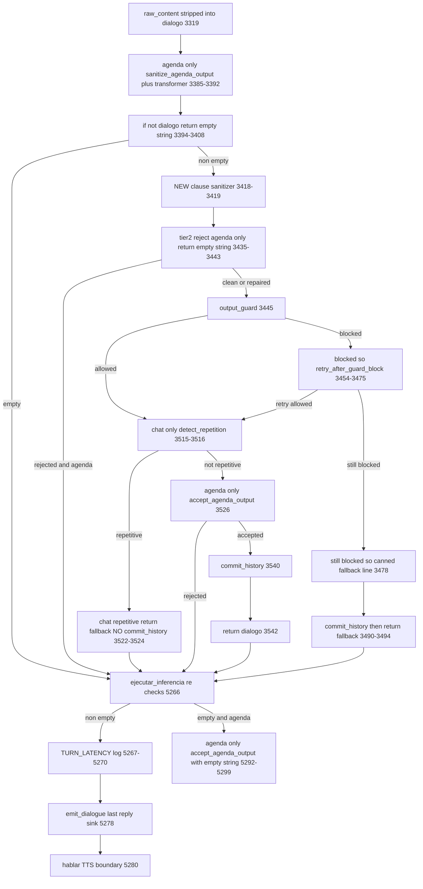
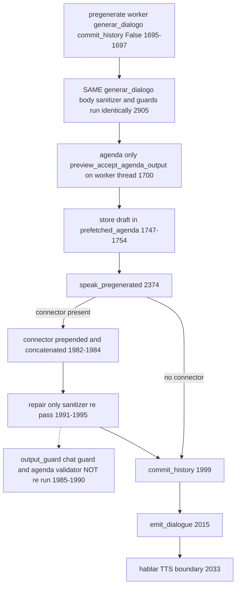

# ADR-039: Intra-Speech Clause Repetition — a Deterministic Sanitizer Below the Ladder

**Date**: 2026-07-29
**Status**: Accepted (implemented, suites green) — **live runtime validation PENDING**
**Branch**: `codex/ui-ux-audit-proposal-20260709` (uncommitted)
**Author**: Claude Code, with owner review across three approval rounds and three parallel audits
**Scope**: `opencohost/core/repetition_guard.py` (the tier), `opencohost/config/settings.py`
(per-source arming), `opencohost/core/llm_engine.py` (the shared seam + telemetry),
`docs/adr/ADR-011-*` (addendum), `pytest.ini` (a gated marker). **Untouched by decision**:
`kira_agenda_controller.py`, all of `opencohost/ui/`, `output_guard` internals,
`detect_repetition`, `_retry_after_guard_block`, `_accept_agenda_output`, `_ejecutar_inferencia`'s
existing body.

---

## Context

A real ~16-minute agenda session emitted, **inside one sentence**:

> "No había roadmap, no había monetización, no había roadmap, no había roadmap."

A comma-delimited clause repeated three times, one repetition non-contiguous, and Kira **spoke
it**. ADR-011 already installed a repetition ladder (detect → trim → regenerate) and ADR-015
cross-validated it. None of it fired, and the reason is structural rather than accidental:

| Existing defense | Compares | Why it is blind here |
|---|---|---|
| `detect_repetition` (`repetition_guard.py:109`) | whole candidate vs prior turns | the duplication is inside one candidate |
| `trim_trailing_repeated_sentences` (`sentence_trim.py:78`) | text vs `recent_texts` | same — cross-turn only |
| `has_looping_lines` (`kira_agenda_controller.py:1205`) | sentences split on `[.!?¡¿]+`, `>24` chars | a clause is not a sentence |
| TTS comma-chunking | — | runs *after* every guard |

**Nothing in the system owned the inside of a sentence.** That is the gap this ADR closes.

---

## Decisions

### D1 — A new tier, below ADR-011's D1, at the shared generation seam

Placed in `MotorVocalIA._generar_dialogo` immediately before the `output_guard` call. There is
no `is_local` gate between that point and the return, so the tier is **provider-agnostic by
construction** — it cannot be true for Ollama and false for NVIDIA NIM. It runs before
`output_guard` so the guardrails always judge the text that will actually be spoken.

### D2 — Exact normalized clause equality inside one sentence. No history, no intent detection, no model

Justification, and this is the load-bearing one: the tier's value is a **property**, not an
estimate. Two identical normalized token sequences cannot be "probably" identical. A semantic
classifier — mini-LLM, embeddings, or a similarity threshold — would trade that property for an
accuracy number that **cannot be measured here**, because no labelled dataset of real loops
exists in this project. Additionally it would put a probabilistic gate in front of a
deterministic one, add an inference before speech, and make a guardrail that decides *what the
audience hears* depend on the operator's GPU — invisibly, so two operators with identical
functional configuration would get different stream quality.

**Explicitly refused: intent detection.** No regex, no phrase list, no extra LLM call to decide
whether a repetition was "asked for". The scope *is* the answer: an operator asking for a repeat
produces it in a **later turn**, and this tier cannot see a later turn. Structural, not
configured.

**If non-exact intra-sentence repetition ever appears in a real incident**, the first thing to
try already exists in-repo: `detect_repetition`'s Layer 2 (`repetition_guard.py:98-106`) masks
every content word to `#` and compares skeletons by **equality, threshold-free** — built for
"same template, rotated synonyms". Extending that to clauses stays deterministic and
dependency-free. Reuse before adding a model.

### D3 — Two removal rules, not one

- **≥3 occurrences** of an eligible clause in one sentence → collapse to the first.
- **Exactly 2 occurrences** → collapse **only if adjacent**.

A non-adjacent double (`A, B, A.`) is deliberate structure — bookending, a refrain — and
collapsing it would eat intentional rhetoric. Discovered while writing the test for the
non-contiguous double; without this rule the tier could not tell the incident (3×) from
legitimate speech.

### D4 — The clause key carries an "opens with ¿ / ¡" flag

`"Así que borraste todo, ¿borraste todo de verdad?"` normalizes to the same token string twice.
Same words, **different speech act** — statement then echoed question. Without the flag the
question is silently deleted. Found by test, not by reasoning.

### D5 — Armed for the agenda sources ONLY

`kira-agenda` and `kira-agenda-stop` on by default; `chat`, `direct`, `ptt`, `accumulated`
shipped **disarmed**, with the per-source config preserved so any of them can be armed later on
real evidence.

**This reverses an earlier position of mine, on the owner's correction.** I had argued that
`direct` and `ptt` having *zero* repetition defense was the strongest reason to arm them. That is
a fallacy: the absence of a guard describes the code, it does not demonstrate a defect. The only
confirmed incident is agenda. And arming the operator-facing sources buys a **real false
positive** that agenda cannot produce: an operator can legitimately ask Kira to repeat a line
three times, and the tier would collapse it silently
(`"No toques ese botón, no toques ese botón, no toques ese botón."` — key 19 chars, above the
floor). Pinned as a documented-limitation test so a future default flip trips a tripwire.

### D6 — Tier 2 (reject → regenerate) is agenda-only BY CONSTRUCTION, not by configuration

A rejection needs an **owner for the regeneration**, and only agenda has one: the ADR-011
ladder, reached by returning `""` — the same idiom the ladder's own reject already uses.
`chat`/`direct`/`ptt` have no ladder. So even a force-armed non-agenda source is **repair-only**.
The verdict is still computed and logged there, so the evidence needed to arm tier 2 elsewhere
accrues on its own without spending an unmeasured cloud call on an unmeasured retry today.

This removed an entire branch the earlier draft needed, and kept `_retry_after_guard_block` out
of the unit.

### D7 — Bounded-retry count: zero new budget (answers ADR-011's open question)

A tier-2 rejection reuses the ladder's existing `recovery.failure_count` path. The ceiling for a
degenerate agenda turn stays where ADR-011 left it: **one initial generation plus at most one
regeneration**. No new counter, no new exit.

### D8 — Telemetry is metadata-only, and must distinguish speculative drafts

No previews, no raw text, no removed content — not even at DEBUG. Counts, ratios, source, stage,
verdict. The `stage` field carries `generate` (foreground), `pregen_draft` (a speculative draft
from the pregen or connector-upgrade worker) or `pregen_connector` (the junction re-pass),
because those workers log on their own threads and interleave. Without that, a tuning pass would
count a draft that was **never spoken** as a live turn.

### D9 — The latency span is a local, never an instance slot

`[TURN_LATENCY]` measures `request → TTS receives text`, a span the code has never measured (it
logs the two halves separately and never sums them). The first implementation stamped
`self._request_start_monotonic` and read it inside `_hablar` — **a race**. `_hablar` has four
callers and two run on background threads: the detached `speaker()` daemon in
`play_prefetched_agenda` (`llm_engine.py:1883`, CTk path) and the `CloudFallbackWarm` worker
(`:3715`). Either could consume a foreground turn's stamp, reporting latency under the wrong
source while the real turn logged nothing.

Fixed by **deleting the shared state**: a plain local in `_ejecutar_inferencia`, the only caller
of `_generar_dialogo(commit_history=True)` and the only path that generates and speaks on one
thread. Net fewer lines. Generalizable lesson: *an instance attribute consumed in a method with
background-thread callers is a race even when there is exactly one writer.*

### D10 — Document, do not fix, the abbreviation false split

`_SENT_SPLIT_RE` splits after **any** `.` followed by whitespace, including `Dr.` / `Sr.` /
`etc.` / `U.S.`. Verified by execution: `"We spoke with Dr. Smith,"` ×3 shreds into four
pseudo-sentences, each internally non-repetitive → the repeat is **missed by this tier and by
`has_looping_lines`**. The Spanish equivalent (`"Sr. Pérez"` ×3) is caught by the ladder only
**by accident**, because the shredded fragment happens to clear the ladder's 24-char floor. A
third shape (`"…, etc. A, A, A."`) yields a **partial** repair leaving one duplicate.

Not fixed, deliberately. Every candidate heuristic ("do not split when the preceding token is
short") would also merge legitimate short sentences like `"Sí. Vamos."`, after which the tier
would start comparing clauses **across** sentences — precisely the scope D2 excluded. That trades
an unobserved false negative for a false positive in the dangerous direction, against the owner's
own standing principle from D5. It also touches the three regexes the module's byte-for-byte
rebuild safety argument rests on.

---

## What the audits established (executed evidence, not argument)

Three parallel audits ran against the implementation. Their durable results:

- **No corruption, in any language.** Every case that did not repair reproduced its input
  **byte-for-byte**; idempotency held on all of them, including a `rejected` verdict. All known
  gaps are false negatives or no-ops. That is the correct failure direction for a tier that
  mutates what the audience hears.
- **The dedup mechanism is genuinely language-agnostic** — English, French and German repair
  correctly; apostrophes are safe (`don't` → `['don','t']`, split identically for every
  occurrence; straight `'` and curly `’` interoperate). **The regexes are not**: CJK
  (`、` `。`, no whitespace) is a total no-op. Product supports es/en today.
- **The 12-char eligibility floor is asymmetric across languages**, measured on the
  post-tokenization key: `"no roadmap"` = 10 (protected) vs `"keine Roadmap"` = 13 (eligible).
  English keys are *shorter*, so the tier fires **less** in English — the safe direction, but a
  per-locale tuning input.
- **A raw-text log claim of mine was wrong and is corrected here.** `validation.py:465-575` and
  `llm_engine.py:3542` log **Kira's own output**, which the project rule permits (R8 targets
  viewer chat). I had framed them as privacy leaks; wrong category. The genuine rule violations
  are `validation.py:397-423` (viewer chat, ungated WARNING — but `runtime_check()` is **dead
  code** today, a landmine) and `ui/voice_control.py:216,239` (operator PTT speech, live).
- **Nothing ships logs off the machine. NOT FOUND** — `ui/crash_reporting.py` lists filenames
  only, by documented design. Every log finding is local-disk-only, which caps its severity.
- **`attempt` is not a meaningful telemetry axis.** `max_intentos` never re-iterates on transport
  failure — both exception branches return on the first. The only honest unit is *which
  `_generar_dialogo` invocation*.

---

## The pipeline, as verified against source

Line numbers read from `llm_engine.py` on 2026-07-29. Every early exit funnels back through the
**same** call site at `_ejecutar_inferencia:5265`, which re-checks at `:5266` / `:5292` — there is
no separate abort branch.

### Foreground turn

### Pregenerated turn — the only path with a connector

### The three terminal destinations

| Destination | Function | Call sites | Defined |
|---|---|---|---|
| History / context | `_commit_history` | `:3540` success · `:3491` guard-fallback · `:1999` pregen playback | `:4631` |
| Last-reply sink | `_emit_dialogue` | `:5278` foreground · `:2015` pregen playback | `:5836` |
| TTS boundary | `_hablar` → `_hablar_impl` | `:5280` foreground · `:2033` pregen playback | `:5355` / `:5375` |

### Two discrepancies the trace found, outside this unit's scope

**A — one spoken path never commits history.** The chat-only repetition discard
(`:3516-3524`) returns `self._guardrail_fallback_line(source) or ""`, a non-empty line the
caller then **speaks and emits to last-reply** — but it never calls `_commit_history`. The
guardrail-fallback path four lines earlier (`:3490-3493`) *does* commit, and its comment states
why: the D4 `memoria_quality_20260717` fix, because *"a guardrail-blocked turn used to return
here BEFORE `_commit_history`, so the whole exchange vanished from history AND capture (F4)."*
**D4 fixed F4 in one path and left the sibling path with the same defect.** Verified in source.
Registered, not fixed here — it is a chat-path defect with no relation to clause repetition.

**B — a pregenerated draft never passes `_accept_agenda_output`.** The gate at `:3526` is
`source.startswith("kira-agenda") and commit_history and not self._accept_agenda_output(...)`,
and a draft is generated with `commit_history=False`, so it never fires. A draft's only agenda
validation is `_preview_accept_agenda_output` (`:1700`), a *different* function that falls back
to the same validator only when no dedicated preview validator is configured (`:4582-4584`); at
playback `_record_accepted_agenda_output` (`:2003`) is a recorder, not a gate. This reads as
intentional (the preview validator exists precisely for drafts) but it is worth stating plainly,
because it means the pregen path's validation is a *different* function from the foreground
path's, not the same one.

---

## Consequences

**Positive.** The confirmed incident classifies `repaired`, deterministically, with the
arithmetic pinned in a test: 76 chars → 40, `removed=2`, `distinct=1`, `max_occurrences=3`. All
three terminal destinations receive the same repaired string — verified, not assumed, because
every traced path reads the same `dialogo` local. Provider-agnostic by construction.

**A real cost, stated plainly.** A tier-2 rejection calls `_invalidate_pregen_epoch`
(`llm_engine.py:1947`), which sets `_prefetched_agenda = None` and bumps the epoch — verified in
source. So a rejection **empties the pregen slot** and reverts that agenda boundary from the
ADR-035 measured **0.34-0.43 s** back toward the measured **16.3-18.5 s** regime
(`logs/opencohost_20260721_131040.log` and `…_012124.log`). Accepted: a rejection should be rare,
and the alternative is speaking the degenerate text. **Whether it is actually rare is exactly
what the telemetry exists to answer.**

**Residual false positive on agenda, acknowledged.** A genuine Spanish rhetorical triple whose
clause exceeds the floor is collapsed — `"Que se vayan todos"` ×3 (key 18 chars) verified to
collapse. The floor protects the short forms (`"no, no, no"`, `"que se vaya"` at 11) but not
this. Telemetry makes it visible; it is the first input to the tuning pass.

**Dead-air risk: NOT RESOLVED.** Three grounds. NVIDIA NIM has **zero** latency measurement of
any kind — `settings.py:105-108` calls `CLOUD_CHAT_TIMEOUT = 90` a placeholder awaiting phase-4
validation, and Ollama RTX-3060 figures (ADR-013:59-67) must never be transferred to it. The
`request → TTS` span was never measured before D9's instrument. Fase-2 interactive pregen was
never runtime-validated. The instrument now exists; the numbers do not.

**Scope discipline held, with two admitted exceptions.** Production logic came to 166 lines
against a ~99 estimate. The overrun is accounted for: D3 (adjacency, ~12) and D4 (inverted mark,
~4) were **not in the approved plan** — added unilaterally while writing tests. Both *narrow*
when the tier fires, so both reduce risk, but they are scope additions and are recorded as such
rather than absorbed silently.

---

## Open questions

- **Threshold tuning.** Every threshold value is reasoned, anchored to measured turn sizes
  (844-char average / 1079 max over 46 generations; ~84 chars per TTS fragment; corta target 450
  at `kira_agenda_controller.py:274`). **No threshold value is itself a measurement.** Tuning
  needs `[CLAUSE_SANITIZER]` records from a real agenda session.
- **Model attribution of the original incident.** The earlier note attributes it to `gemma4:e4b`,
  but that is an Ollama **local** tag while the front is configured for `z-ai/glm-5.2`. Not
  reconcilable from source.
- **Full telemetry correlation.** A `gen_seq` threaded to both log sites (~15 lines) would make a
  reject and its regeneration joinable. Deferred until the current fields prove insufficient.

---

## Validation gate

Not closable from a test suite. The owner must run a real agenda session and report:
`[CLAUSE_SANITIZER]` verdict counts, `[TURN_LATENCY]` medians split by verdict, and whether any
`repaired` turn removed something it should not have. Until then this ADR is Accepted for
**design**, not for **runtime**.

---

## Related ADRs

- **[ADR-011](./ADR-011-cohost-repetition-regenerate-on-duplicate.md)** — the cross-turn ladder
  this tier sits below; its Addendum 2026-07-29 records the tier and answers its own
  bounded-retry open question.
- **[ADR-035](./ADR-035-agenda-dead-air-prefetch-overlap.md)** — the pregen overlap a tier-2
  rejection defeats; source of the 0.34-0.43 s and 16.3-18.5 s figures.
- **[ADR-013](./ADR-013-model-latency-vs-repetition-benchmark-rtx3060.md)** — the local-only
  latency benchmark whose numbers must **not** be transferred to cloud.
- **[ADR-040](./ADR-040-deferral-policy-clause-sanitizer-residuals.md)** — why the residual
  findings became proposals instead of code.

## Update log

- **2026-07-29**: Created. Implementation landed, 63 unit/seam/e2e tests plus 3 gated live tests;
  full-suite run recorded in `AGENT_HANDOFF.md`. One pre-existing failure
  (`test_interactive_pregen.py::test_llm_generating_flag_brackets_the_ollama_call`) proven
  unrelated by stashing the three production files and reproducing it on pristine code.
