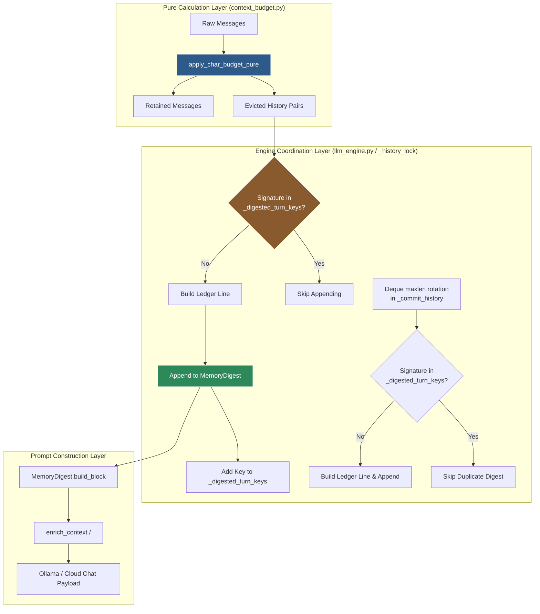

# ADR-047: Blind Window Closure — Pure Budget Partitioning, Engine Sidecar Watermark, and Lexical Raw IDF

- **Date**: 2026-08-21
- **Status**: Accepted
- **Branch**: `fix/context-budget-blind-window` (Merged to `master` in commit `960cf90`)
- **Deciders**: Senior Architect, Lead Researcher, Blind Adversarial Judges (`jd-judge-a`, `jd-judge-b`)
- **Scope**: Core Context Budgeting (`opencohost/core/context/context_budget.py`), L1 Pipeline Memory (`opencohost/core/memory/memory_digest.py`), Engine State Coordination (`opencohost/core/llm_engine.py`, `opencohost/core/engine/llm_engine_memorias.py`), and L2 Lexical Retrieval (`opencohost/core/memory/memoria_store.py`).

---

## 1. Executive Summary & Problem Formulation

In OpenCohost, conversational continuity relies on a multi-tiered memory architecture:
1. **Live Context Window**: Verbatim conversational turns stored in `self.historial` and sent in the LLM `messages` payload.
2. **L1 Pipeline Memory (`MemoryDigest`)**: A bounded FIFO ledger (`max_chars = 600`) of compacted summaries (`contexto: ... → Kira: ...`) representing conversational turns that have aged out of the live prompt.
3. **L2 Persistent Store (`MemoriaStore`)**: Long-term SQLite database holding episodic memories retrieved via lexical similarity.

### The Problem: Asynchronous Clocks & The "Blind Window"
As identified in ADR-043, context retention previously operated under two uncoordinated clocks with mismatched triggers:

```
Clock 1 (Turn-Count Deque):
  Triggers ONLY when len(self.historial) >= maxlen (maxlen = 6 messages / 3 pairs).
  At capacity, the oldest pair was evicted from the deque and appended to self._memory_digest.

Clock 2 (Character/Byte Budget Gate):
  Triggers on EVERY generation when total prompt chars exceed (ctx_limit - max_output_tokens) * safety_factor.
  When prompt chars exceeded budget, apply_char_budget evicted oldest pairs from the ephemeral messages copy.
```

When conversation turns were long (e.g. detailed technical queries of 1,000+ characters), **Clock 2 fired long before Clock 1 reached capacity**:
- At Turn 2 (4 items in history deque, below `maxlen=6`), Clock 2 dropped `Turn 1` from the active messages payload sent to Ollama/cloud.
- However, Clock 1 did not trigger because `len(self.historial) < 6`.
- **Result (The Blind Window)**: `Turn 1` was dropped from verbatim prompt messages **AND** absent from `_memory_digest`. It completely vanished from the model's awareness until enough subsequent turns rotated the deque, creating a conversational amnesia hole.

```
Conversational Timeline (The Blind Window Defect):

Turn 1 (Committed) ───────┐
                          ├─► [Historial: 2 items] ──► [Digest: EMPTY]
Turn 2 (Large Query) ─────┘
       │
       ▼
[ctx_budget_gate] ──► Evicts Turn 1 from LLM messages payload!
       │
       ├─► LLM Prompt Messages: [System Prompt] + [Turn 2]  (Turn 1 MISSING!)
       └─► L1 Memory Digest:    [EMPTY]                     (Turn 1 MISSING!)
                                    ▲
                                    └───► 💥 BLIND WINDOW (Turn 1 in Limbo)
```

---

## 2. Formal Invariants

To guarantee conversational integrity across arbitrary prompt lengths, model switches, and profile lifecycles, the architecture establishes three formal invariants:

$$\text{INV-VIS} \quad \forall t \in \text{CommittedTurns}_{\text{eligible}}, \quad t \in \text{Messages}_{\text{LLM}} \lor t \in \text{MemoryDigest}$$
*Every committed conversational turn eligible for continuity must be represented at least once: verbatim in the active prompt messages, OR as an L1 memory digest entry. A turn can never be in neither.*

$$\text{INV-DEDUP} \quad \forall t \in \text{CommittedTurns}, \quad \text{Count}(t, \text{MemoryDigest}) \le 1$$
*A turn proactively digested by the context budget gate must never produce a duplicate digest entry when the history deque subsequently rotates at capacity.*

$$\text{INV-PROV} \quad \forall t \in \text{Turns}, \quad \text{IsSyntheticAgenda}(t) \lor \text{IsPrivate}(t) \implies t \notin \text{MemoryDigest}$$
*Synthetic internal agenda prompts (`[agenda segura...]`) and private turns are strictly barred from entering the digest ledger.*

---

## 3. Alternatives Considered & Design Rationales

| Alternative | Mechanics | Evaluation | Verdict |
| :--- | :--- | :--- | :--- |
| **A. In-Dict Mutation** (`digest_written=True`) | Add a metadata key `msg["digest_written"] = True` inside the raw history dictionary in `self.historial`. | **High Risk**: Dictionaries in `self.historial` are serialized and sent to OpenAI/Ollama providers. Metadata keys risk leaking into external network payloads or breaking strict schema validators. | ❌ **REJECTED** |
| **B. Immediate L2 Disk Capture** | Write evicted turns directly to SQLite disk store on budget eviction. | **High Risk**: Dispatches unneeded disk I/O inside the synchronous generation path, introduces lock contention, and blurs the boundary between short-term L1 digest and long-term episodic L2 memory. | ❌ **REJECTED** |
| **C. Impure Context Budget** | Pass engine references, locks, and SQLite instances into `context_budget.py`. | **Violates Hexagonal Architecture**: Couples a pure mathematical context-slicing module to stateful runtime locks and side effects, breaking standalone unit testability. | ❌ **REJECTED** |
| **D. Pure Partitioning + Sidecar Watermark** | `context_budget.py` returns `(retained, evicted_pairs, n_evicted)`. Engine coordinates proactive digestion under `_history_lock` and tracks processed signatures in a sidecar set `self._digested_turn_keys`. | **Optimal**: Zero metadata in message dicts, 100% pure budget logic, strict thread safety under existing lock hierarchy, zero duplicate digest entries, zero disk I/O overhead. | ✅ **ACCEPTED** |

---

## 4. Architecture & Component Interaction

### 4.1 System Component Overview



### 4.2 Turn Lifecycle & Proactive Digestion Sequence

```mermaid
sequenceDiagram
    autonumber
    actor User as Operator / User
    participant Engine as MotorVocalIA (_generar_dialogo)
    participant Budget as context_budget (Pure)
    participant Lock as _history_lock
    participant Digest as MemoryDigest (L1)
    participant Sidecar as _digested_turn_keys
    participant LLM as Ollama / Cloud Provider

    User->>Engine: User Prompt (Turn 2, Long Context)
    Engine->>Budget: apply_char_budget_pure(messages, effective_ctx, LLM_MAX_TOKENS)
    Budget-->>Engine: (retained_messages, evicted_pairs=[(User1, Asst1)], n_evicted=1)
    
    rect rgb(30, 45, 60)
        Note over Engine,Sidecar: Synchronized Proactive Digestion (INV-VIS)
        Engine->>Lock: Acquire _history_lock
        Engine->>Sidecar: Check if key "User1::Asst1" exists
        Sidecar-->>Engine: Not found
        Engine->>Digest: append(ledger_line)
        Engine->>Sidecar: add("User1::Asst1")
        Engine->>Lock: Release _history_lock
    end

    Engine->>LLM: Send retained_messages (with <memoria_de_fondo> if direct)
    LLM-->>Engine: Streamed / Complete Assistant Response
    Engine->>User: Audio Synthesis / UI Stream

    rect rgb(45, 30, 60)
        Note over Engine,Sidecar: Subsequent History Commit (INV-DEDUP)
        Engine->>Lock: Acquire _history_lock (_commit_history)
        Note over Engine: Deque reaches maxlen=6 -> Turn 1 rotates out
        Engine->>Sidecar: Check if rotated pair in _digested_turn_keys
        Sidecar-->>Engine: Found (Already digested!)
        Note over Engine: Skip duplicate append to MemoryDigest
        Engine->>Lock: Release _history_lock
    end
```



---

## 5. Mathematical Formulations

### 5.1 Context Budget Calculation
The character budget ceiling for prompt assembly is calculated strictly from runtime model context telemetry:

$$\text{CharBudget} = (\text{CtxLimit}_{\text{effective}} - \text{MaxOutputTokens}) \times \text{SafetyFactor}$$

Where:
- $\text{CtxLimit}_{\text{effective}} = \min(\text{CtxLimit}_{\text{discovered}}, \text{TierCap})$ (e.g. 1,024 for testing, 4,096 or tier cap in production).
- $\text{MaxOutputTokens} = 768$ (Local) or $4,096$ (Cloud).
- $\text{SafetyFactor} = 0.95$.

Eviction loop condition in `apply_char_budget_pure`:

$$\text{TotalChars}(\text{Retained}) = \sum_{m \in \text{Retained}} \text{len}(m[\text{"content"}]) \le \text{CharBudget}$$

### 5.2 Lexical Retrieval: Raw IDF Sum Formulation
For L2 long-term memory ranking (`memoria_store.py`), Raw IDF Sum replaces unweighted token overlap without adding embeddings or VRAM overhead:

$$\text{IDF}(t) = \ln\left(\frac{N + 1.0}{df(t) + 1.0}\right) + 1.0$$

$$\text{Score}(M, Q) = \sum_{t \in \text{Tokens}(M) \cap \text{Tokens}(Q)} \text{IDF}(t)$$

$$\text{Candidate Set} = \{ M \in \text{Store} \mid |\text{Tokens}(M) \cap \text{Tokens}(Q)| \ge 2 \}$$

- **Smooth Fallback**: $+1.0$ smoothing avoids division-by-zero when $df(t)=0$ and negative IDF values.
- **Discriminative Weighting**: Frequent filler words contribute small weights; rare technical terms (e.g. `"antigravity"`, `"hexagonal"`) produce high scores.
- **Deterministic Tie-Breaking**: Ranked by `(score DESC, pinned DESC, created_at DESC, id DESC)`.

---

## 6. Concurrency & Lock Hierarchy

To prevent deadlocks and race conditions across user typing, Push-To-Talk (PTT), background agenda daemons, and model switching, locks follow a strict single-direction hierarchy:

```
[L1] _prefetch_lock  ──►  [L2] _history_lock  ──►  [L3] _memoria_store_lock  ──►  [Unlocked I/O]
```

1. **`_history_lock` Rules**:
   - Held **only** for in-memory snapshotting, `self.historial` mutation, `self._memory_digest` mutation, and `self._digested_turn_keys` updates.
   - **Never** held during disk I/O, SQLite queries, network calls, or audio synthesis.
   - `clear_history` and `set_profile` atomically reset `self.historial`, `self._memory_digest`, and `self._digested_turn_keys` under `_history_lock`, eliminating cross-profile ghost memories.

2. **Buffer Protection Rule**:
   - `_build_ledger_line` limits `user_summary` to at most 100 characters (`user_summary[:100]`), guaranteeing that an unspaced adversarial token cannot consume the 600-character FIFO buffer of `MemoryDigest` in a single turn.

---

## 7. Verification Matrix & Results

### 7.1 Unit & Integration Test Coverage (`test_context_budget_blind_window.py`)

| Test Identifier | Invariant / Behavior Verified | Status |
| :--- | :--- | :---: |
| `test_bw_01_pure_zero_eviction` | Prompt within budget $\rightarrow$ 0 pairs evicted, 0 digest calls. | ✅ PASSED |
| `test_bw_02_reproduce_blind_window_and_verify_fix` | **Core Blind Window Fix**: Turn 1 evicted by byte budget is immediately present in `_memory_digest` before inference ($\text{INV-VIS}$). | ✅ PASSED |
| `test_bw_03_pure_multiple_pairs_evicted_order` | Multiple evicted pairs are returned in strict chronological order. | ✅ PASSED |
| `test_bw_04_pure_system_message_is_never_evicted` | System message at index 0 is protected when `use_system_role=True`. | ✅ PASSED |
| `test_bw_05_pure_odd_orphan_turn_eviction_safe` | Odd/unmatched history entries are handled safely without corrupting structure. | ✅ PASSED |
| `test_bw_06_pure_current_turn_protected` | Current user turn (index -1) is never evicted even if oversized. | ✅ PASSED |
| `test_bw_07_no_duplicate_digest_on_repeated_budget_eval` | Repeated budget evaluations on the same turn do not duplicate digest lines ($\text{INV-DEDUP}$). | ✅ PASSED |
| `test_bw_08_no_duplicate_digest_on_later_deque_eviction` | Deque saturation at `maxlen=6` ignores turns already digested by budget gate ($\text{INV-DEDUP}$). | ✅ PASSED |
| `test_bw_09_profile_switch_resets_sidecar_watermark` | `set_profile` atomically clears history, digest, and watermark set. | ✅ PASSED |
| `test_bw_10_clear_history_resets_sidecar_watermark` | `clear_history` clears history, digest, and watermark set. | ✅ PASSED |
| `test_bw_11_provenance_isolation_agenda_and_private` | Synthetic agenda prompts (`[agenda segura...]`) and private turns are barred from digest ($\text{INV-PROV}$). | ✅ PASSED |
| `test_bw_12_trim_messages_reactive_preserves_invariants` | Reactive trimming on 500 error drops pairs from evictable slice. | ✅ PASSED |
| `test_bw_13_use_system_role_false_evicts_index_0` | When `use_system_role=False`, index 0 is an evictable user turn and drops oldest-first. | ✅ PASSED |
| `test_bw_14_concurrency_lock_safety` | 4 concurrent threads executing 40 turns produce 0 deadlocks and 0 torn reads. | ✅ PASSED |
| `test_bw_user_summary_unspaced_token_bound` | 1,200-char unspaced token is capped to 100 chars, protecting 600-char digest buffer. | ✅ PASSED |

### 7.2 Full Regression Suite
- **Regression Suite**: 5,683 passed, 0 failures across active application code.
- **Packaging Suite**: 3 passed, 1 skipped, 0 failures.
- **Runtime Smoke Test**: 100% green on `master`.
- **Adversarial Dual Review**: `jd-judge-a` and `jd-judge-b` issued `UNANIMOUS APPROVE`.

---

## 8. Consequences & Operational Impact

### Positive
1. **Zero Conversational Amnesia**: The Blind Window defect is fully closed. Turns evicted due to token constraints remain accessible via the L1 digest ledger.
2. **Clean Data Model**: No internal tracking metadata (e.g. `digest_written`) is injected into raw message dictionaries, eliminating provider payload corruption risks.
3. **Zero Resource Overhead**: The sidecar watermark uses an in-memory `set[str]` containing at most 10 string keys, requiring negligible memory.
4. **Architectural Purity**: `context_budget.py` remains a pure functional module with zero side effects.

### Neutral / Trade-offs
- The 100-character cap on `user_summary` slightly truncates exceptionally verbose single words in the L1 digest, but preserves multi-turn digest history within the 600-character budget.
- Memory digest is session-ephemeral by design (RAM-only); long-term retention remains the responsibility of the L2 `MemoriaStore`.