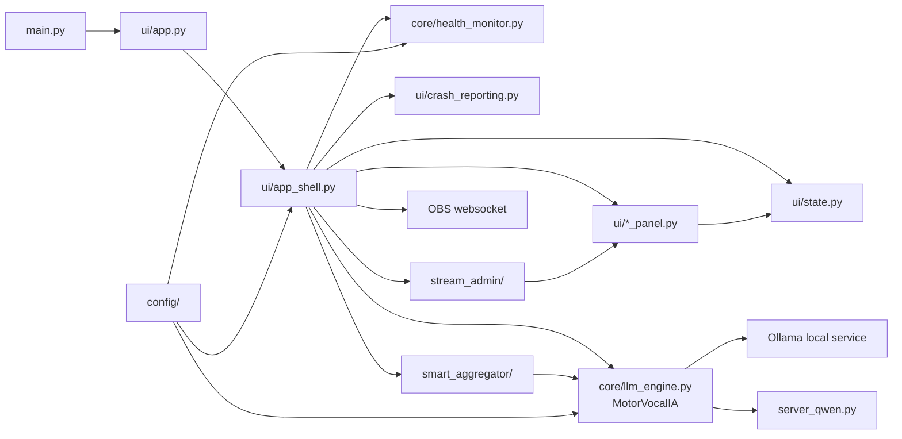

# OpenCohost Architecture Map

This document is a high-level architecture map for OpenCohost. It describes
current verified repository structure and ownership boundaries without replacing
the future module-specific docs.

## Current Product Boundary

| Label | Meaning |
|---|---|
| OpenCohost | Current public product direction. |
| Kira | Preserved cohost/persona identity. |
| VocalAI | Legacy class-identifier naming still present in code (`MotorVocalIA`, `VocalAIApp`). The "VoiceAI" runtime rename is done; "VocalAI" class identifiers remain deferred. |

Current behavior: the runtime is rebranded to OpenCohost — the shared logger is
named "OpenCohost", logs are written as `opencohost_*.log`, and the debug env var
is `OPENCOHOST_DEBUG`. The remaining legacy identifiers are the "VocalAI" class
names (`MotorVocalIA`, `VocalAIApp`); renaming those is deferred because broad
class renames would increase regression risk.

## Entry Point

The product entry point is the Tauri shell. The CTk entry point below it is
frozen legacy, retained but not maintained.

| File | Current role |
|---|---|
| `OpenCohost_UI/` (`pnpm tauri:debug`) | **Product entry point.** `src-tauri/src/backend.rs` probes ports 8765/8770 and spawns `python -m uvicorn opencohost.api.main:app` if nothing answers (`spawn: true` in `src-tauri/backend.config.json`), then serves the React front end. |
| `opencohost/api/main.py` | FastAPI app factory; mounts every router. Runnable standalone via `run-api.bat`, which exists only for that case. |
| `opencohost/api/engine_host.py` | Composition root of the product: constructs and owns the motor + health monitor, arms every host flag. |
| `main.py` | *Legacy.* Storage env setup, CustomTkinter theme, creates `VocalAIApp`, registers shutdown cleanup, starts the Tk mainloop. |
| `ui/app.py` | *Legacy.* Thin compatibility layer that imports `VocalAIApp` from `ui.app_shell`. |
| `ui/app_shell.py` | *Legacy.* Composition root for the CTk desktop app: window, panels, motor wiring, runtime callbacks, OBS/avatar/stream/admin coordination, and shutdown. |

## System Map

## Major Areas

| Area | Key files/directories | Current responsibility |
|---|---|---|
| Product UI and host | `OpenCohost_UI/src/features/`, `api/engine_host.py`, `api/routers/` | Tauri + React front end and the FastAPI host that owns the engine. One router per surface: avatar, chat, stream, obs, music, perfiles, personalization, memoria, llm_provider, ptt, agenda, i18n_tts, status, events. `EngineHost` is the only place host flags are armed. |
| Legacy CTk shell (FROZEN) | `ui/app_shell.py`, `ui/state.py`, `ui/*_panel.py`, `ui/voice_control.py`, `ui/ptt_manager.py` | Superseded 2026-08-13. Retained, not maintained — see "UI Shell" below. |
| LLM and speech runtime | `core/llm_engine.py`, `core/llm_tiers.py`, `core/streaming_speech.py`, `core/sentence_splitter.py` | Motor thread, Ollama chat calls, model/tier state, speech generation, TTS chunking/splitting, speech lifecycle. |
| Health and runtime safety | `core/health_monitor.py`, `ui/crash_reporting.py`, `core/temp_file_cleanup.py` | Health monitoring, Qwen process management, fallback signals, crash evidence, fatal logs, temp cleanup. |
| SmartAggregator and agenda | `smart_aggregator/`, `core/editorial_cards.py`, `core/editorial_agenda_bridge.py` | Chat filtering, vibe/activity signals, agenda topics, cohost orchestration, editorial cards, topic suggestions. |
| Stream integrations | `stream_admin/`, `ui/stream_admin_ui.py`, `smart_aggregator/chat_source.py` | YouTube/Twitch provider abstractions, OAuth storage, metadata/moderation/admin flows, chat source normalization. |
| Configuration and storage | `config/settings.py`, `config/storage.py`, `config/*.yaml`, `config/*.json` | Paths, timeouts, model settings, stream admin settings, SmartAggregator settings, app/runtime storage resolution. |
| Tests | `tests/` | Automated/focal tests for UI, runtime, aggregator, stream integrations, config, health, crash reporting, and deterministic smoke contracts. |

## Ownership Boundaries

### UI Shell

There are two composition roots. Only one is maintained.

Current behavior:

- `api/engine_host.py` is the composition root of the product. It constructs and
  owns the `MotorVocalIA` + `HealthMonitor`, and it is the ONLY place that arms
  host flags (`_speech_router_enabled`, `_speech_interrupt_enabled`).
- `OpenCohost_UI/` is the Tauri + React front end. `pnpm tauri:debug` spawns the
  backend itself via `src-tauri/src/backend.rs`; nothing else needs starting.
- `ui/app_shell.py` is the composition root of the **frozen legacy** CTk shell.
  `ui/state.py` provides its thread-aware state container; its panels live in
  `ui/`.

Design decision (2026-08-13):

- The CTk shell is superseded and frozen. Every one of its panels has an API
  router behind it; the last gap, viewer chat reaching Kira, closed in `4ffb3e3`.
  Do not add features to `ui/`, refactor it, or restyle it.
- Because `_speech_router_enabled` defaults `False` and only `EngineHost` sets it
  `True`, every feature gated on it — the speech router and LLM output streaming
  included — is permanently inert under CTk. That is intended. Arming the router
  under CTk belongs to `interruptible_speech_architecture_20260804` §8, not to
  whatever change surfaced the asymmetry.
- Within the legacy shell, Tk widget mutation must still stay on the main loop
  and worker-originated UI work still routes through queued/scheduled paths.

Known limitation:

- `ui/app_shell.py` is still a large coordination file. It is frozen, so this is
  no longer debt worth paying down — do not perform broad extraction on it.

### Runtime Speech

Current behavior:

- `core/llm_engine.py` owns `MotorVocalIA`.
- The motor handles Ollama interaction, model/tier state, conversation history,
  TTS requests, and speech lifecycle state.

Design decision:

- Direct user interaction must not be spoken over by agenda prefetch.
- Speech source state must be cleared on normal completion and known failure
  paths.

Known limitation:

- Real audio/device behavior still requires manual or opt-in runtime validation.

### SmartAggregator

Current behavior:

- `smart_aggregator/` contains chat source contracts, filtering, vibe/activity
  aggregation, agenda signals, and Kira agenda controller logic.

Design decision:

- Raw chat is not public diagnostic data.
- Chat can feed in-memory counters and compact context, but raw chat must not be
  exposed to LLM prompts, diagnostics, logs, or persistence.

Known limitation:

- Module-specific public docs still need evidence-backed expansion.

### Stream Integrations

Current behavior:

- `stream_admin/` contains provider abstractions, OAuth storage, YouTube provider
  code, Twitch provider placeholder/support code, analytics, and moderation.
- `config/stream_admin.yaml` uses environment placeholders for YouTube OAuth
  credentials and local token paths under `data/stream_admin/`.

Design decision:

- OAuth tokens and generated stream data are local/private artifacts.

Known limitation:

- Real YouTube/OAuth behavior needs real-service validation and should not be
  implied by unit tests alone.

### Health and Crash Evidence

Current behavior:

- `core/health_monitor.py` contains VRAM/Ollama/RTF/Qwen process monitoring.
- `ui/crash_reporting.py` installs Python/Tk/thread crash hooks and fatal log
  setup.

Design decision:

- Crash evidence is layered: Python hooks, Tk hook, threading hook, fatal log,
  and safe child-log path references.

Known limitation:

- Native crashes from audio/device libraries cannot be fully caught by ordinary
  Python `try/except`.

## Key Runtime Constraints

- The app is local-first.
- Qwen heavy TTS and Ollama are local service/process dependencies.
- OBS and stream integrations depend on external services.
- Real audio and GUI behavior have runtime constraints beyond unit tests.
- Public docs must not claim installer/packaging readiness until validated.

## Current Test Reference

Use [`TESTING.md`](TESTING.md) for the current test catalog and validation
boundaries. As of 2026-06-07, the repository has 53 `tests/test_*.py` files and
1,736 pytest-collected items in the project environment.

## Planned Module Docs

The architecture map intentionally stays shallow. Deeper docs should be produced
module by module:

- [`docs/modules/ui-shell.md`](modules/ui-shell.md)
- [`docs/modules/runtime-speech.md`](modules/runtime-speech.md)
- `docs/modules/tts-audio.md`
- `docs/modules/smart-aggregator.md`
- `docs/modules/stream-integrations.md`
- `docs/modules/runtime-safety.md`

Each module doc must list evidence, current state, known limitations, deferred
work, and verification status.

## Deferred Work

Deferred work should remain in Conductor tracks or clearly labeled roadmap
sections. Current known deferred areas include:

- semi-real runtime smoke/audio validation,
- packaging/installer work,
- broad Product UI work,
- Qwen lifecycle hardening unless runtime validation proves it is needed,
- full internal rename of the remaining VocalAI class identifiers
  (`MotorVocalIA`, `VocalAIApp`) to OpenCohost.
