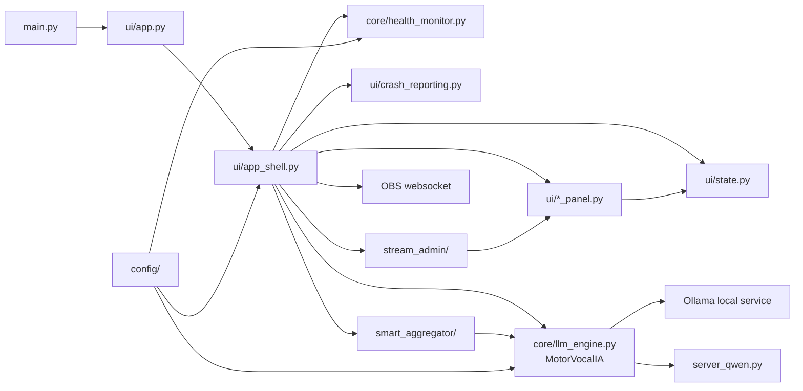

# OpenCohost Architecture Map

This document is a high-level architecture map for OpenCohost. It describes
current verified repository structure and ownership boundaries without replacing
the future module-specific docs.

## Current Product Boundary

| Label | Meaning |
|---|---|
| OpenCohost | Current public product direction. |
| Kira | Preserved cohost/persona identity. |
| VoiceAI / VocalAI | Existing internal/project naming still present in modules, paths, package metadata, and some legacy docs. |

Current behavior: public-facing app startup now logs OpenCohost, while many
internal identifiers still use VoiceAI/VocalAI names. Internal renaming is
deferred because broad renames would increase regression risk.

## Entry Point

| File | Current role |
|---|---|
| `main.py` | Applies storage environment setup, configures CustomTkinter theme, creates `VocalAIApp`, registers shutdown cleanup, and starts the Tk mainloop. |
| `ui/app.py` | Thin compatibility layer that imports `VocalAIApp` from `ui.app_shell`. |
| `ui/app_shell.py` | Main composition root for the desktop app: window, panels, motor wiring, runtime callbacks, OBS/avatar/stream/admin coordination, and shutdown. |

## System Map

## Major Areas

| Area | Key files/directories | Current responsibility |
|---|---|---|
| UI shell and panels | `ui/app_shell.py`, `ui/state.py`, `ui/*_panel.py`, `ui/voice_control.py`, `ui/ptt_manager.py` | Desktop composition, Tk state, panel wiring, PTT/audio UI, avatar/OBS UI, status display, stream/admin UI. |
| LLM and speech runtime | `core/llm_engine.py`, `core/llm_tiers.py`, `core/streaming_speech.py`, `core/sentence_splitter.py` | Motor thread, Ollama chat calls, model/tier state, speech generation, TTS chunking/splitting, speech lifecycle. |
| Health and runtime safety | `core/health_monitor.py`, `ui/crash_reporting.py`, `core/temp_file_cleanup.py` | Health monitoring, Qwen process management, fallback signals, crash evidence, fatal logs, temp cleanup. |
| SmartAggregator and agenda | `smart_aggregator/`, `core/editorial_cards.py`, `core/editorial_agenda_bridge.py` | Chat filtering, vibe/activity signals, agenda topics, cohost orchestration, editorial cards, topic suggestions. |
| Stream integrations | `stream_admin/`, `ui/stream_admin_ui.py`, `smart_aggregator/chat_source.py` | YouTube/Twitch provider abstractions, OAuth storage, metadata/moderation/admin flows, chat source normalization. |
| Configuration and storage | `config/settings.py`, `config/storage.py`, `config/*.yaml`, `config/*.json` | Paths, timeouts, model settings, stream admin settings, SmartAggregator settings, app/runtime storage resolution. |
| Tests | `tests/` | Automated/focal tests for UI, runtime, aggregator, stream integrations, config, health, crash reporting, and deterministic smoke contracts. |

## Ownership Boundaries

### UI Shell

Current behavior:

- `ui/app_shell.py` is the composition root.
- `ui/state.py` provides a thread-aware state container.
- UI-facing panels live in `ui/`.

Design decision:

- Tk widget mutation must stay on the main loop.
- Worker-originated UI work should be routed through queued/scheduled UI paths.

Known limitation:

- `ui/app_shell.py` is still a large coordination file. Do not perform broad
  extraction without a dedicated design and regression plan.

### Runtime Speech

Current behavior:

- `core/llm_engine.py` owns `MotorVocalIA`.
- The motor handles Ollama interaction, model/tier state, conversation history,
  TTS requests, and speech lifecycle state.

Design decision:

- Direct user interaction must not be spoken over by agenda prefetch.
- Speech source state must be cleared on normal completion and known failure
  paths.

Known limitation:

- Real audio/device behavior still requires manual or opt-in runtime validation.

### SmartAggregator

Current behavior:

- `smart_aggregator/` contains chat source contracts, filtering, vibe/activity
  aggregation, agenda signals, and Kira agenda controller logic.

Design decision:

- Raw chat is not public diagnostic data.
- Chat can feed in-memory counters and compact context, but raw chat must not be
  exposed to LLM prompts, diagnostics, logs, or persistence.

Known limitation:

- Module-specific public docs still need evidence-backed expansion.

### Stream Integrations

Current behavior:

- `stream_admin/` contains provider abstractions, OAuth storage, YouTube provider
  code, Twitch provider placeholder/support code, analytics, and moderation.
- `config/stream_admin.yaml` uses environment placeholders for YouTube OAuth
  credentials and local token paths under `data/stream_admin/`.

Design decision:

- OAuth tokens and generated stream data are local/private artifacts.

Known limitation:

- Real YouTube/OAuth behavior needs real-service validation and should not be
  implied by unit tests alone.

### Health and Crash Evidence

Current behavior:

- `core/health_monitor.py` contains VRAM/Ollama/RTF/Qwen process monitoring.
- `ui/crash_reporting.py` installs Python/Tk/thread crash hooks and fatal log
  setup.

Design decision:

- Crash evidence is layered: Python hooks, Tk hook, threading hook, fatal log,
  and safe child-log path references.

Known limitation:

- Native crashes from audio/device libraries cannot be fully caught by ordinary
  Python `try/except`.

## Key Runtime Constraints

- The app is local-first.
- Qwen heavy TTS and Ollama are local service/process dependencies.
- OBS and stream integrations depend on external services.
- Real audio and GUI behavior have runtime constraints beyond unit tests.
- Public docs must not claim installer/packaging readiness until validated.

## Current Test Reference

Use [`TESTING.md`](TESTING.md) for the current test catalog and validation
boundaries. As of 2026-06-07, the repository has 53 `tests/test_*.py` files and
1,736 pytest-collected items in the project environment.

## Planned Module Docs

The architecture map intentionally stays shallow. Deeper docs should be produced
module by module:

- [`docs/modules/ui-shell.md`](modules/ui-shell.md)
- [`docs/modules/runtime-speech.md`](modules/runtime-speech.md)
- `docs/modules/tts-audio.md`
- `docs/modules/smart-aggregator.md`
- `docs/modules/stream-integrations.md`
- `docs/modules/runtime-safety.md`

Each module doc must list evidence, current state, known limitations, deferred
work, and verification status.

## Deferred Work

Deferred work should remain in Conductor tracks or clearly labeled roadmap
sections. Current known deferred areas include:

- semi-real runtime smoke/audio validation,
- packaging/installer work,
- broad Product UI work,
- Qwen lifecycle hardening unless runtime validation proves it is needed,
- full internal rename from VoiceAI/VocalAI to OpenCohost.
