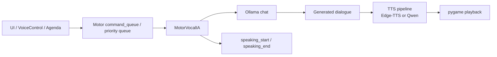

# Runtime Speech Module

This module document explains the current runtime speech boundary for
OpenCohost: how user/direct speech requests, agenda speech, TTS generation,
speech ownership state, and priority arbitration fit together.

## Current State

`core/llm_engine.py` owns `MotorVocalIA`, the runtime motor that receives work
from the UI, calls the local LLM service, manages model/tier state, generates
dialogue text, and plays TTS audio.

The runtime speech path is intentionally sequential at the speech/playback
boundary. Direct user interaction, chat, and agenda work can be queued, but TTS
speech state must remain single-owner so the UI and agenda controller know who
is speaking.

## Key Files

| File | Role | Evidence status |
|---|---|---|
| `core/llm_engine.py` | `MotorVocalIA`: command queue, priority queue, LLM calls, history, TTS, speech source state. | Verified |
| `core/llm_tiers.py` | LLM tier configuration and active tier state. | Verified |
| `core/streaming_speech.py` | Streaming speech pipeline abstraction for sentence-level playback. | Verified |
| `core/sentence_splitter.py` | Sentence boundary splitter used by streaming speech tests. | Verified |
| `core/health_monitor.py` | Heavy-TTS health gates, Qwen process manager, RTF tracking. | Verified |
| `ui/app_shell.py` | Routes motor events to UI, agenda state machine, prefetch arbitration, and speech start/end handling. | Verified |
| `ui/voice_control.py` | Sends PTT/direct voice text into the motor and uses high priority for PTT when motor is busy. | Verified |
| `ui/ptt_manager.py` | Push-to-talk hotkey lifecycle feeding voice control. | Verified |

## Speech Sources

`MotorVocalIA` tracks the current speech owner through:

- `_speaking`
- `_current_speech_source`
- `is_speaking`
- `current_speech_source`

Known source categories:

| Source | Meaning |
|---|---|
| `direct` | Manual text or direct user interaction. |
| `ptt` | Push-to-talk / streamer speech. |
| `chat` | Chat-derived reaction. |
| `kira-agenda*` | Autonomous or semi-autonomous cohost agenda work. |
| `accumulated` | Compacted accumulated context after queue pressure or busy motor state. |

## Runtime Flow

## Priority and Arbitration

Current behavior:

- priority `0`: PTT / streamer work,
- priority `1`: chat or direct queued work,
- priority `2`: agenda work.

The motor queue preserves higher-priority work over lower-priority work. Agenda
prefetch is text-only until consumed, and cached agenda speech is cancelled or
skipped when higher-priority pending work or direct/non-agenda audio work exists.

Design decision:

- Agenda prefetch may prepare text while current speech is active, but it must
  not speak over direct user interaction.
- PTT/direct work has priority over agenda speech.

## Speech Lifecycle

Current `_hablar(...)` behavior:

1. Sets `_speaking = True`.
2. Sets `_current_speech_source = source`.
3. Emits `speaking_start`.
4. Sanitizes text for TTS playback.
5. Splits text into chunks.
6. Generates audio chunks with light or heavy TTS.
7. Plays chunks through pygame.
8. Clears `_speaking` and `_current_speech_source`.
9. Emits `speaking_end`.

Important cleanup behavior:

- If `speaking_start` callback raises, `_speaking` and `_current_speech_source`
  are cleared and the exception is re-raised.
- If heavy TTS lacks a loaded reference voice, speech state is cleared and
  `speaking_end` is emitted.
- If text sanitization produces no valid utterance chunks, speech state is
  cleared and `speaking_end` is emitted.
- Playback/chunk failures are logged and do not leave speech ownership stale in
  the normal `_hablar(...)` cleanup path.

## TTS Modes

| Mode | Current behavior | Validation boundary |
|---|---|---|
| Light TTS | Uses Edge-TTS path and produces `.mp3` chunks. | Can be unit/fake tested; real internet dependency can still affect runtime. |
| Heavy TTS | Calls local Qwen TTS server and produces `.wav` chunks. | Requires local model/server/process validation for full confidence. |

Heavy TTS may be gated by health monitor state. If health logic blocks heavy
TTS, the motor can fall back to light TTS.

## Agenda Prefetch Boundary

Agenda prefetch is not speech. It generates text in the background and stores a
cached agenda response for later playback.

Current verified behavior:

- `prefetch_agenda(...)` generates agenda text without starting TTS.
- `play_prefetched_agenda(...)` commits history and speaks the cached text.
- pending higher-priority work can block cached agenda playback.
- direct/non-agenda audio work clears or cancels agenda prefetch.

## Tests and Validation

| Test file | What it covers |
|---|---|
| `tests/test_llm_engine_timeouts.py` | TTS timeouts, LLM timeout handling, agenda prefetch, priority queue behavior, sanitizer behavior, history redaction. |
| `tests/test_llm_engine_model_trace.py` | Startup model resolution, model switching, retry behavior, persistence, model trace warnings. |
| `tests/test_llm_engine_tiers.py` | Manual tier switching, rollback, profile/memory preservation, generation model capture. |
| `tests/test_runtime_smoke_harness.py` | Deterministic smoke harness invariants and stale speech-source edge case. |
| `tests/test_kira_orchestration_gaps.py` | Agenda/direct arbitration, prefetch yielding, emergency stop and sequence edge cases. |
| `tests/test_streaming_speech_pipeline.py` | Sentence-level streaming speech pipeline behavior with fakes. |
| `tests/test_sentence_splitter.py` | Sentence splitting boundaries, Spanish punctuation, abbreviations, buffering. |
| `tests/test_voice_control.py` | Voice/PTT panel behavior and direct-to-motor routing under mocked UI/audio conditions. |

## What These Tests Do Not Prove

Automated tests do not fully prove:

- real audio-device playback,
- native `pygame` mixer stability,
- native `sounddevice` capture behavior,
- Qwen heavy-TTS behavior with a real model under load,
- full shutdown behavior after real audio playback,
- real streamer/PTT timing under live desktop use.

Those require manual validation or opt-in runtime smoke testing.

## Contributor Rules

When changing runtime speech:

1. Do not mix PTT, LiveVoice continuous, chat, and agenda behavior without an
   explicit design boundary.
2. Preserve priority ordering: PTT/direct work must not be blocked by agenda
   prefetch.
3. Clear speech ownership state on every new failure path that can exit
   `_hablar(...)`.
4. Do not expose raw agenda/chat context in history, logs, diagnostics, or public
   docs.
5. Keep unit/fake tests separate from real audio/runtime smoke tests.
6. If a change depends on real audio, Qwen, pygame, Ollama, or OBS timing, record
   the manual validation requirement.

## Known Limitations

- Real audio behavior cannot be fully proven by the automated suite.
- Heavy TTS depends on local Qwen server/model readiness.
- Light TTS can depend on internet behavior.
- The deterministic smoke harness is useful but does not replace semi-real audio
  validation.
- Runtime speech still has several local environment assumptions inherited from
  the current prototype.

## Deferred Work

Deferred runtime-speech work should remain in explicit tracks:

- `runtime_smoke_harness_20260606` for opt-in runtime/audio smoke expansion,
- Qwen lifecycle hardening if runtime validation proves it is needed,
- packaging/installer setup for local speech dependencies,
- deeper TTS/audio module documentation.

## Verification Checklist

- [x] Files listed in this doc exist.
- [x] Responsibilities were checked against source definitions and focused
  searches.
- [x] Speech ownership claims were checked against `_hablar(...)`.
- [x] Priority/prefetch claims were checked against `MotorVocalIA` and
  `ui/app_shell.py`.
- [x] Test claims reference existing test files.
- [x] Future work is labeled as deferred.
- [x] No private local data, tokens, or raw chat are exposed.
