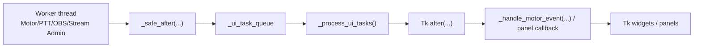

# UI Shell Module

This module document explains the current UI shell boundary for OpenCohost. It
is intentionally scoped to the desktop composition layer, Tk mainloop ownership,
panel wiring, and UI-state coordination.

## Current State

OpenCohost is currently a CustomTkinter desktop application. The root UI shell
still uses existing internal VoiceAI/VocalAI identifiers, but it now represents
the OpenCohost product direction in public-facing copy.

The UI shell is not a pure presentation layer. It is the composition root that
connects panels, the speech motor, SmartAggregator, Stream Admin, avatar/OBS,
health status, crash reporting, PTT, and shutdown behavior.

## Key Files

| File | Role | Evidence status |
|---|---|---|
| `ui/app.py` | Thin compatibility import layer for `VocalAIApp`. | Verified |
| `ui/app_shell.py` | Main application window and composition root. | Verified |
| `ui/state.py` | Thread-aware UI state container and observer hub. | Verified |
| `ui/protocols.py` | UI callback protocols and `CallbackDispatcher`. | Verified |
| `ui/voice_control.py` | Voice/PTT-facing panel logic, websocket/audio UI state, recording controls. | Verified |
| `ui/ptt_manager.py` | Global push-to-talk hotkey management. | Verified |
| `ui/status_bar.py` | Status pills and UI state presentation. | Verified |
| `ui/avatar_panel.py` | Avatar image-state and OBS-facing controls. | Verified |
| `ui/model_panel.py` | Ollama/model selection and model status controls. | Verified |
| `ui/profile_panel.py` / `ui/profiles_window.py` | Profile selection and profile editing surfaces. | Verified |
| `ui/advanced_panel.py` | Logs and advanced/debug panel. | Verified |
| `ui/smart_aggregator_ui.py` | SmartAggregator UI entry point. | Verified |
| `ui/stream_admin_ui.py` | Stream Admin UI entry point. | Verified |
| `ui/cohost_agenda_panel.py` | Co-host agenda UI panel. | Verified |

## Ownership Boundaries

### The UI shell owns composition

`ui/app_shell.py` owns the top-level application composition:

- creates the main window,
- builds and places panels,
- wires callbacks between UI modules and runtime modules,
- starts the speech motor after UI construction,
- starts UI task/log processing loops,
- coordinates runtime shutdown.

### The UI shell does not own business logic

The UI shell should not absorb independent domain logic when a focused module
can own it. Examples:

- speech runtime belongs in `core/llm_engine.py`,
- health/runtime monitoring belongs in `core/health_monitor.py`,
- SmartAggregator logic belongs in `smart_aggregator/`,
- stream provider logic belongs in `stream_admin/`,
- storage/path resolution belongs in `config/storage.py` and `config/settings.py`.

### Tk mutations belong on the main loop

Tk/CustomTkinter widget updates must happen on the main loop. Worker-originated
events should be routed through `_safe_after(...)` and the UI task queue instead
of directly mutating widgets from background threads.

Current verified mechanisms:

- `VocalAIApp` creates `_ui_task_queue`.
- `VocalAIApp` schedules `_process_ui_tasks`.
- `_safe_after(...)` queues work from non-main threads.
- `_on_motor_event(...)` schedules worker-thread motor events before handling.
- `_handle_motor_event(...)` handles motor state transitions on the UI side.

## UI Event Flow



## Startup Flow

Current verified startup shape:

1. `main.py` applies storage environment setup.
2. `main.py` creates `VocalAIApp`.
3. `VocalAIApp` builds the UI and initializes panel references.
4. The motor start is deferred with `after(...)`.
5. UI task and log processing loops are scheduled with `after(...)`.
6. Shutdown cleanup is registered through the window close protocol and `atexit`.

Design reason:

- The UI must exist and the event loop must be able to schedule work before
  worker-thread callbacks try to update UI state.

## Model Download and Activation UX

### Quick path

1. Start or detect Ollama from the model panel button.
2. Select a model from the visible combo box.
3. Click the same button:
   - **Download model** if the selected tag is not installed
   - **Activate model** if the selected tag is already installed

### Current boundary

The model panel is intentionally a **curated selection UI**, not a generic
package manager for arbitrary Ollama tags.

Current verified behavior:

- The combo box is built from:
  - curated tags in `config/settings.py`
  - runtime discovery from `ollama.list()` when Ollama is ready
- The button is stateful:
  - opens Ollama download page if the app is missing
  - starts Ollama if the service is stopped
  - downloads the selected visible model if Ollama is ready and the model is not installed
  - activates the selected visible model if it is already installed
- The app can still start the local Ollama server from the UI. A verified runtime
  log sequence is:
  - `Iniciando Ollama...`
  - `Ollama iniciado correctamente.`
  - `Ollama disponible. Preparando modelo...`
- The UI does **not** expose a free-form text field for arbitrary model tags.

### What this means for new models

If a model is not visible in the panel yet, the operator must currently install
it outside the app with Ollama first, for example:

```powershell
ollama pull gemma4:12b
```

After that, once Ollama is in a ready state, the panel should discover the
installed tag and append it to the visible list.

### Hugging Face links vs runtime tags

The model panel does not consume raw Hugging Face repository URLs as its primary
runtime input. The current UI/runtime path expects an Ollama model tag such as:

```powershell
gemma4:12b
```

If the operator is looking at a Hugging Face model page, that page is reference
material, not the string the current OpenCohost UI sends to the runtime.

### Why this boundary exists

This keeps the desktop UX simpler and avoids turning OpenCohost into a second
model manager when Ollama already owns:

- model download truth,
- installed inventory truth,
- pull/retry lifecycle.

## Tests and Validation

| Test file | What it covers |
|---|---|
| `tests/test_app_shell_motor_event_threading.py` | Worker-thread motor events and `_safe_after(...)` scheduling behavior. |
| `tests/test_app_shell_obs_resilience.py` | OBS retry lifecycle, operator notifications, closing cleanup, avatar preview resilience, and motor heartbeat behavior. |
| `tests/test_ui_state.py` | UIState get/set, observer notifications, batch updates, thread safety, wait/shutdown behavior. |
| `tests/test_integration.py` | App shell structure, callback wiring, panel composition, stream admin UI interactions, main compatibility. |
| `tests/test_product_ui_refactor_safety.py` | Product shell composition and safety boundaries around Kira panel, stream/log callbacks, agenda lifecycle, avatar preview, and music/avatar wiring. |
| `tests/test_voice_control.py` | Voice panel initialization, websocket state, PTT flush watcher, recording behavior, UI state transitions, cleanup. |
| `tests/test_status_bar.py` | Status pill behavior, observer integration, batch updates, and edge cases. |

## What These Tests Do Not Prove

Automated tests do not fully prove:

- real desktop rendering on every Windows setup,
- real audio device behavior through `sounddevice`,
- real websocket behavior against LiveAudio,
- real OBS websocket behavior,
- full Tk mainloop behavior during long live sessions,
- native crashes from audio libraries.

Those areas require manual validation or opt-in runtime smoke validation.

## Current Safety Rules for Contributors

When changing the UI shell:

1. Do not mutate Tk widgets from worker threads.
2. Do not bypass `_safe_after(...)` for worker-originated UI changes.
3. Keep LiveVoice continuous and PTT behavior separate unless explicitly scoped.
4. Do not remove status/fallback/error gates without proving the current behavior.
5. Do not turn `ui/app_shell.py` extraction into an unrelated broad refactor.
6. Prefer adding or updating focused tests for the panel or event path touched.
7. If the behavior depends on real audio, OBS, or stream services, record the
   manual validation requirement.

## Known Limitations

- `ui/app_shell.py` remains a large coordination file.
- Some existing docs still reference older VoiceAI/VocalAI naming.
- UI module docs are not complete yet for every panel.
- Real GUI/audio/OBS behavior still needs runtime validation beyond unit tests.

## Deferred Work

Deferred UI-shell work should be tracked separately before implementation:

- deeper module docs for individual panels,
- broad UI extraction from `ui/app_shell.py`,
- Product UI polish,
- packaging/installer-specific UI setup,
- real runtime smoke validation for Tk + audio + OBS interaction.

## Verification Checklist

- [x] Files listed in this doc exist.
- [x] Responsibilities were checked against file definitions and current tests.
- [x] Worker-thread UI scheduling was checked against `_safe_after(...)`,
  `_ui_task_queue`, `_process_ui_tasks()`, and motor-event tests.
- [x] Test claims reference existing test files.
- [x] Future work is labeled as deferred.
- [x] No private local data, tokens, or raw chat are exposed.
